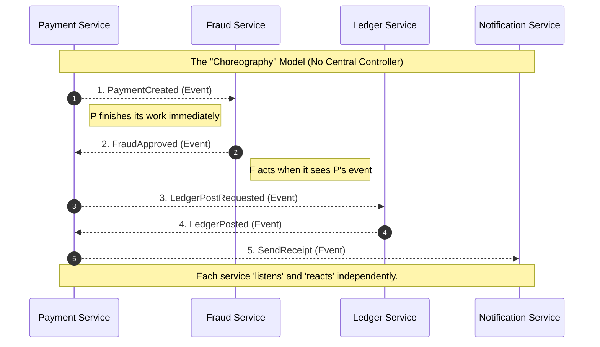
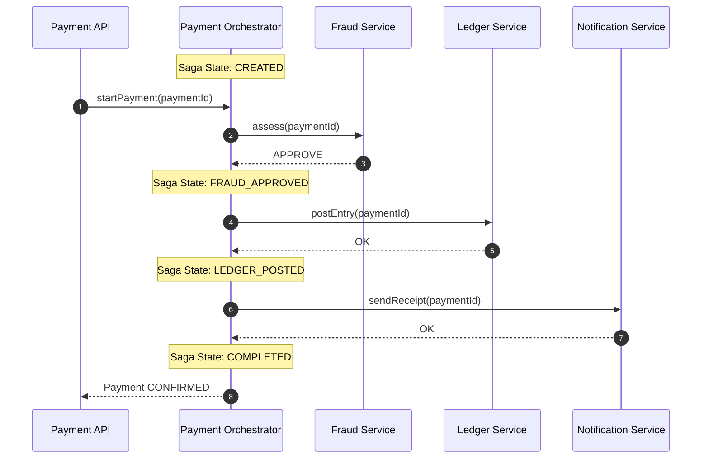
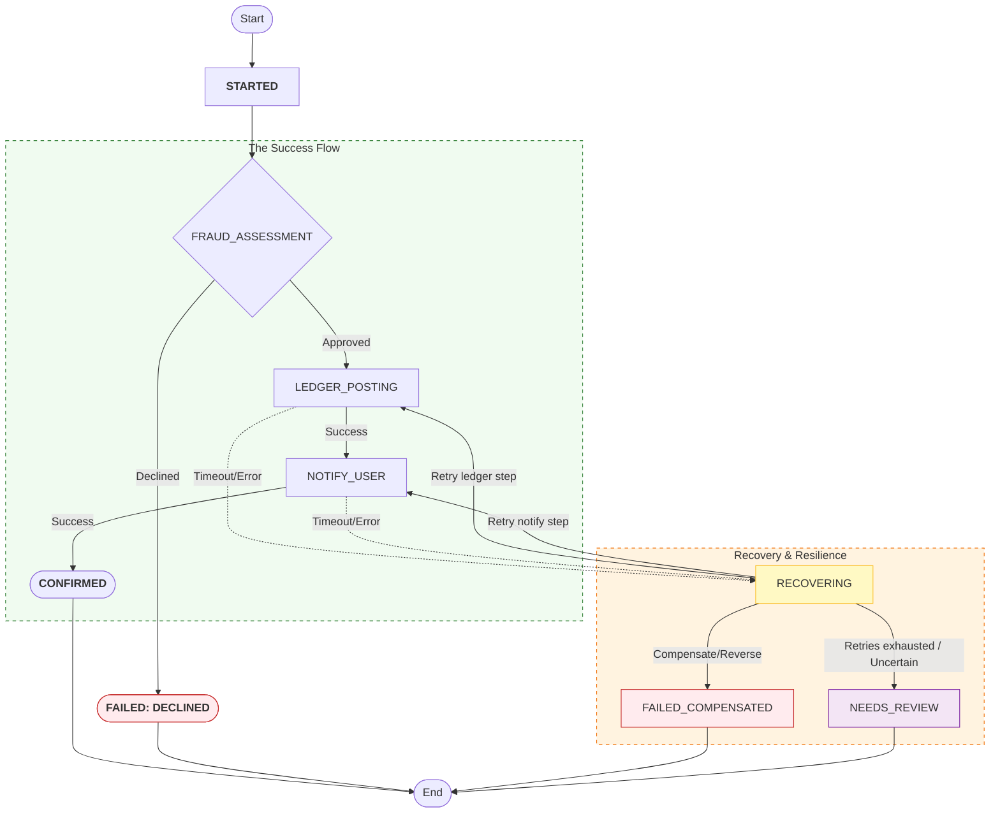

## 1. Why This Article Exists

---

In the previous article, we saw the uncomfortable truth about real payment workflows:

- A payment is a **multi-step workflow** across services.
- **Partial failures** are normal (one step succeeds, another fails).
- ACID transactions help **locally**, but don’t guarantee **global correctness**.

So now we need a new tool:

> **A way to coordinate multiple local transactions into one reliable business outcome.**

This is where **Saga** comes in.

In this article, we will:

- introduce the Saga pattern (in practical terms)
- compare **choreography vs orchestration**
- explicitly state **what we choose** for our payment design

We will keep this chapter focused on the **coordination model and design choice**.

In the next chapter, we’ll make this coordination **production-safe** with durable state, retries, timeouts, and compensation mechanics.

---

## 2. The Workflow We Must Coordinate

---

Let’s keep the workflow concrete.

A simplified payment flow usually touches these steps:

1. **Create / update payment record** (idempotent)
2. **Fraud / risk decision** (approve/decline/unknown)
3. **Ledger entry** (money movement recorded)
4. **Notification** (receipt, SMS, email)
5. _(Optional)_ **Order confirmation** (in commerce systems)

We want one stable business outcome:

- The payment is **CONFIRMED** only if the required steps succeed.
- Failures must lead to an explicit, controlled state:
  - **FAILED** (no side effects)
  - **FAILED + COMPENSATED** (side effects undone)
  - **PENDING / NEEDS_REVIEW** (uncertain and escalated)

This is not a single DB transaction problem anymore.

It’s a **distributed workflow correctness** problem.

---

## 3. The Core Idea: Saga Pattern

---

A **Saga** is a way to implement a multi-step workflow without a distributed ACID transaction.

A Saga consists of:

- a sequence of **local transactions** (one per service boundary)
- and, if needed, **compensating actions** for steps that already committed

Think of it like this:

> “If we can’t commit everything atomically, we commit step-by-step — and we define how to recover when something fails mid-way.”

### What Saga gives us

- **No global lock / no global transaction**
- Clear definition of:
  - what “done” means
  - what “failed” means
  - what “recovery” means

### A simple mental model

Below is a conceptual table (not implementation yet):

| Step                    | Local transaction (does work) | Compensation (undo / neutralize) |
| ----------------------- | ----------------------------- | -------------------------------- |
| Fraud decision          | record decision               | usually none (audit stays)       |
| Ledger entry            | create entry                  | create reversal entry            |
| Payment debit / reserve | debit / reserve               | refund / release                 |
| Notification            | send receipt                  | none (best-effort; can resend)   |

Important nuance:

- Not every step has a meaningful “undo”.
- Compensation can be “best effort” or “logical reversal”.
- Some steps are not compensated at all — they are retried or tolerated.

We’ll treat compensation mechanics and rules in next article.

---

## 4. Two Ways to Run a Saga: Choreography vs Orchestration

---

The Saga idea is the same, but there are two common execution styles.

### 4.1 Choreography-Based Saga (event-driven saga)

In choreography:

- services emit events when they finish
- other services subscribe and react
- there is no central coordinator

#### Pros

- high autonomy per team/service
- naturally event-driven
- scales well organizationally

#### Cons

- the workflow logic becomes **distributed**
- debugging is harder (“who triggered this step?”)
- higher risk of:
  - event storms
  - accidental cycles
  - unclear ownership of the end-to-end outcome

Choreography can be excellent, but for correctness-sensitive payment workflows it raises the bar for operability.

---

### 4.2 Orchestration-Based Saga (command-driven saga)

In orchestration:

- one coordinator owns the workflow state
- it issues commands to services
- it decides next steps based on outcomes

#### Pros

- a single, explicit view of the workflow
- easier to reason about correctness
- centralized place for:
  - state transitions (high-level)
  - observability (correlation)
  - policy decisions (retry vs compensate)

#### Cons

- orchestrator becomes a critical component
- risk of turning into a “god service” if it absorbs domain logic

We’ll avoid that by keeping domain logic inside services.

---

## 5. What Our Design Chooses (Explicit Decision)

---

For Phase 3 baseline, **we choose orchestration**.

### 5.1 Why orchestration fits our payment system (baseline)

Payments have:

- correctness-sensitive side effects (money movement)
- high operational cost of mismatches
- strong need for debuggability and clarity

Orchestration gives us:

- a single “truth” of workflow progress
- a single place to control state transitions
- simpler incident response (“what step failed and why?”)

### 5.2 Guardrails: how we avoid a “god orchestrator”

The orchestrator must not become a business logic dump.

Our boundary rules:

- Orchestrator:
  - owns **workflow state** and **control flow**
  - issues commands and evaluates outcomes
- Services:
  - own **domain logic**
  - own **their data**
  - are **idempotent** at the step level

This keeps the system modular and scalable.

---

## 6. The Orchestrated Payment Saga (High-Level)

---

We now model payment processing as a workflow with explicit steps.

A conceptual step flow might be:

1. Start payment (idempotent)
2. Fraud assessment
3. Ledger posting
4. Notify user
5. Mark payment as confirmed

Notice what changed compared to earlier architecture:

- we are no longer thinking in “single request → chain of calls”
- we are thinking in “workflow → state transitions”

This shift is the foundation of reliable distributed coordination.

---

## 7. Failure Handling: Retry vs Compensate (Concept Only)

---

Once we adopt a saga mindset, failures become explicit design decisions.

At a high level:

- **Transient failures** → retry (with boundaries)
- **Permanent/business failures** → stop + compensate where required
- **Uncertain outcomes** → mark as `NEEDS_REVIEW` and escalate

A teaser matrix (details in next article):

| Failure type   | Example                         | Primary action                   | Fallback                                   |
| -------------- | ------------------------------- | -------------------------------- | ------------------------------------------ |
| transient      | timeout sending notification    | retry                            | async retry / best-effort                  |
| permanent      | fraud declined                  | stop                             | mark FAILED (no compensation required yet) |
| partial commit | ledger posted, later step fails | compensate later step or reverse | mark NEEDS_REVIEW if uncertain             |

The key is that the system must have:

> **an explicit recovery path for each failure class.**

---

## 8. Workflow State Is Now First-Class

---

To coordinate a saga, we need a “truth” for progress.

At minimum, the workflow needs:

- `paymentId` (business id)
- `workflowId` / `correlationId`
- step statuses:
  - `FRAUD_DONE`
  - `LEDGER_DONE`
  - `NOTIFY_DONE`
- terminal outcomes:
  - `SUCCEEDED`
  - `FAILED`
  - `FAILED_COMPENSATED`
  - `NEEDS_REVIEW`

This state cannot be purely in memory.

It must survive:

- process restarts
- timeouts
- retries
- partial failures

We’ll implement and harden this in the next chapter.

---

## 9. Key Takeaways

---

- **Saga** coordinates multi-service workflows using local transactions + compensations.
- There are two main saga execution styles:
  - **Choreography** (event-driven, distributed flow)
  - **Orchestration** (central coordinator, explicit control flow)
- For our payment system baseline, we choose **orchestration** for clarity and operability.
- The orchestrator must not become a “god service”:
  - it owns workflow state + control flow
  - domain logic stays inside services
- Once sagas enter the design, **workflow state becomes first-class**.

---

## TL;DR

---

Partial failures are inevitable in multi-service payments.

Saga is the coordination model that replaces “global ACID” with:

- step-by-step local commits
- explicit recovery paths (retry / compensate)
- observable workflow state

We choose **orchestration** for our baseline because it makes the workflow explicit and debuggable.

---

### 🔗 What’s Next?

Now that we’ve chosen orchestration + saga as our coordination model, we need to make it **production-safe**.

In the next article we will add:

- **durable workflow state machine** (persisted states + transitions)
- **retry + timeout rules** (bounded retries, backoff, retryability)
- **compensating transactions (mechanics)** and invariants
- handling “stuck” workflows and escalation paths
- how our payment architecture evolves with an orchestrator + reliable execution

👉 **Up Next: →**  
**[Payment System — Making Sagas Reliable (Durable State + Retries + Compensation)](/learning/advanced-skills/high-level-design/4_correct-reliable-systems/4_10_making-sagas-reliable)**
