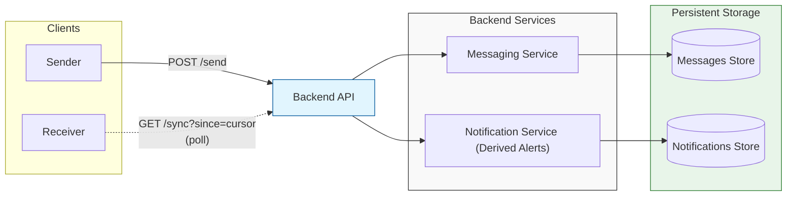
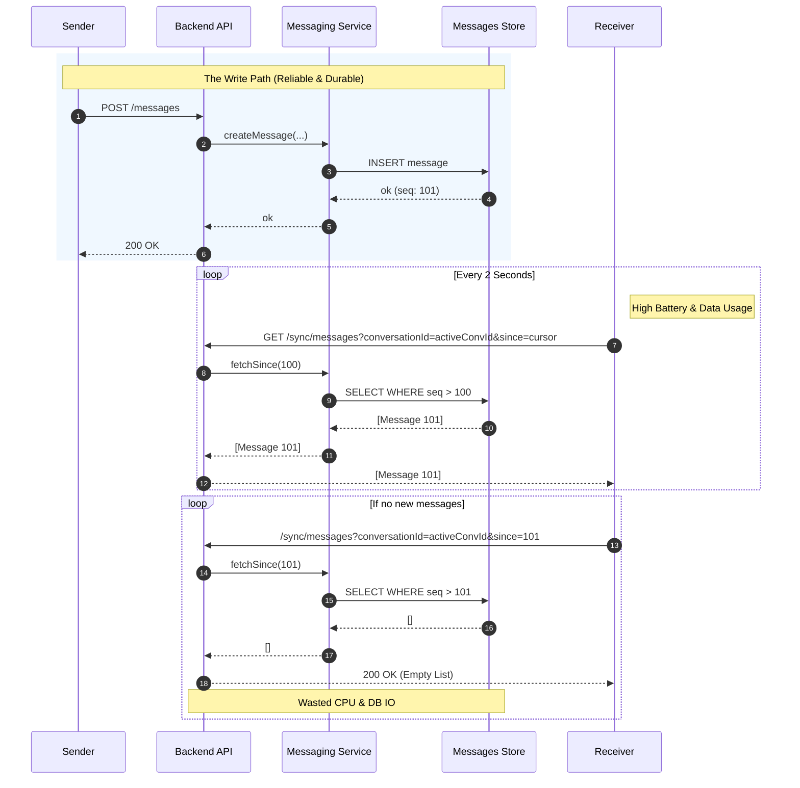
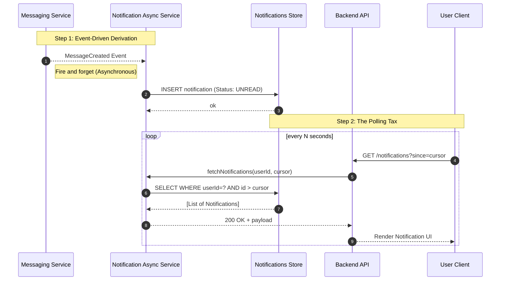
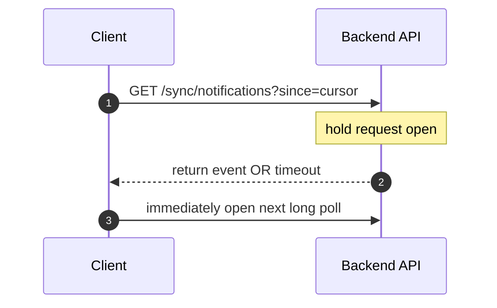
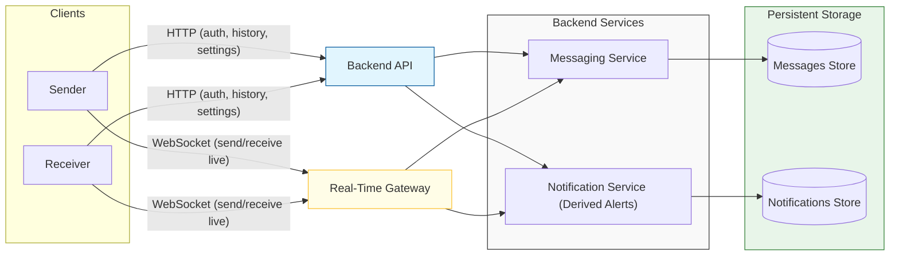
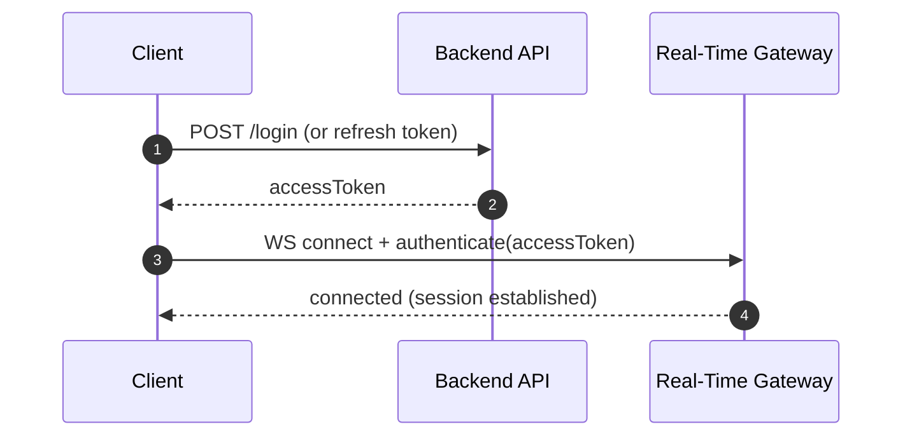
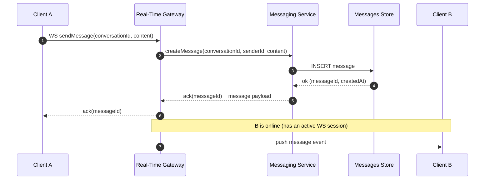
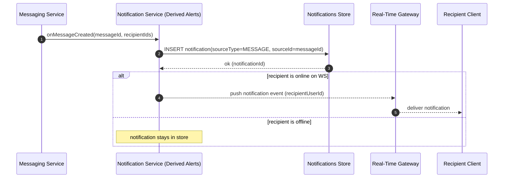
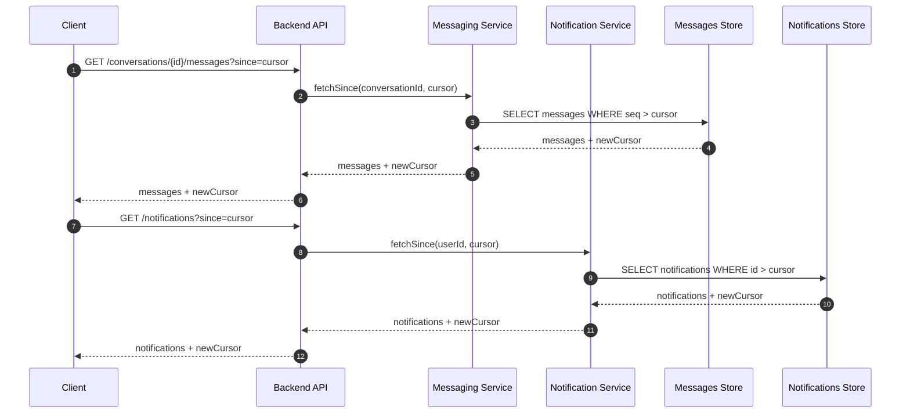
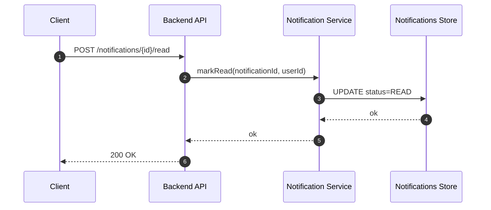

## 1. From Requirements to Architecture (Baseline V0)

---

In the previous article, we defined the requirements for a **Real-Time Messaging System (Notifications + Chat)**.

As with any system design problem, we start with the simplest architecture that satisfies the requirements, then evolve it as production pressures appear.

For this system, the core responsibilities are:

1. accept chat messages
2. store them durably
3. deliver new items to online users
4. let offline users catch up later
5. generate **notifications (derived alerts)** when users are not actively viewing the conversation

### Baseline V0: API + Services + Storage (Polling-based delivery)

The simplest baseline uses a classic **API → services → database** setup.

In V0, the receiver learns about new messages/notifications by repeatedly calling a cursor-based sync endpoint.

This works for a small system, but it’s not truly real-time—and it becomes expensive at scale.

---

## 2. Typical Delivery Flow in V0 (Polling)

---

In V0, the system does not push updates.

Instead, the receiver periodically calls a **cursor-based sync endpoint** to fetch anything new since the last seen cursor.

### 2.1 Chat flow (sender writes, receiver polls)

In practice, a client does **not** poll every conversation frequently.

- When a user is viewing a conversation, the client polls that **active conversation** (high frequency).
- For other conversations, the client relies on **derived notifications** (or a low-frequency refresh of the conversation list).

> **Why this gets expensive:**  
> Per-conversation polling scales with the number of active conversations a user keeps “fresh”.  
> Even if most users poll only 1–2 active conversations, at platform scale the aggregate request volume becomes enormous — and most responses are empty.

### 2.2 Message-driven notification flow (derived alert + receiver polls)

In Phase 4, a notification is typically **derived from a message** (e.g., “New message from X”) when the recipient is offline or not actively viewing the conversation.

Under normal conditions, this works:

- messages are stored and eventually delivered to receivers
- derived notifications are stored and eventually shown to users
- offline users can catch up using stored history

However, once we demand **real-time UX** and **scale**, the first pressure appears.

---

## 3. Hidden Real-Time Risk in V0: Polling Can’t Be “Real-Time”

---

Polling creates two fundamental problems.

### 3.1 Latency is bounded by the polling interval

If the client polls every 5 seconds:

- best case: event arrives just before poll → ~0s delay
- worst case: event arrives just after poll → ~5s delay

So “real-time” becomes:

> **“eventually, within N seconds”**

For chat and message alerts, this feels broken.

### 3.2 At scale, polling becomes a cost and stability problem

> Even if each user polls only the active conversation, at millions of users the system still sees a massive volume of mostly-empty sync requests.

When you have many clients:

- most polls return “no new updates”
- yet each poll still consumes:
  - API capacity
  - DB/cache reads (or cache checks)
  - network bandwidth
  - CPU on both client and server

This causes:

- constant background load (“always-on traffic”)
- thundering herd during reconnects
- incident amplification (spikes exactly when the system is stressed)

Polling is a valid baseline to start with, but it cannot satisfy Phase 4 expectations.

So we upgrade.

---

## 4. Upgrade V1: Long Polling

---

Long polling is the simplest upgrade that improves latency without changing components.

Instead of responding immediately, the server holds the request open:

- returns as soon as an event becomes available, or
- returns on timeout

Client then immediately opens the next long poll.

### What improves

- latency improves (server responds immediately when an event arrives)
- fewer wasted responses than basic polling

Long polling is often “good enough” for moderate scale notification systems.

But it still breaks for our full Phase 4 scope.

---

## 5. Hidden Risk in V1: Too Many Open HTTP Requests

---

Long polling replaces many short requests with fewer long-lived ones, but at scale it introduces a new operational problem:

- huge number of concurrent open HTTP connections
- load balancers and proxies impose timeouts and limits
- server resources are tied up holding requests
- reconnect storms become “connection storms”

And most importantly for our example:

> Long polling is awkward for **bidirectional chat**.

Chat needs:

- client → server message send
- server → client message push

Long polling only covers server → client updates.

So we need a proper push transport.

---

## 6. Upgrade V2: Push Transport (SSE vs WebSockets)

---

At this point, the correct baseline for “real-time” is to maintain a long-lived connection and push events as they happen.

Two common options:

### 6.1 Server-Sent Events (SSE)

- server → client only (one-way)
- built on HTTP
- operationally simple
- great for notifications-only delivery

### 6.2 WebSockets

- bidirectional (client ↔ server)
- ideal for chat (send and receive on the same connection)
- supports multiplexing multiple channels (chat + notifications)

### What we choose in our design

Because our example includes **Chat + message-driven Notifications**, we choose:

- ✅ **WebSockets as the baseline transport**

(If we were building **notifications-only**, SSE could be the simpler baseline.)

---

## 7. Baseline V2 Architecture: Real-Time Gateway + Backend API

---

Once we adopt WebSockets, we introduce one new component:

> **Real-Time Gateway** (WebSocket servers)

But we do **not** remove the Backend API.

Instead, the system now has **two entry points** into the same backend services:

- **Backend API (HTTP/REST)** — control + history  
  (auth bootstrap, fetch chat history, fetch notifications, mark read, settings)
- **Real-Time Gateway (WebSocket)** — live data plane  
  (send/receive messages in real-time, receive derived notification events)

Both typically talk to the **same backend services** (Messaging + Notification), but they handle very different traffic patterns and scaling concerns.

#### The "real-time gateway" is responsible for:

- managing long-lived connections (connect, authenticate, heartbeat)
- routing inbound real-time messages to backend services
- pushing outbound events (messages + derived notifications) to connected clients
- handling reconnect bursts safely (later: backpressure and buffering)

#### The "Backend API" remains responsible for:

- authentication and session bootstrap
- history fetch (messages/notifications)
- state updates (mark read, conversation management)
- anything that fits a request/response model better than a live stream

> ✅ **Real world note: API Gateway vs Real-Time Gateway**  
> These are _both_ “edge layers”, but optimized for different traffic shapes:
>
> - **API Gateway / Web Server (HTTP)** handles request/response traffic: auth, history fetch, mark-read, settings.  
>   Real-world examples: **Nginx**, **Envoy**, **Kong**, **Apigee**, **AWS API Gateway**, **Azure API Management**.
> - **Real-Time Gateway (WebSockets/SSE)** handles long-lived connections: connect/auth, heartbeats, user→connection routing, fanout, and backpressure.  
>   Real-world examples: managed options like **AWS API Gateway (WebSocket API)**, **Azure Web PubSub**, **Pusher**, **Ably**; or a **custom WebSocket gateway** built with **Netty (Java)**, **Socket.IO (Node.js)**, **Phoenix Channels (Elixir)**, etc.
>
> **Key idea:** WebSockets is the transport; the Real-Time Gateway is the server fleet that terminates and manages those WebSocket connections at scale.

---

## 8. Typical Flows in V2 (Gateway + Backend API)

---

With V2, the client uses **two channels**:

- **HTTP (Backend API)** for auth + history + state updates
- **WebSocket (Gateway)** for live send/receive

Below are the typical baseline flows.

---

### 8.1 Bootstrap + Connect (common first step)

---

### 8.2 Chat send + real-time delivery (data plane)

---

### 8.3 Derived notification (for offline / not-in-chat recipients)

When a message is created, we may generate a **notification** for recipients who are offline or not actively viewing the conversation.

---

### 8.4 History fetch + catch-up (control/history plane)

History fetch is used both for **reconnect catch-up** and for **screen-level freshness** (opening a conversation from a notification). WebSockets deliver live events, but REST history remains the source of truth.

---

### 8.5 Mark notification as read (control plane)

**Key idea:** WebSockets are for live delivery, but the Backend API is still essential for history, state changes, and recovery after disconnects.

At this point we have a true real-time baseline.

But we’ve created the next pressure.

---

## 9. Next Hidden Problem: Fanout and Delivery Can’t Live in the Request Path

---

Even with WebSockets and gateways, a naive “backend directly pushes everything” design breaks at scale:

- fanout (one event → many connections/devices) can block request processing
- reconnect storms create bursts that overload both backend and gateways
- we still need answers for:
  - delivery guarantees (duplicates are normal)
  - ordering (chat expectations)
  - offline delivery and replay
  - backpressure when clients are slow

This is exactly why real-time systems introduce **an event bus**:

> decouple event production from event delivery,  
> so delivery can scale independently and absorb bursts.

That’s our next upgrade.

---

## Key Takeaways

---

- The simplest baseline is **API → services → storage** with polling-based sync.
- In Phase 4, **messages are the source of truth**; **notifications are derived alerts** (often from messages).
- Polling fails on both **latency** and **cost/stability** at scale.
- Long polling improves latency, but introduces **too many open HTTP connections** and still doesn’t fit chat cleanly.
- For Chat + derived Notifications, the correct baseline is **push transport**.
- We choose **WebSockets** and introduce a **Real-Time Gateway**.
- Next pressure: delivery and fanout must be decoupled → we need an **event bus**.

---

## TL;DR

---

Polling is the simplest baseline, but it cannot deliver real-time UX and it becomes expensive at scale.

Long polling improves latency but is operationally fragile and not a clean fit for bidirectional chat.

For a real-time messaging system **where messages are core** and **notifications are derived alerts**, the correct baseline is a **push architecture using WebSockets** and a dedicated **Real-Time Gateway**.

Next we add an **event bus** so event delivery can scale independently of request handling.

---

### 🔗 What’s Next

Now that we have real-time gateways, we need a scalable way to distribute events and handle fanout without blocking backend request processing.

In the next article we’ll introduce:

- **Pub/Sub vs Queue** (and where streams fit)
- how an event bus decouples producers from delivery workers
- the first cut of our event-driven architecture

👉 **Up Next: →**  
**[Real-Time System — Introducing the Event Bus (Pub/Sub vs Queue)](/learning/advanced-skills/high-level-design/5_realtime-event-driven-systems/5_3_baseline-architecture)**
