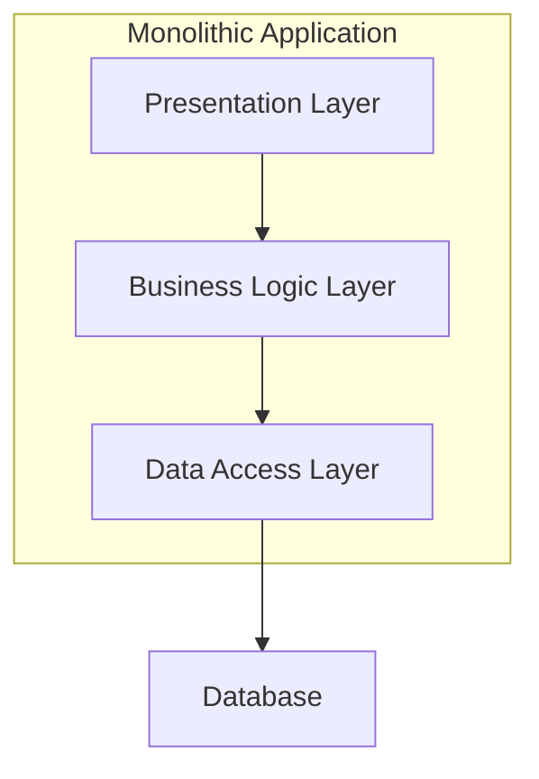

## 1. What Is Monolithic Architecture?

---

A **monolithic architecture** is a system design where the core responsibilities of an application live inside a **single deployable unit**.

In a monolith:

- request handling
- business logic
- data access

are all packaged together and deployed as **one application**.

From a High-Level Design perspective, the key idea is:

> **The system is built, deployed, and scaled as a single unit.**

#### Diagram explanation

This diagram shows a monolithic application as a **single deployable unit** that internally organizes responsibilities into layers.

Requests flow from the **Presentation Layer** to the **Business Logic Layer**, and finally to the **Data Access Layer**, which interacts with the database.

While responsibilities are separated internally for clarity and maintainability, the application is **built, deployed, and scaled as one unit**.

---

## 2. Understanding the Layers in the Diagram

---

The diagram separates the monolithic application into **logical layers**.  
These layers do not represent separate deployments — they represent **separation of responsibilities** within the same application.

### 2.1 Presentation Layer

#### What it represents in the diagram

- The entry point into the system

#### Responsibilities

- Receive requests from clients (browser, mobile app, API client)
- Perform basic input validation
- Translate requests into calls to the business logic
- Format responses for the client

#### What it does NOT do

- Business decisions
- Database access

---

### 2.2 Business Logic Layer

#### What it represents in the diagram

- The core decision-making part of the system

#### Responsibilities

- Enforce business rules
- Coordinate workflows (e.g., create order, update status)
- Decide _what should happen_ in response to a request

#### What it does NOT do

- Handle HTTP concerns
- Directly access the database

---

### 2.3 Data Access Layer

#### What it represents in the diagram

- The system’s boundary to persistent storage

#### Responsibilities

- Read and write data to the database
- Execute queries
- Map stored data to application-level structures

#### What it does NOT do

- Business validation
- Workflow orchestration

---

### 2.4 Database (Outside the Application Boundary)

#### What it represents in the diagram

- Persistent storage external to the application

#### Responsibilities

- Durability of data
- Consistency guarantees
- Query execution

The application treats the database as an external dependency.

---

## 3. Why Monolithic Architecture Exists

---

Monolithic architecture exists because it solves the **simplest and most common problem** in software systems:

> _How do we build a working system quickly, correctly, and with minimal complexity?_

It provides:

- fast development velocity
- simple deployment
- straightforward debugging
- minimal operational overhead

For many systems, especially early-stage ones, this is exactly what is needed.

---

## 4. When to Use Monolithic Architecture

---

Monolithic architecture is a **good choice** when:

- the system is small or early-stage
- the development team is small
- traffic volume is low to moderate
- requirements are still evolving
- operational simplicity is a priority

In these scenarios, the cost of more complex architectures outweighs their benefits.

---

## 5. When NOT to Use Monolithic Architecture

---

A monolith may become a limitation when:

- different parts of the system need to scale independently
- deployment cycles become slow or risky
- teams grow large and need clear ownership boundaries
- failures in one module frequently impact the entire system
- the system requires extreme availability or global scale

At this point, architectural evolution may be necessary.

---

## 6. How Monolithic Architecture Appeared in HLD Examples

---

### Phase 1: Simple Web System

In **Phase 1**, we intentionally chose a monolithic architecture because:

- the system had limited scope
- traffic expectations were low
- clarity and correctness mattered more than scalability
- introducing distributed complexity would have been premature

This choice allowed us to:

- focus on understanding system flow
- avoid unnecessary infrastructure
- build a solid baseline architecture

---

## 7. Common Misconceptions

### ❌ “Monoliths are bad”

Monoliths are not bad.  
They are often the **correct starting point**.

Many successful systems begin as monoliths and evolve only when necessary.

---

### ❌ “Microservices are always better”

Microservices solve specific problems:

- scale
- ownership
- fault isolation

If those problems do not exist yet, microservices add **unjustified complexity**.

---

### ❌ “Monoliths cannot scale”

Monoliths can scale:

- vertically
- and even horizontally (to a point)

They simply have **practical limits**, not immediate ones.

---

## 8. Key Trade-offs

| Aspect                 | Monolithic Architecture |
| ---------------------- | ----------------------- |
| Simplicity             | ✅ Very high            |
| Development Speed      | ✅ Fast                 |
| Debugging              | ✅ Easy                 |
| Independent Scaling    | ❌ Limited              |
| Fault Isolation        | ❌ Weak                 |
| Operational Complexity | ✅ Low                  |

These trade-offs explain **why monoliths are chosen early** and **revisited later**.

---

### 🔗 What’s Next?

Next, we’ll explore how **structure inside a monolith** improves maintainability.

👉 **Next Concept:**  
**Layered (N-Tier) Architecture**

---

> 📝 **Takeaway**:
>
> - Monolithic architecture is a **single deployable system**.
> - It prioritizes simplicity and speed.
> - It is often the **right first architecture**.
> - Architectural evolution should be driven by **real constraints**, not trends.
