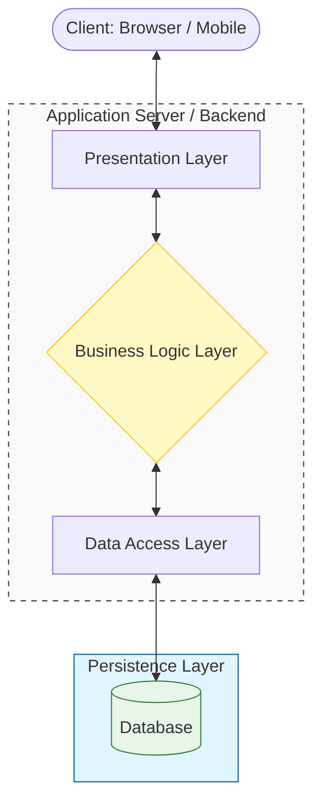

## 1. What Is Layered (N-Tier) Architecture?

---

Layered architecture (also called **N-Tier architecture**) is a design approach where an application is divided into **logical layers**, each responsible for a specific part of the system.

Instead of placing all functionality in one place, responsibilities are **separated into layers** such as:

- presentation
- business logic
- data access

Each layer interacts primarily with the **layer directly below it**, creating a clear structure inside the application.

This separation improves **maintainability, clarity, and scalability of the codebase**.

---

## 2. Why Layered Architecture Exists

---

As applications grow, mixing responsibilities creates several problems:

- code becomes difficult to maintain
- business rules leak into UI logic
- database logic spreads across the application
- changes become risky and error-prone

Layered architecture solves this by **organizing the system into clear boundaries**.

Each layer focuses on **one type of responsibility**, making the system easier to understand and evolve.

---

## 3. A Typical Layered Architecture

---

The following diagram focuses on **how requests move through layers** inside an application.



### Diagram Explanation

The system is divided into logical layers inside the application.

Requests flow through the layers:

1. The **Presentation Layer** receives the request.
2. The **Business Logic Layer** decides what should happen.
3. The **Data Access Layer** interacts with the database.

Each layer has a **clear responsibility**, preventing concerns from mixing together.

---

## 4. Understanding Each Layer

---

### 4.1 Presentation Layer

The **Presentation Layer** is the **entry point into the system**.

Responsibilities typically include:

- Receiving client requests
- Performing basic input validation
- Formatting responses
- Translating HTTP or API calls into business operations

This layer should **not contain business rules or database logic**.

Common examples include:

- REST controllers
- GraphQL resolvers
- API endpoints
- UI adapters

---

### 4.2 Business Logic Layer

The **Business Logic Layer** contains the **core rules and workflows of the system**.

Responsibilities include:

- Enforcing business rules
- Coordinating operations
- Deciding how requests should be handled
- Orchestrating interactions with the data layer

This layer answers the question:

> _What should happen when the system receives this request?_

Examples include:

- Order processing
- Payment validation
- User registration logic

---

### 4.3 Data Access Layer

The **Data Access Layer (DAL)** handles **communication with persistent storage**.

Responsibilities include:

- Executing database queries
- Retrieving and storing data
- Mapping stored data into application structures
- Isolating the rest of the application from database details

This layer focuses on **how data is stored and retrieved**, not on business rules.

---

## 5. Layered Architecture in Real Systems

---

Most web applications — especially **monolithic applications** — follow layered architecture internally.

For example, a typical backend service might be structured like:

```text
Controller Layer
      ↓
Service Layer
      ↓
Repository / Data Layer
      ↓
Database
```

Even though the system is deployed as **one application**, the internal layering keeps responsibilities organized.

---

## 6. Benefits of Layered Architecture

---

Layered architecture provides several advantages.

### 6.1 Clear Separation of Responsibilities

Each layer focuses on a specific role, reducing overall system complexity.

Responsibilities such as request handling, business rules, and database interaction are isolated from one another.

---

### 6.2 Improved Maintainability

When responsibilities are clearly separated, changes can often be made within a single layer without affecting the rest of the system.

For example, changing how data is stored usually impacts only the **Data Access Layer**, not the business logic or presentation layer.

---

### 6.3 Easier Testing

Layered systems make it easier to test components independently.

Business logic can be tested without involving the user interface or database, which simplifies automated testing and debugging.

---

### 6.4 Familiar and Predictable Structure

Layered architecture is widely used across web applications and backend systems.

Because the structure is familiar to most developers, teams can collaborate more easily and understand the codebase faster.

---

## 7. Limitations of Layered Architecture

---

Despite its advantages, layered architecture also introduces certain trade-offs.

### 7.1 Performance Overhead

Requests must pass through multiple layers before reaching the database and returning a response.

In highly performance-sensitive systems, this additional processing path can introduce latency.

---

### 7.2 Over-Abstraction

In very small applications, strict layering may create unnecessary complexity.

Too many layers can make the system harder to navigate without providing significant architectural benefits.

---

### 7.3 Not Always Ideal for Highly Distributed Systems

As systems scale and become more distributed, simple layered structures may evolve into more specialized architectures such as:

- microservices architectures
- event-driven architectures
- domain-oriented designs

These patterns handle large-scale concerns more effectively.

---

## 8. Relationship to Monolithic Architecture

---

Layered architecture often exists **inside monolithic applications**.

A monolithic architecture defines **how the application is deployed**, while layered architecture defines **how responsibilities are organized internally**.

In simple terms:

- **Monolithic Architecture → deployment structure**
- **Layered Architecture → internal code organization**

A monolithic application can still maintain clear separation of concerns by organizing its code into layers.

| Concept                 | What It Describes                                          |
| ----------------------- | ---------------------------------------------------------- |
| Monolithic Architecture | How the application is deployed (a single deployable unit) |
| Layered Architecture    | How responsibilities are organized inside the application  |

---

## 9. Key Takeaways

---

- Layered architecture divides an application into **logical responsibility boundaries**.
- Common layers include **presentation, business logic, and data access**.
- The pattern improves maintainability, clarity, and testability.
- Layered architecture is commonly used inside **monolithic applications**.

---

### 🔗 What’s Next?

Next, we will explore **Client–Server Architecture**, which explains how systems are structured across network boundaries and how clients interact with servers.

👉 **Up Next → Client–Server Architecture**

👉 **Next Concept:**  
**[Client–Server Architecture](/learning/advanced-skills/high-level-design/6_concepts-for-reference/6_3_client-server-architecture)**
