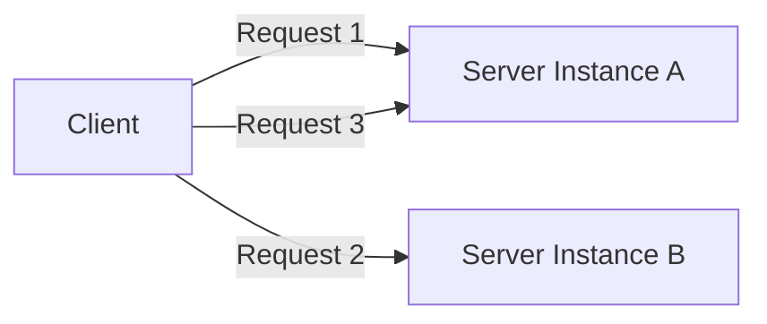
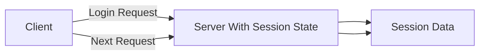

## 1. What Are Stateless and Stateful Applications?

---

When clients interact with servers, the system must decide **how it handles information about previous requests**.

Two common approaches exist:

- **Stateless systems** – the server does not remember previous interactions.
- **Stateful systems** – the server maintains information about the client’s session.

This distinction has a significant impact on **scalability, reliability, and system design**.

---

## 2. Stateless Systems

In a **stateless system**, every request from a client is treated as an **independent interaction**.

The server does not store information about previous requests.  
Instead, each request contains **all the information needed** for the server to process it.

---

### 2.1 Stateless Request Flow

### Diagram Explanation

Because the server does not store session information, a**ny server instance can process any request**.

This allows the system to distribute requests across multiple servers without needing to track session state.

---

### 2.2 Advantages of Stateless Systems

Stateless architectures offer several benefits:

#### Horizontal Scalability

Requests can be distributed across many servers easily because no session data is stored on a specific machine.

#### Improved Reliability

If one server fails, another server can handle the request without losing context.

#### Simpler Load Balancing

Load balancers can route requests freely since servers do not depend on session state.

---

### 2.3 Common Stateless Systems

Many modern APIs and services are designed to be stateless.

Examples include:

- REST APIs
- microservices
- serverless functions
- most public web APIs

---

## 3. Stateful Systems

---

In a **stateful system**, the server maintains information about the client across multiple requests.

This information is often stored in a **session**.

### 3.1 Stateful Request Flow

### Diagram Explanation

The server stores session data that persists between requests.

This means the server remembers information such as:

- user authentication
- session preferences
- application state

---

### 3.2 Advantages of Stateful Systems

Stateful systems can simplify certain types of applications.

#### Easier Session Management

User sessions can be stored directly on the server.

#### Simpler Application Logic

The server does not need the client to resend information with every request.

---

### 3.3 Challenges of Stateful Systems

However, stateful systems introduce several design challenges.

#### Limited Scalability

Requests must be routed to the **same server instance** that holds the session.

#### Failover Complexity

If the server storing session data fails, session information may be lost.

#### Load Balancer Constraints

Load balancers may need to use **sticky sessions**, which restricts request distribution.

---

## 4. Real-World Examples

---

Stateless and stateful approaches appear in different types of systems.

| System Type | Example                                                          |
| ----------- | ---------------------------------------------------------------- |
| Stateless   | REST APIs, serverless services                                   |
| Stateful    | Online games, collaborative applications, long-lived connections |

Most modern web architectures prefer **stateless services**, especially in cloud environments.

---

## 5. Stateless vs Stateful at Scale

---

As systems scale, stateless architectures are usually preferred.

Stateless services allow systems to:

- scale horizontally
- distribute traffic easily
- recover from failures quickly

When state must be preserved, it is typically stored in **external systems**, such as:

- databases
- distributed caches
- session stores

This allows application servers to remain stateless while the system still maintains necessary data.

---

## 6. Key Takeaways

---

- **Stateless systems** treat every request as independent.
- **Stateful systems** store session information between requests.
- Stateless architectures are generally easier to **scale and distribute**.
- Modern cloud systems often keep application servers stateless while storing state in external systems.

---

### 🔗 What’s Next?

Next, we will explore **Synchronous vs Asynchronous Communication**, which explains how systems coordinate interactions between components.

👉 **Next Concept:**  
**[Synchronous vs Asynchronous Communication](/learning/advanced-skills/high-level-design/6_concepts-for-reference/6_5_sync-vs-async-communication)**
