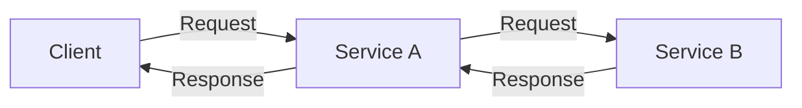
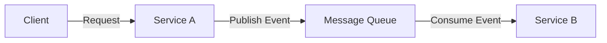

## 1. What Is Communication Between System Components?

---

In most systems, components need to interact with each other to complete a request.

For example:

- an API server calling a payment service
- a web application retrieving data from a database
- one microservice requesting information from another

These interactions typically follow one of two communication models:

- **Synchronous communication**
- **Asynchronous communication**

Understanding the difference helps determine **how systems coordinate work and handle delays**.

---

## 2. Synchronous Communication

---

In **synchronous communication**, a component sends a request and **waits for a response before continuing**.

The caller is blocked until the operation completes.

---

### 2.1 Synchronous Interaction

#### Diagram Explanation

1. A client sends a request to **Service A**.
2. Service A calls **Service B** to complete part of the operation.
3. Service A must **wait for Service B to respond** before continuing.
4. After receiving the response, Service A returns the result to the client.

The request flow is **linear and blocking**, meaning each step must complete before the next one begins.

---

### 2.2 Advantages of Synchronous Communication

#### 1. Simpler Flow

The request–response model is straightforward and easy to understand.

Each operation completes before the next step begins, making the control flow predictable.

---

#### 2. Immediate Feedback

The caller receives the result of the operation immediately, which is useful for operations where the client expects an instant response.

---

#### 3. Easier Debugging

Because requests follow a clear path through the system, tracing errors and failures is typically easier.

---

### 2.3 Limitations of Synchronous Communication

#### 1. Blocking Behavior

If the downstream service is slow, the caller must wait for the operation to finish before continuing.

---

#### 2. Reduced Resilience

Failures in one component can affect the entire request chain.

For example, if **Service B** is unavailable, **Service A** cannot complete the request.

---

#### 3. Limited Scalability

Long chains of synchronous calls can create performance bottlenecks in complex systems.

---

## 3. Asynchronous Communication

---

In **asynchronous communication**, a component sends a request or message and **does not wait for the operation to complete**.

The sender continues processing while the receiving component handles the task independently.

---

### 3.1 Asynchronous Interaction

#### Diagram Explanation

1. The client sends a request to **Service A**.
2. Service A publishes a message or event to a queue.
3. Service B consumes the message and processes it independently.
4. The original request does **not wait** for Service B to complete its work.

This interaction allows services to operate **independently**, reducing tight coupling between system components.

---

### 3.2 Advantages of Asynchronous Communication

#### 1. Improved Scalability

Systems can process messages at their own pace without blocking the caller.  
Multiple consumers can process messages in parallel, allowing the system to scale more easily.

---

#### 2. Better Resilience

Failures in one component do not immediately block other components.  
Messages can be retried or processed later if temporary failures occur.

---

#### 3. Decoupled Services

Services communicate through messages rather than direct calls.  
This reduces dependencies between components and allows services to evolve independently.

---

### 3.3 Challenges of Asynchronous Communication

#### 1. Increased System Complexity

Asynchronous systems require additional infrastructure such as message queues and event brokers.  
They also introduce concerns such as retries, message ordering, and monitoring.

---

#### 2. Delayed Results

Because processing happens in the background, results may not be available immediately.

This model often relies on **eventual completion** rather than immediate responses.

---

#### 3. Harder Debugging

Tracing the flow of messages across services can be more difficult than following a simple synchronous request chain.

---

## 4. Where Each Model Is Used

---

| Communication Model | Typical Use Cases                                                     |
| ------------------- | --------------------------------------------------------------------- |
| **Synchronous**     | API requests, database queries, user authentication                   |
| **Asynchronous**    | background jobs, event processing, notifications, analytics pipelines |

Most modern systems use a **combination of both communication models**.

For example:

- user login requests are handled synchronously
- sending email notifications or processing analytics events may happen asynchronously

---

## 5. Key Takeaways

---

- **Synchronous communication** waits for a response before continuing.
- **Asynchronous communication** allows components to continue processing without waiting.
- Synchronous systems are simpler but can introduce bottlenecks.
- Asynchronous systems improve scalability but add operational complexity.
- Real-world architectures typically combine both approaches.

---

### 🔗 What’s Next?

Next, we will explore **Single Database as Source of Truth**, which explains why many systems begin with a single central data store before evolving toward more distributed data architectures.

👉 **Next Concept:**  
**[Single Database as Source of Truth](/learning/advanced-skills/high-level-design/6_concepts-for-reference/6_6_single-database)**
