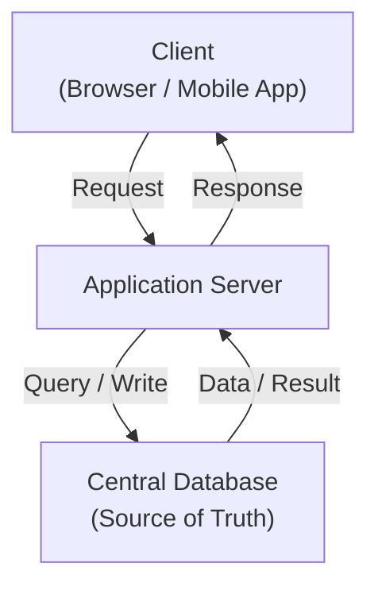

## 1. What Is a Single Database as Source of Truth?

---

A **Single Database as Source of Truth** means that a system relies on **one central data store** as the authoritative location for its data.

All system components:

- read data from this database
- write updates to this database

This ensures that **every part of the system refers to the same consistent dataset**.

---

## 2. Typical System Structure

---

In many early-stage systems, the architecture looks like this:



### Diagram Explanation

1. A client sends a request to the application server.
2. The server processes the request.
3. Any data required for the request is retrieved from the **central database**.
4. Updates are written back to the same database.

Because all reads and writes go through a single database, the system always has a **consistent view of the data**.

---

## 3. Why Systems Start with a Single Database

---

Using a single database simplifies system design in several ways.

### 3.1 Simpler Consistency

All data is stored in one place, which avoids synchronization problems between multiple data stores.

---

### 3.2 Easier Development

Developers do not need to manage complex data replication or distributed transactions.

---

### 3.3 Simpler Debugging

When something goes wrong, there is only **one authoritative data store** to investigate.

---

### 3.4 Faster Early Development

Early-stage systems benefit from simplicity.  
A centralized database reduces architectural complexity.

---

## 4. Real-World Example

---

Consider a simple **e-commerce platform**.

All system components rely on the same database:

- product catalog
- user accounts
- orders
- payments
- inventory

```text
Application Server
        |
        v
Central Database
```

Every operation reads or writes data to this central database.

---

## 5. Advantages of a Single Source of Truth

---

### 5.1 Strong Data Consistency

Because there is only one database, the system always sees the most up-to-date data.

---

### 5.2 Simpler Architecture

No need for complex data synchronization between multiple storage systems.

---

### 5.3 Easier Maintenance

Operational complexity is lower compared to distributed databases.

---

## 6. Limitations as Systems Scale

---

As systems grow, relying on a single database can create challenges.

### 6.1 Performance Bottlenecks

High traffic may overwhelm a single database instance.

---

### 6.2 Scaling Constraints

Vertical scaling (bigger machines) eventually reaches hardware limits.

---

### 6.3 Availability Risks

If the database fails, the entire system may become unavailable.

---

## 7. How Systems Evolve Beyond a Single Database

---

As systems scale, architects often introduce:

- **read replicas** for scaling read traffic
- **caching layers** for performance
- **database sharding** for horizontal scaling
- **distributed databases** for global systems

However, these solutions introduce new complexity and should only be used **when necessary**.

---

## 8. Why Starting Simple Is Often Better

---

A common mistake in system design is **introducing distributed databases too early**.

For many systems:

- a single database can handle significant traffic
- simplicity improves reliability
- development speed remains high

Distributed data architectures should be introduced only when **clear scaling signals appear**.

---

## 9. Key Takeaways

---

- A **Single Database as Source of Truth** means all data reads and writes occur in one central database.
- This approach simplifies consistency, development, and debugging.
- Most systems start with a centralized database before evolving into distributed architectures.
- Distributed databases should be introduced only when scaling requirements demand them.

---

### 🔗 What’s Next?

The final concept in Phase 1 focuses on a fundamental mindset in system design:

👉 **Next Concept:**  
**[Architectural Trade-offs](/learning/advanced-skills/high-level-design/6_concepts-for-reference/6_6_single-database)**

Every design decision involves balancing benefits and costs.
