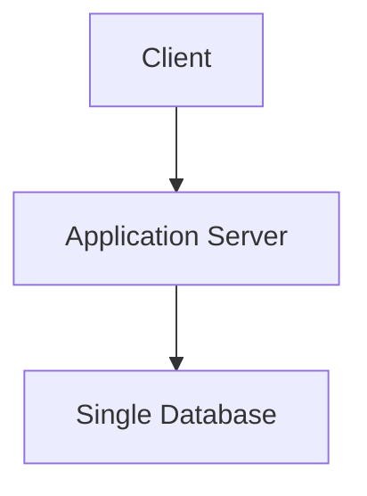

## 1. What Are Architectural Trade-offs?

---

Every system design decision comes with **benefits and costs**.

Choosing an architecture is not about finding a **perfect solution**, but about selecting the option that best fits the **current requirements, constraints, and goals of the system**.

This balancing act is known as an **architectural trade-off**.

---

## 2. Why Trade-offs Exist in System Design

---

Software systems operate under multiple competing constraints, such as:

- performance
- scalability
- reliability
- complexity
- development speed
- operational cost

Improving one aspect of a system often **makes another aspect more difficult**.

For example:

- increasing system reliability may increase system complexity
- improving scalability may increase operational overhead
- simplifying development may limit future flexibility

Because of this, architects must constantly evaluate **which trade-offs are acceptable**.

---

## 3. Example: Simplicity vs Scalability

---

Consider the architecture used in **Phase 1: Simple Web System**.

### Design Choice

In Phase 1, we deliberately chose a simple architecture:

- a **monolithic application**
- a **single database**
- **synchronous communication**

These decisions prioritized simplicity and clarity over scalability.

---

### 3.1 Why This Choice Was Made

This architecture prioritizes:

- simplicity
- faster development
- easier debugging

These are valuable advantages for early-stage systems where rapid iteration and maintainability are more important than large-scale performance.

---

### 3.2 The Trade-off

However, this design also introduces limitations:

- limited horizontal scalability
- potential database bottlenecks
- single points of failure

These trade-offs are acceptable because the system’s **current requirements are modest**. As systems grow, these limitations may eventually require architectural changes.

---

## 4. Trade-offs Are Context Dependent

---

A design decision that works well for one system may not work for another.

Architectural decisions depend heavily on the **context of the system**, including its requirements and constraints.

For example:

| System Type      | Likely Priority             |
| ---------------- | --------------------------- |
| Startup MVP      | Development speed           |
| Global platform  | Scalability                 |
| Financial system | Consistency and reliability |
| Real-time system | Low latency                 |

Because priorities differ, architectures must adapt accordingly.

---

## 5. Common Trade-offs in System Design

---

Certain trade-offs appear frequently in system architecture.

| Trade-off                      | Description                                                       |
| ------------------------------ | ----------------------------------------------------------------- |
| Simplicity vs Scalability      | Simple systems are easier to build but harder to scale            |
| Consistency vs Availability    | Strong consistency may reduce availability in distributed systems |
| Performance vs Maintainability | Highly optimized systems may become harder to maintain            |
| Flexibility vs Complexity      | Highly flexible systems may introduce additional complexity       |

Understanding these trade-offs helps architects choose the most appropriate design.

---

## 6. Trade-offs in Real Systems

---

Most successful systems evolve by **adjusting trade-offs over time**.

A system might initially adopt:

- simple architecture
- centralized database
- synchronous communication

As traffic and complexity increase, architects may introduce:

- load balancing
- caching
- replication
- asynchronous messaging

Each change improves certain characteristics but also introduces **new trade-offs**.

---

## 7. The Architect’s Mindset

---

A good system designer does not ask:

> “What is the best architecture?”

Instead, the better question is:

> “Which architecture makes the most sense for the current constraints?”

Understanding trade-offs helps architects avoid both:

- **over-engineering too early**
- **under-designing critical systems**

---

## 8. Key Takeaways

---

- Every architectural decision involves **trade-offs**.
- There is rarely a single perfect solution.
- The right architecture depends on **context, constraints, and priorities**.
- Good architects evaluate both the **benefits and the costs** of every decision.

---

## Phase 1 Concept Summary

Phase 1 introduced the foundational concepts used to design our first system:

- Monolithic Architecture
- Layered (N-Tier) Architecture
- Client–Server Architecture
- Stateless vs Stateful Applications
- Synchronous vs Asynchronous Communication
- Single Database as Source of Truth
- Architectural Trade-offs

These concepts form the **foundation for more advanced system design decisions** in later phases.

---

## What's Next

In **Phase 2**, we begin designing systems that must handle **much larger traffic and data volumes**.

This will introduce new architectural techniques such as:

- load balancing
- caching
- scaling strategies

👉 **Up Next → Phase 2: Scaling for Reads**
