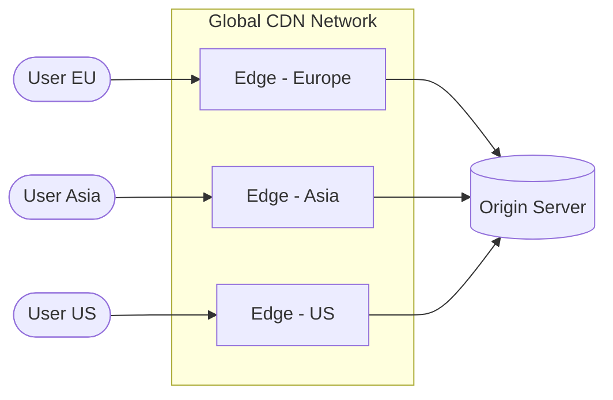
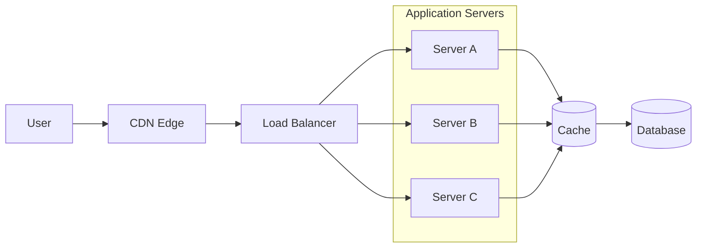

---
title: "Content Delivery Networks (CDN)"
description: "Learn how CDNs reduce latency and improve scalability by serving content from edge locations closer to users."
keywords:
  - content delivery network
  - cdn system design
  - edge caching
  - distributed caching
  - system design cdn
  - latency optimization
weight: 10
date: 2026-03-07
layout: "topic-content"
---

## 1. The Problem: Global Latency

---

As systems grow, users are no longer located in a single geographic region.

Consider a system hosted in **one data center**.

Users from other regions must send requests across long network paths.

Example:

```text
User (India) → Server (US-East)
```

This introduces:

- high **network latency**
- increased **server load**
- slower user experience

Even if the application servers are scalable, the **physical distance between users and servers becomes a bottleneck**.

---

## 2. What is a CDN?

---

A **Content Delivery Network (CDN)** is a distributed network of servers that cache content closer to users.

Instead of every request reaching the origin server, requests can be served from a **nearby edge server**.

Example flow:


If the content is already cached at the edge:

```text
User → Edge → Response
```

The origin server is not contacted.

---

## 3. How CDNs Reduce Latency

---

CDNs reduce latency by placing **edge servers in many geographic locations**.

Example architecture:



Users are automatically routed to the **closest edge location**.

This significantly reduces **round-trip network time**.

---

## 4. What Content CDNs Cache

---

CDNs are most effective for **static or infrequently changing content**.

Common examples include:

- images
- videos
- JavaScript files
- CSS files
- downloadable assets

Example:

```text
/images/logo.png
/static/app.js
/videos/tutorial.mp4
```

These resources are ideal for caching because they change rarely.

---

## 5. CDN Request Flow

---

A typical CDN request flow works as follows:

1. User requests content
2. DNS resolves the domain to a CDN edge location
3. CDN checks its cache

If cached:

```text
Edge → User
```

If not cached:

```text
Edge → Origin Server → Edge → User
```

The content is then stored at the edge for future requests.

---

## 6. CDN + Application Architecture

---

Modern systems often combine **CDN, load balancers, caching layers, and application servers**.

Example architecture:



In this architecture:

- CDN handles **static content**
- application servers handle **dynamic logic**
- Redis handles **data caching**
- database stores **persistent data**

This layered approach improves both **performance and scalability**.

---

## 7. Benefits of CDNs

---

### Reduced Latency

Users receive responses from nearby edge locations.

### Lower Origin Load

Many requests never reach the application servers.

### Improved Scalability

Traffic spikes can be absorbed by the CDN network.

### Better User Experience

Pages load faster due to reduced network distance.

---

## 8. Real-World CDN Providers

---

Popular CDN providers include:

- Cloudflare
- Akamai
- Fastly
- AWS CloudFront
- Google Cloud CDN

These providers operate **large global edge networks**.

---

## 9. CDN Limitations

---

CDNs work best for **static or cacheable content**.

They are less effective for:

- highly dynamic data
- personalized responses
- real-time updates

For such cases, requests must still reach the **origin application servers**.

---

## 10. Key Takeaways

---

- CDNs reduce latency by caching content near users.
- They improve scalability by reducing load on origin servers.
- Edge servers serve cached content without contacting the backend.
- CDNs are most effective for static or infrequently changing assets.

---

### 🔗 What’s Next?

So far in Phase 2 we improved system scalability using:

- caching
- horizontal scaling
- load balancing
- stateless servers
- CDNs

However, these optimizations introduce a new challenge:

**data consistency across distributed systems**.

👉 Up Next: **Eventual Consistency**