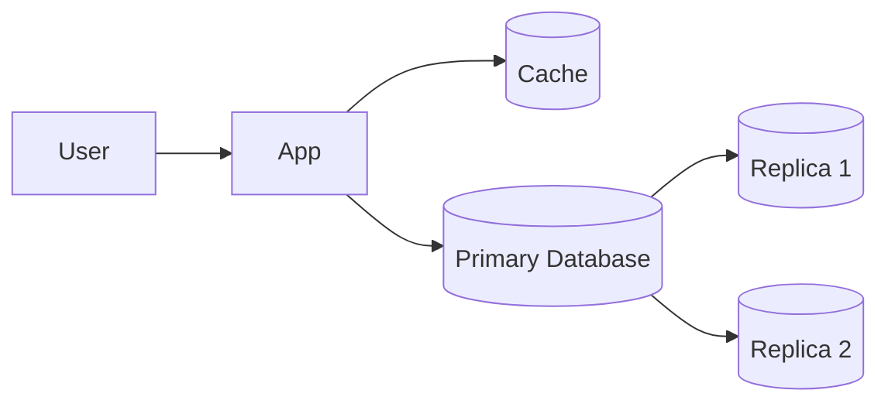
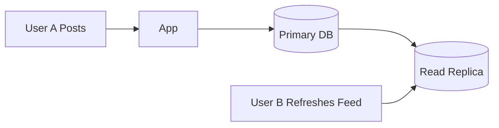

---
title: "Eventual Consistency"
description: "Understand why distributed systems often sacrifice strong consistency for availability and scalability, and how eventual consistency works in practice."
keywords:
  - eventual consistency
  - strong vs eventual consistency
  - distributed systems consistency
  - system design consistency models
  - cap theorem consistency
  - data propagation delay
weight: 11
date: 2026-03-07
layout: "topic-content"
---

## 1. The Problem Introduced by Scaling

---

In Phase 2 we introduced several techniques to scale systems:

- caching
- horizontal scaling
- load balancing
- stateless application servers
- CDNs

These improvements significantly increase system performance and scalability.

However, they introduce a new challenge.

When data is stored or cached in **multiple locations**, updates may not appear everywhere immediately.

Example:

```text
User A updates a profile
User B still sees the old profile
```

This temporary mismatch between systems is known as **eventual consistency**.

---

## 2. What is Eventual Consistency?

---

**Eventual consistency** means that if no new updates are made to a piece of data, all replicas of that data will **eventually converge to the same value**.

In other words:

```text
Temporary inconsistency is allowed
But the system eventually becomes consistent
```

Unlike strong consistency, the system does not guarantee that all users see the **latest value immediately**.

Instead, it guarantees that **all replicas will synchronize over time**.

---

## 3. Why Eventual Consistency Exists

---

In distributed systems, data is often stored across multiple nodes.

Example architecture:



When a write occurs:

1. The primary database updates immediately
2. Replicas receive the update later

During that time window:

```text
Primary DB → new value
Replica DB → old value
```

This delay is called **replication lag**.

---

## 4. Example: Social Media Feed

---

Consider a social media system.

User A posts a message.

```text
User A → "Hello World"
```

The write happens in the primary database.

However, the feed service may read data from a **replica or cache**.



If the replica has not yet received the update, User B may temporarily see:

```text
Old feed data
```

After replication completes, the feed becomes consistent.

---

## 5. Where Eventual Consistency Appears

---

Eventual consistency commonly appears in systems using:

### Distributed Databases

Replication across multiple nodes introduces propagation delays.

### Caching Systems

Caches may serve slightly stale data until invalidation occurs.

### CDNs

Edge servers cache content and update it later.

### Messaging Systems

Asynchronous processing may delay updates between services.

---

## 6. Strong Consistency vs Eventual Consistency

---

| Property | Strong Consistency | Eventual Consistency |
|--------|------------------|---------------------|
| Data freshness | Always latest value | May return stale data |
| Latency | Higher | Lower |
| Availability | Lower during failures | Higher |
| Scalability | Limited | High |

Strong consistency guarantees that **all users see the same data immediately**.

Eventual consistency allows temporary divergence but improves system scalability.

---

## 7. Why Large Systems Use Eventual Consistency

---

Large-scale systems often prioritize:

- availability
- scalability
- fault tolerance

Requiring strict synchronization between all nodes would significantly reduce performance.

Eventual consistency allows systems to:

- process writes quickly
- serve reads from multiple locations
- tolerate network delays

This trade-off is fundamental to distributed architecture.

---

## 8. Real-World Examples

---

Eventual consistency appears in many large systems:

### Social Media

Posts may take a few seconds to appear for all users.

### E-commerce

Inventory counts may briefly differ between services.

### DNS

DNS updates propagate gradually across servers.

### CDN Caches

Edge nodes update cached content asynchronously.

---

## 9. Designing Around Eventual Consistency

---

Engineers design systems assuming temporary inconsistencies will occur.

Common techniques include:

- retry mechanisms
- background synchronization
- cache invalidation
- conflict resolution

The goal is not to eliminate inconsistency completely, but to **ensure the system eventually converges to a correct state**.

---

## Key Takeaways

---

- Eventual consistency allows distributed systems to scale efficiently.
- Data may be temporarily inconsistent across nodes.
- Replication lag, caching, and CDNs often introduce this behavior.
- Over time, all replicas converge to the same state.

---

### 🔗 What’s Next?

With Phase 2 complete, we now understand how systems scale using:

- caching
- load balancing
- stateless servers
- CDNs
- eventual consistency

In the next phase we will explore **more complex distributed system architectures**, where messaging systems and asynchronous communication become essential.