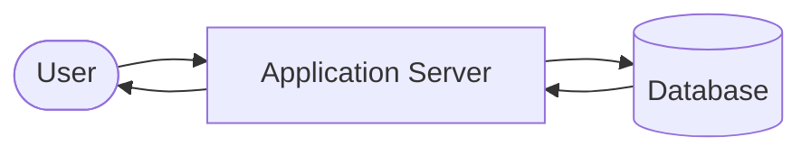
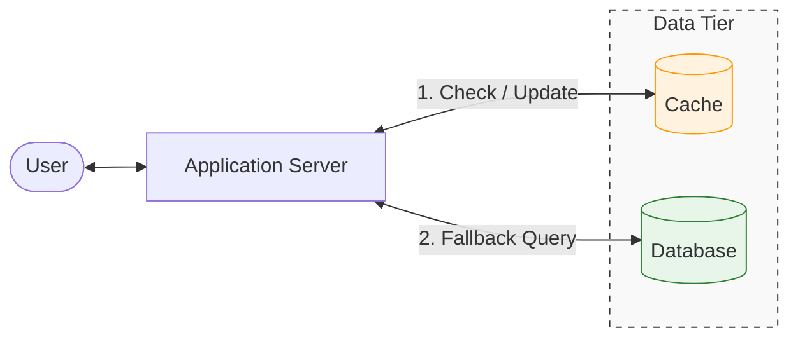

## 1. What Is Caching?

---

Caching is the technique of storing **frequently accessed data in a faster storage layer** so that future requests can be served more quickly.

Instead of repeatedly fetching the same data from a slower system such as a database, the application first checks whether that data already exists in a cache.

If it does, the system returns the cached result immediately.

At a high level, caching is about one simple idea:

> **Do not recompute or refetch expensive data if you already have it available in a faster place.**

---

## 2. Why Caching Exists

---

As systems grow, the same data is often requested again and again.

Examples include:

- a user’s home feed
- product details on an e-commerce site
- profile information
- trending posts
- static website assets

If every request goes all the way to the database or backend system, the system begins to suffer from:

- high latency
- repeated computation
- unnecessary database load
- reduced scalability

Caching exists to solve these problems.

It allows systems to:

- respond faster
- reduce backend pressure
- support more traffic
- improve user experience

---

## 3. A Simple Mental Model

---

Without caching:

Every request requires a database query.

With caching:

The application checks the cache first.  
Only if the data is missing does it query the database.

---

## 4. Why Caching Is So Powerful

---

Caching is powerful because it attacks one of the biggest problems in system design:

> **Repeated access to the same data**

In many systems, read traffic is much higher than write traffic.

For example:

- millions of users may read a post
- only one user wrote it
- many users view the same profile
- thousands of users request the same homepage data

Without caching, the backend repeats the same work many times.

With caching, the system performs the expensive operation once and reuses the result.

---

## 5. Key Takeaways

---

- Caching stores frequently accessed data in a faster storage layer.
- It reduces latency and protects backend systems such as databases.
- Read-heavy systems benefit the most from caching.
- Caching avoids repeating expensive computations or database queries.

---

### 🔗 What’s Next?

Now that we understand **why caching exists**, the next step is understanding **how caching behaves during requests**.

👉 **Next Concept:**  
**[Cache Hit vs Cache Miss](/learning/advanced-skills/high-level-design/7_concepts-phase2/7_2_cache-hit-and-miss)**

This next article explains how requests interact with the cache and why the **cache hit rate** is one of the most important performance metrics in distributed systems.
