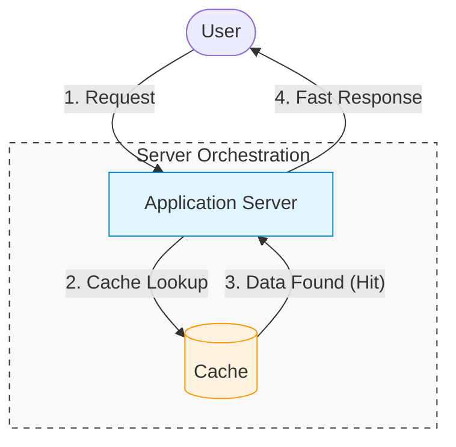
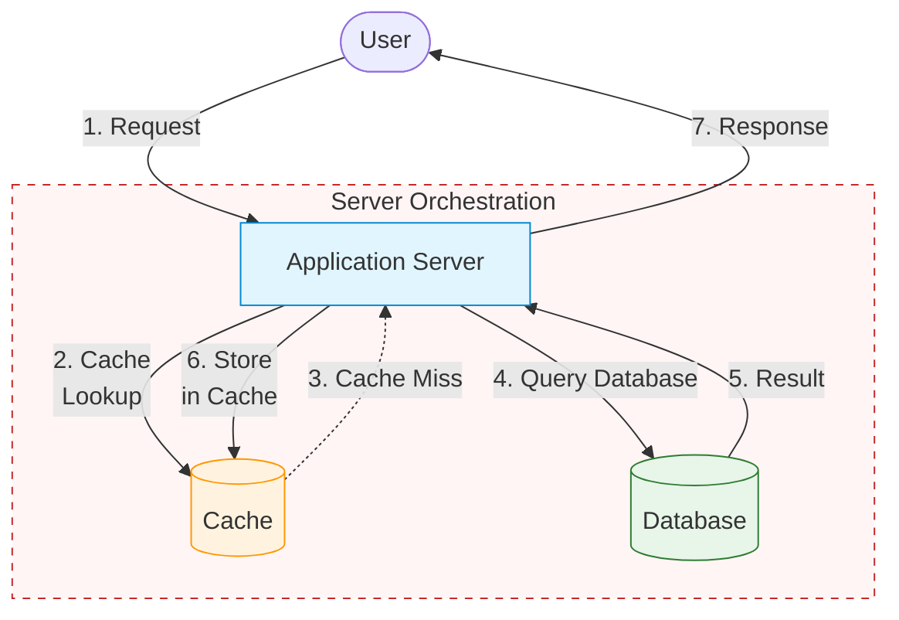

## 1. How Requests Interact With a Cache

---

In the previous article, we learned **why caching exists**.

Now the next step is understanding **how a request actually flows through the system when a cache is present**.

Every request that reaches an application with caching follows the same first step:

```
Check the cache first
```

Depending on whether the requested data exists in the cache or not, the request follows one of two paths:

- **Cache Hit**
- **Cache Miss**

Understanding this difference is critical for designing scalable systems.

---

## 2. What Is a Cache Hit?

---

A **cache hit** occurs when the requested data is already present in the cache.

This is the ideal situation.

Instead of querying the database or performing expensive computation, the system immediately returns the cached data.

### 2.1 Cache Hit Flow



### 2.2 What Happens Internally

1. User sends a request
2. Application checks the cache
3. Requested data is found
4. Data is returned immediately

No database query is required.

### 2.3 Why Cache Hits Are Powerful

Cache hits provide several benefits:

- extremely fast responses
- reduced database load
- lower infrastructure cost
- better scalability

In high-performance systems, most requests should ideally be **cache hits**.

---

## 3. What Is a Cache Miss?

---

A **cache miss** occurs when the requested data does not exist in the cache.

When this happens, the system must fetch the data from the original source (usually the database).

### 3.1 Cache Miss Flow



### 3.2 What Happens Internally

1. User sends a request
2. Application checks the cache
3. Data is not found
4. Application queries the database
5. Database returns the result
6. Application stores the result in cache
7. Response is returned to the user

This ensures that **future requests for the same data can become cache hits**.

---

## 4. Cache Hit Rate

---

One of the most important metrics for evaluating caching effectiveness is the **cache hit rate**.

The cache hit rate measures the percentage of requests served directly from the cache.

```
Cache Hit Rate = Cache Hits / Total Requests
```

Example:

- Total requests per second: **10,000**
- Cache hits: **9,000**
- Cache misses: **1,000**

```
Hit Rate = 9000 / 10000 = 90%
```

This means **90% of requests never reach the database**.

---

## 5. Why Hit Rate Matters

---

High cache hit rates dramatically reduce backend pressure.

Example system load:

Without caching:

```
10,000 requests/sec → database
```

With a 90% hit rate:

```
1,000 requests/sec → database
```

This allows the system to support **10× more traffic without scaling the database**.

---

## 6. What Causes Cache Misses?

---

Cache misses happen for several reasons.

### 6.1 Cold Cache

When a system first starts, the cache is empty.

All requests will initially miss until the cache fills.

---

### 6.2 Expired Data

Cached data often has a **TTL (time-to-live)**.

Once expired, the data must be fetched again.

---

### 6.3 Eviction

Caches have limited memory.

When space runs out, older entries are removed to make room for new data.

---

### 6.4 New Data

If the system has never requested a specific item before, it cannot exist in cache.

---

## 7. The Goal of Good Caching

---

A well-designed cache aims to:

- maximize **cache hits**
- minimize **cache misses**
- protect backend systems
- keep latency low

However, achieving this balance requires careful cache design.

The next concepts will explore how systems control cache behavior.

---

## 8. Key Takeaways

---

- Every cached request results in either a **cache hit** or **cache miss**.
- Cache hits serve data instantly without contacting the database.
- Cache misses require fetching data from the source.
- The **cache hit rate** determines how effective the cache is.

---

### 🔗 What’s Next?

Now that we understand how caches behave during requests, the next step is learning **how systems decide what to cache and how writes interact with caches**.

👉 **Next Concept:**  
**[Caching Patterns](/learning/advanced-skills/high-level-design/7_concepts-phase2/7_3_caching-patterns)**
