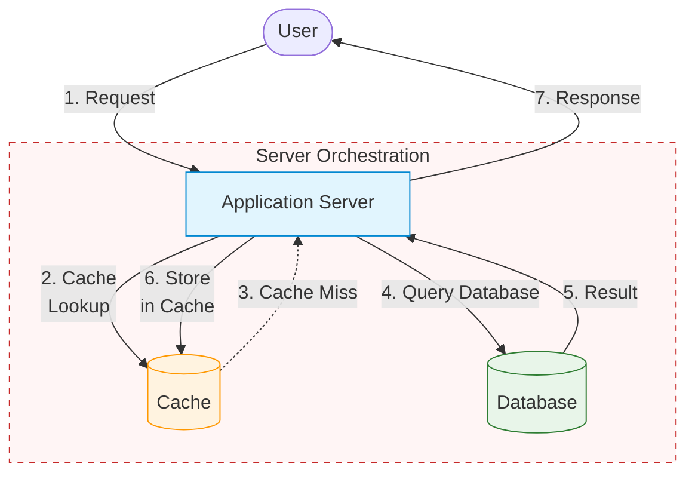
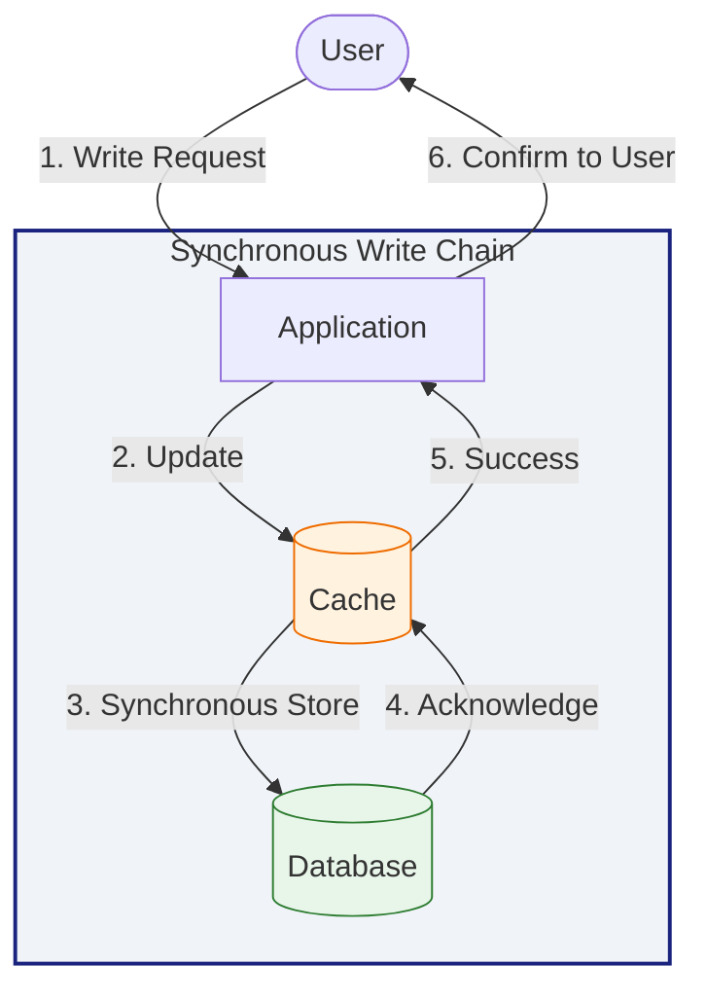
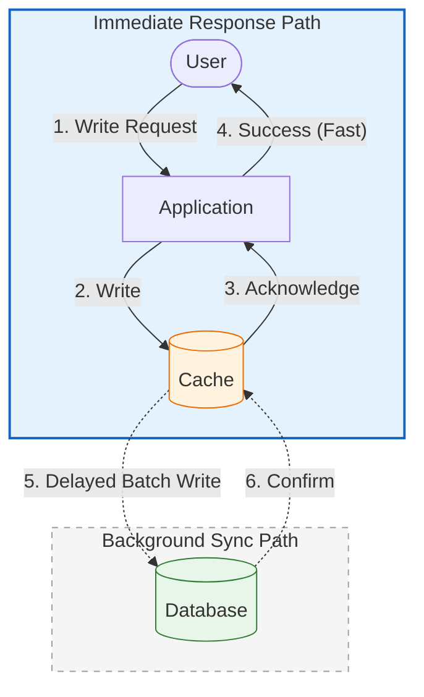
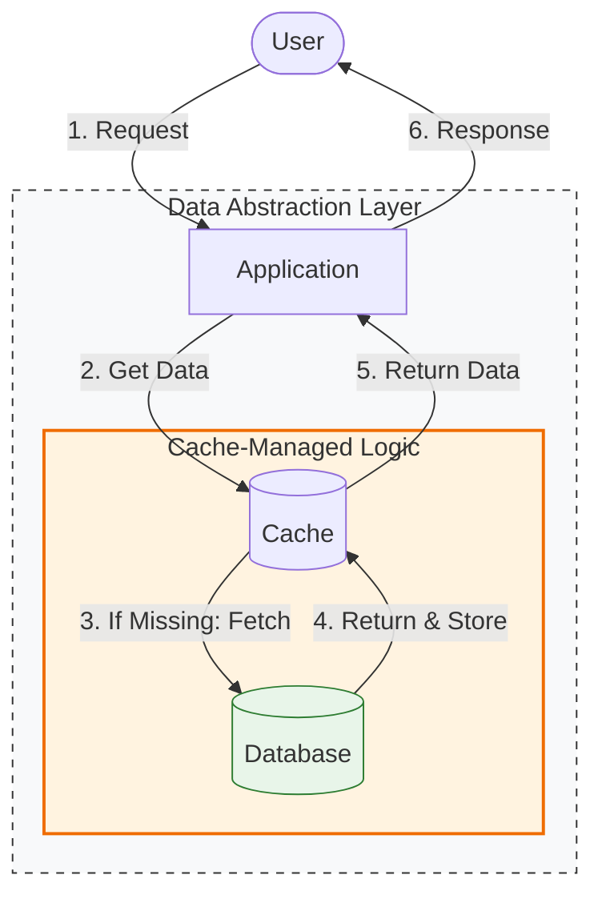
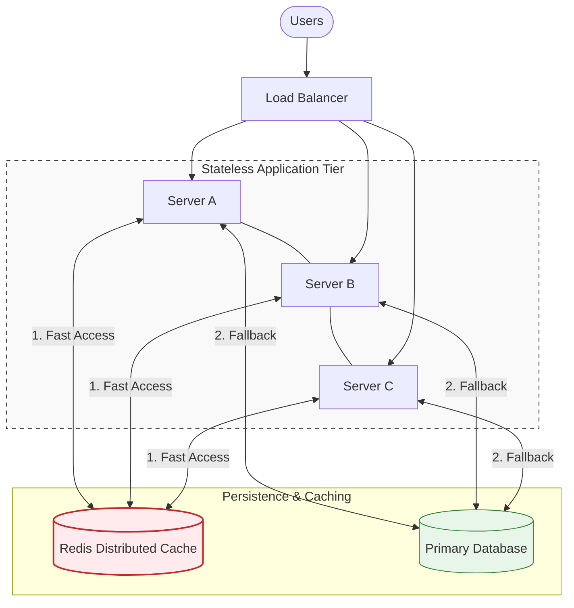

## 1. Why Caching Patterns Exist

---

In the previous article we learned how **cache hits and cache misses** work.

However, a cache does not manage itself automatically.

A system must decide:

- **when to read from the cache**
- **when to read from the database**
- **when to update the cache**
- **when to write to the database**

These decisions define how the cache behaves in a system.

The rules that control this behavior are called **caching patterns**.

Different systems use different patterns depending on their requirements for:

- performance
- data consistency
- write frequency
- operational complexity

---

## 2. Cache-Aside (Lazy Loading)

---

The **Cache-Aside pattern** is the most commonly used caching strategy.

In this pattern, the application is responsible for interacting with both the **cache** and the **database**.

### How It Works

1. Application checks the cache
2. If the data exists → return it
3. If not → fetch from database
4. Store the result in the cache
5. Return the response

### Architecture Flow



### Advantages

- simple to implement
- application has full control
- cache only stores frequently used data

### Trade-offs

- first request after a cache miss is slower
- requires careful cache invalidation

Because of its simplicity and flexibility, **Cache-Aside is the most widely used caching pattern in modern systems**.

---

## 3. Write-Through Cache

---

In the **Write-Through pattern**, data is written to the cache and the database at the same time.

This keeps the cache synchronized with the database.

### How It Works

1. Application writes data to cache
2. Cache immediately writes the data to the database
3. Cache stores the updated value

### Architecture Flow



### Advantages

- cache always contains fresh data
- reads are very fast

### Trade-offs

- write operations become slower
- unnecessary cache entries may be created

This pattern is often used when **read speed is critical and data freshness must remain high**.

---

## 4. Write-Back (Write-Behind) Cache

---

In the **Write-Back pattern**, writes are first stored in the cache and only later written to the database asynchronously.

### How It Works

1. Application writes data to cache
2. Cache immediately returns success
3. Cache updates the database later

### Architecture Flow



### Advantages

- extremely fast write operations
- reduced database load

### Trade-offs

- risk of data loss if cache fails before persistence
- more complex system design

Write-back caching is commonly used in **high-throughput systems where write performance is critical**.

---

## 5. Read-Through Cache

---

In the **Read-Through pattern**, the cache itself is responsible for fetching data from the database.

The application interacts only with the cache.

### How It Works

1. Application requests data from cache
2. If data is missing, cache retrieves it from database
3. Cache stores the result
4. Cache returns the response

### Architecture Flow



### Advantages

- simpler application logic
- centralized cache management

### Trade-offs

- less flexibility for the application
- requires cache infrastructure support

---

## 6. Choosing the Right Pattern

---

Selecting a caching strategy is a balance between **data integrity** and **system performance**. No single pattern fits every use case.

> These patterns are not mutually exclusive. Large systems often combine multiple caching patterns depending on the type of data and workload characteristics.

Because in reality systems do things like:

```text
Cache Aside for reads
Write Through for critical writes
Write Back for analytics data
```

| Pattern       | Write Latency | Read Latency | Consistency | Best For                                                            |
| ------------- | ------------- | ------------ | ----------- | ------------------------------------------------------------------- |
| Cache-Aside   | Low           | Low (on hit) | Eventual    | General web apps with unpredictable workloads.                      |
| Read-Through  | N/A           | Lowest       | High        | Systems where the Cache acts as a Data Provider (e.g., AWS DAX).    |
| Write-Through | High          | Low          | Strong      | Financial data or user profiles where "stale" data is unacceptable. |
| Write-Back    | Lowest        | Low          | Low         | High-volume IoT telemetry, logging, or real-time analytics.         |

### Decision Flowchart

If you are unsure which to pick, follow this logic:

1. **Is your app read-heavy and "stale" data is okay for a few seconds?**
   - Use **Cache-Aside**. (Simplest to implement).
2. **Is data integrity your #1 priority (e.g., Bank Balance)?**
   - Use **Write-Through**. (Ensures DB and Cache are twins).
3. **Are you dealing with millions of tiny writes per second (e.g., Gaming Leaderboard)?**
   - Use **Write-Back**. (Aggregates writes to save the DB from melting).
4. **Do you want to hide the database complexity from your microservices?**
   - Use **Read-Through**. (The Library handles the fetch).

---

## 7. Real-World Usage

---

Most modern applications use **Cache-Aside** combined with **distributed caches such as Redis or Memcached**.

In production environments, applications rarely run on a single server. They use a **Distributed Cache** (like Redis) so that if User A hits Server 1 and User B hits Server 2, they both see the same cached data.

Example architecture:



### Why this architecture is the "Elite" standard:

- **Shared State:** By using a **Distributed Cache** instead of local server memory, any server in your fleet can fulfill a request using data cached by a different server.

- **Decoupled Scaling:** You can scale your "App Tier" (add more CPUs) independently of your "Data Tier" (add more RAM to Redis).

- **The "Source of Truth" Hierarchy:**
  - **Redis**: High-speed, volatile RAM (The "Short-term memory").
  - **Database**: Durable, disk-based storage (The "Long-term memory").

---

## 8. Key Takeaways

---

- Caching patterns define **how caches interact with applications and databases**.
- The most common pattern in web systems is **Cache-Aside**.
- Write-through and write-back patterns affect how writes propagate to the database.
- Choosing the right caching pattern depends on performance and consistency requirements.

---

### 🔗 What’s Next?

Now that we understand caching behavior and patterns, the next challenge is managing **stale data**.

👉 **Next Concept:**  
**[Cache Invalidation](/learning/advanced-skills/high-level-design/7_concepts-phase2/7_4_cache-invalidation)**

This article explains how systems ensure cached data stays fresh when the underlying data changes.
