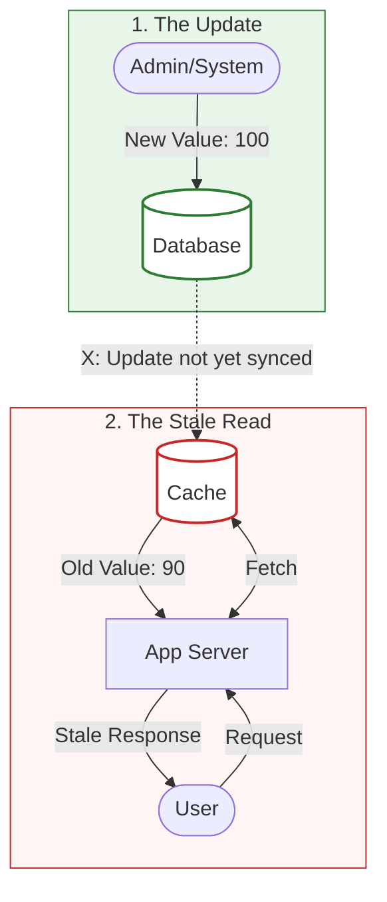
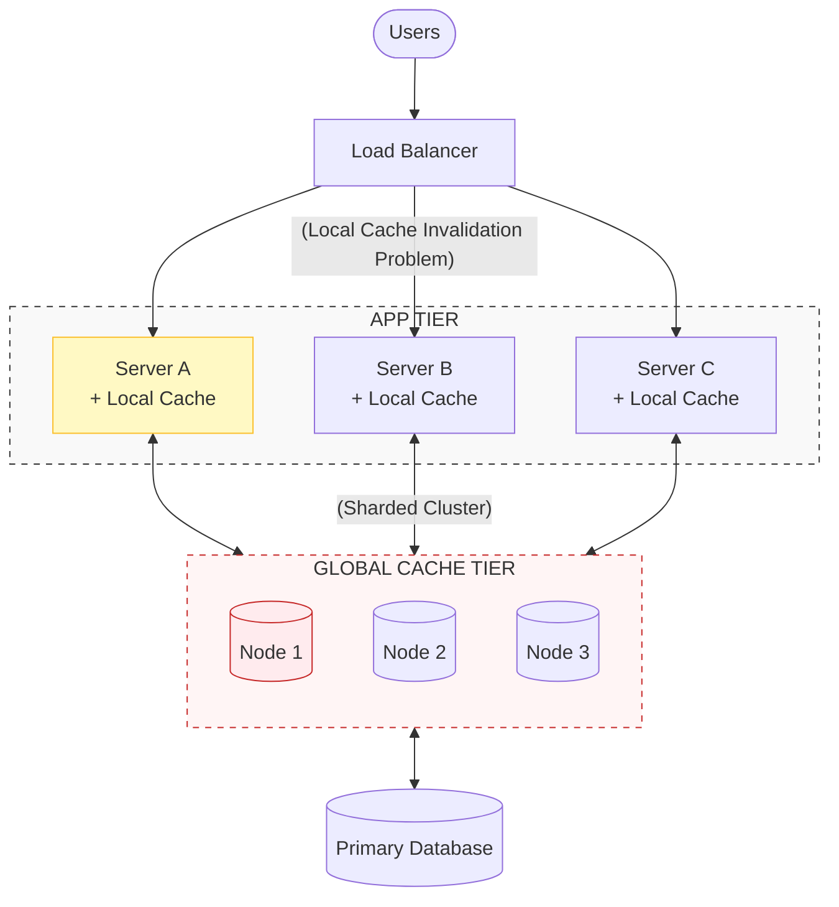
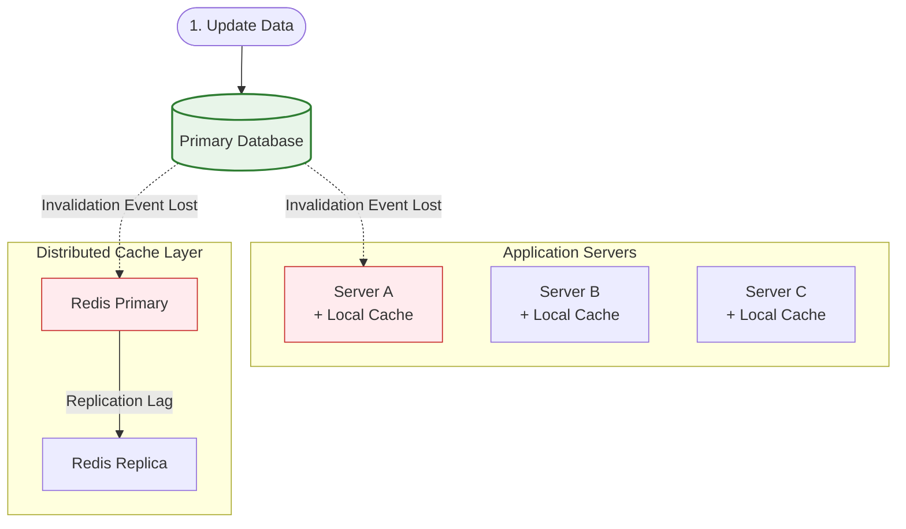
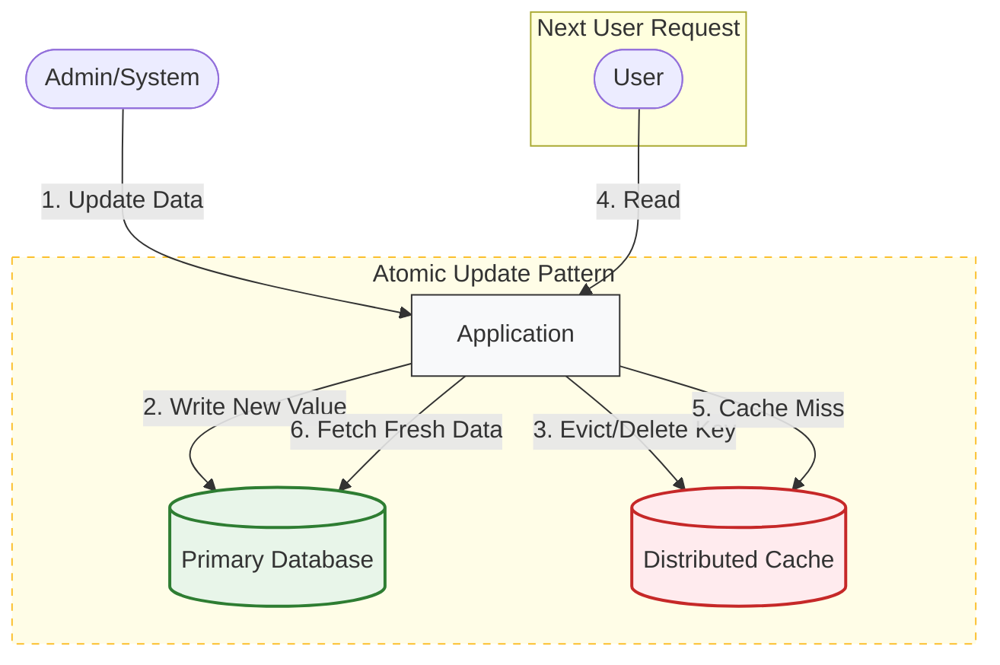
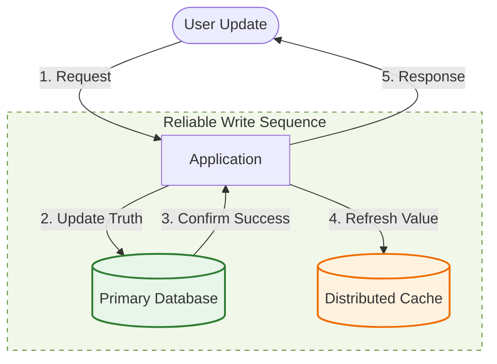
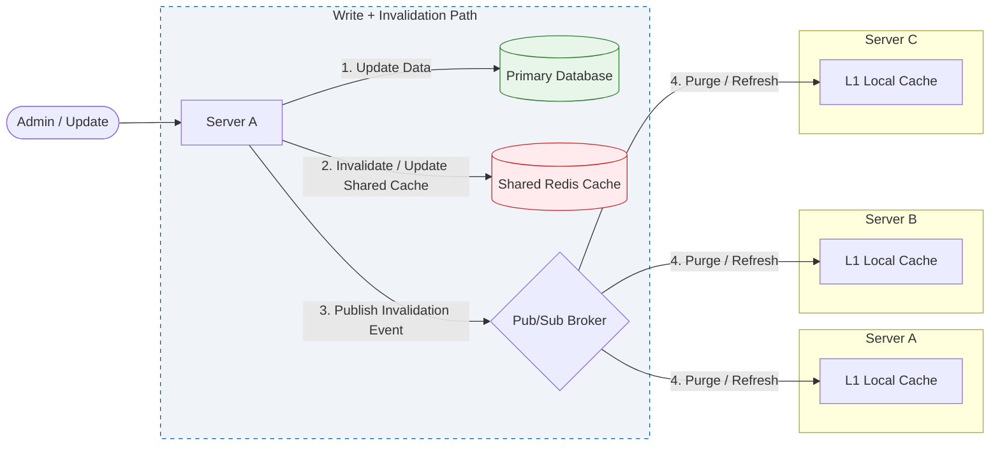
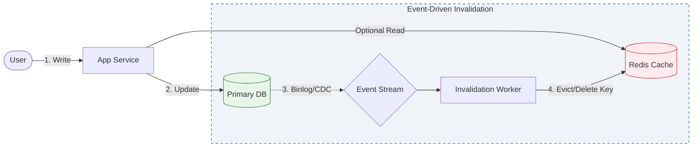

## 1. The Hardest Problem in Caching

---

Caching dramatically improves system performance, but it introduces a new challenge:

> **How do we ensure cached data stays correct when the underlying data changes?**

This problem is known as **cache invalidation**.

There is a famous saying in computer science:

> There are only two hard things in Computer Science:
>
> 1. Cache invalidation
> 2. Naming things

While humorous, it reflects a real engineering challenge.

Once data is cached, it becomes a **copy of the source of truth**. When the original data changes, the cached copy may become **stale**.

If stale data is served to users, the system can behave incorrectly.

---

## 2. What Is Stale Data?

---

Stale data occurs when the cache contains **an outdated version of the data**.

Example scenario:

1. A product price is cached.
2. The price changes in the database.
3. The cache still stores the old price.
4. Users see incorrect information.

### Example Flow



Until the cache is refreshed or invalidated, users continue receiving outdated data.

---

## 3. Why Cache Invalidation Is Difficult

---

Caching seems simple in small systems, but it becomes extremely difficult in **distributed architectures**.

The challenge comes from one fundamental fact:

> Once data is cached, the system now has **multiple copies of the same data**.

When the source of truth (the database) changes, every cached copy must eventually be updated or removed.

If this does not happen correctly, the system begins serving **stale or inconsistent data**.

In small systems this is manageable.

In distributed systems, it becomes significantly harder.

---

### 3.1 The Three Pillars of Inconsistency

In real-world systems, cache invalidation is difficult because of three common architectural problems.

#### 1. Layered Memory (L1 vs L2 Caches)

High-performance systems often use **multiple cache layers**.

For example:

- **Local Cache (L1)** → memory inside each application server
- **Distributed Cache (L2)** → shared cache like Redis

Example architecture:



If Redis is updated, the **local caches on each server may still contain stale data**.

This creates isolated pockets of outdated information sometimes called **"islands of stale data."**

---

#### 2. Replication Lag

Distributed caches and databases often use **replication**.

Example:

```text
Redis Primary → Redis Replica
```

When the primary instance updates data, there is usually a **small propagation delay** before replicas receive the update.

During this window:

- some users may read from the **primary (new value)**
- others may read from the **replica (old value)**

This creates a short period of **temporary inconsistency**.

---

#### 3. The Dual-Write Problem

Updating a database and a cache requires **two separate operations**.

Example flow:

```text
1. Write new value to Database
2. Update Cache
```

If the database update succeeds but the cache update fails due to:

- network failure
- timeout
- service crash

the system enters an inconsistent state:

```text
Database → new value
Cache → old value
```

Until the cache expires or is manually refreshed, users will continue to receive outdated data.

This problem is known as the **dual-write problem**, and it is one of the most common sources of production bugs in distributed systems.

---

### 3.2 Visualizing the Invalidation Gap

The diagram below illustrates how a single database update must propagate through **multiple cache locations** across the system.



In this architecture:

- the **database is the source of truth**
- caches exist across multiple servers
- invalidation signals must propagate through several layers

If any invalidation signal fails to reach a cache node, that node may continue serving **stale data**.

Managing this propagation safely and reliably is what makes **cache invalidation one of the hardest problems in distributed systems**.

---

## 4. Time-To-Live (TTL)

---

The simplest invalidation strategy is **TTL (Time-To-Live)**.

Each cached item is stored with an expiration time.

After the TTL expires, the item is automatically removed from the cache.

### Example

```
Cache Entry: Product:123
TTL: 60 seconds
```

After 60 seconds, the cached data is discarded and must be fetched again.

### Advantages

- simple to implement
- no manual invalidation logic required
- widely supported by caching systems

### Trade-offs

- stale data may be served until expiration
- choosing the correct TTL can be difficult

TTL works best when data does not change frequently.

---

## 5. Explicit Cache Invalidation

---

Another approach is to explicitly remove cached entries when data changes.

Example flow:



Steps:

1. Data is updated in the database.
2. The application deletes the related cache entry.
3. Future requests fetch fresh data.

### Advantages

- fresher data than TTL-based systems
- more predictable consistency

### Trade-offs

- invalidation logic must be carefully implemented
- missing invalidation paths can cause stale data

---

## 6. Update-on-Write Strategy

---

Instead of deleting cache entries, the system can **update the cache when the database changes**.

Example:



Steps:

1. Application writes data to the database.
2. The same update is applied to the cache.

This ensures the cache remains synchronized with the database.

### Advantages

- cache always contains fresh data
- avoids cold cache after invalidation

### Trade-offs

- additional write complexity
- risk of cache/database divergence if updates fail

---

## 7. Event-Driven Cache Invalidation (Pub-Sub)

---

In large distributed systems, explicitly invalidating caches across multiple servers can become difficult.

Instead of directly updating every cache node, systems often use an **event-driven architecture** where data changes produce **invalidation events** that are broadcast to all interested services.

This approach is typically implemented using a **Publish–Subscribe (Pub-Sub) messaging system**.

### How It Works

1. Data is updated in the database.
2. The application publishes an **invalidation event**.
3. A messaging system distributes this event to subscribers.
4. Each cache node receives the event and removes or refreshes the cached data.

This ensures that **all cache nodes eventually become consistent** with the database.

### Architecture Flow



### Advantages

- scales well across many application servers
- avoids tightly coupled invalidation logic
- ensures distributed caches receive updates

### Trade-offs

- introduces messaging infrastructure
- small **eventual consistency window** may still exist
- requires careful handling of message delivery guarantees

### Real-World Examples

Many large-scale systems use event-driven cache invalidation:

| System                  | Technology Used |
| ----------------------- | --------------- |
| Microservices Platforms | Kafka           |
| Redis Clusters          | Redis Pub/Sub   |
| Cloud Architectures     | AWS SNS / SQS   |
| Streaming Platforms     | Event Streams   |

In these architectures, database updates produce events, and cache nodes subscribe to those events to invalidate stale entries automatically.

This pattern is widely used in large distributed systems where caches exist across many services and servers.

---

## 8. Cache Invalidation vs Cache Eviction

---

These two concepts are often confused.

| Concept            | Meaning                                    |
| ------------------ | ------------------------------------------ |
| Cache Invalidation | Removing data because it is outdated       |
| Cache Eviction     | Removing data because cache memory is full |

Invalidation protects **correctness**.

Eviction manages **memory capacity**.

Both mechanisms are essential for stable caching systems.

---

## 9. Real-World Strategies

---

Large-scale systems typically combine multiple approaches.

Example strategies:

- **TTL + Cache-Aside** for general web systems
- **Explicit invalidation** for user updates
- **Event-driven invalidation** using messaging systems
- **Short TTLs** for rapidly changing data

A common real-world architecture:



In this architecture:

- database updates produce events
- cache subscribers listen to those events
- cache entries are refreshed automatically

This approach is common in **large distributed systems**.

---

## Key Takeaways

---

- Cache invalidation ensures cached data remains correct.
- Stale data occurs when cached data diverges from the source of truth.
- TTL is the simplest invalidation strategy.
- Explicit invalidation provides stronger freshness guarantees.
- Many production systems combine multiple invalidation strategies.

---

### 🔗 What’s Next?

Caching systems must also decide **which items to remove when memory is full**.

👉 **Next Concept:**  
**[Cache Eviction Policies](/learning/advanced-skills/high-level-design/7_concepts-phase2/7_5_cache-eviction-policies)**

This concept explains how caches decide which entries to remove using strategies such as **LRU, LFU, and FIFO**.
