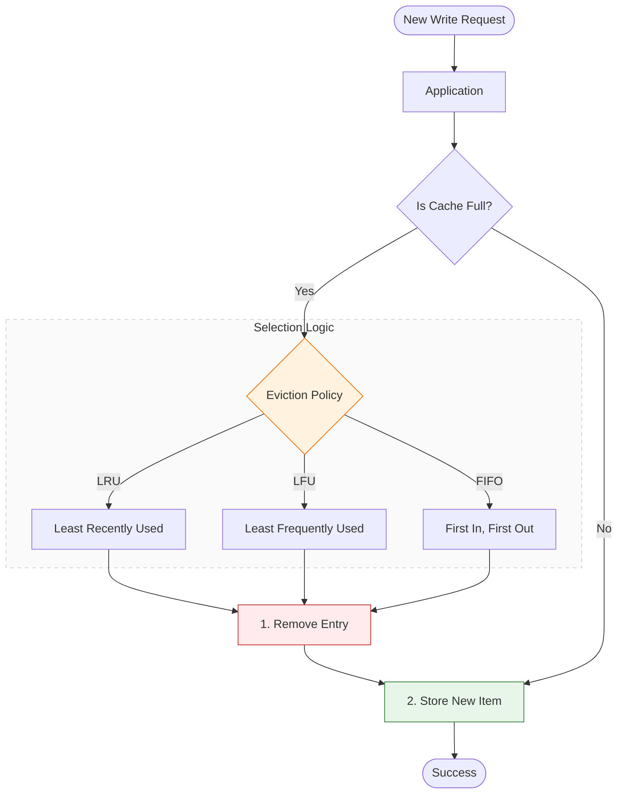

## 1. Why Cache Eviction Exists

---

Caches store data in **fast but limited memory**.

Unlike databases, which store data on disk and can scale to very large sizes, most caches operate primarily in **RAM**, which is significantly faster but also much smaller.

Because of this limitation, a cache cannot store every piece of data indefinitely.

When the cache reaches its memory limit, it must decide **which existing items should be removed to make room for new data**.

This process is called **cache eviction**.

---

## 2. Cache Eviction vs Cache Invalidation

---

Cache eviction is often confused with cache invalidation, but they solve different problems.

| Concept            | Purpose                                              |
| ------------------ | ---------------------------------------------------- |
| Cache Invalidation | Removes data because it is **outdated or incorrect** |
| Cache Eviction     | Removes data because the **cache is full**           |

Invalidation protects **correctness**.

Eviction manages **memory capacity**.

Both mechanisms work together to maintain a healthy caching system.

---

## 3. What Happens When a Cache Is Full?

---

When a cache reaches its capacity, the system must perform an eviction decision.

Example flow:



The **eviction policy** determines which existing cache entry will be removed.

Different eviction strategies aim to remove the data that is **least likely to be needed again**.

---

## 4. Least Recently Used (LRU)

---

The **Least Recently Used (LRU)** policy removes the item that has not been accessed for the longest time.

### Idea

If data has not been used recently, it is less likely to be used again soon.

### Example

```
Cache Capacity = 3

Access order:
A → B → C → A → D
```

When **D** arrives, the cache is full.

The least recently used item is **B**, so it is removed.

Result:

```
Cache = A, C, D
```

### Advantages

- simple and effective
- adapts well to typical access patterns
- widely used in real systems

### Real‑World Usage

LRU is commonly used in:

- Redis
- Memcached
- operating system page caches

---

## 5. Least Frequently Used (LFU)

---

The **Least Frequently Used (LFU)** policy removes the item with the lowest access frequency.

### Idea

Items that are rarely used are less valuable to keep in the cache.

### Example

```
Cache Capacity = 3

Access frequency:
A = 10
B = 2
C = 7
```

If a new item arrives, **B** will be evicted because it has the lowest usage count.

### Advantages

- retains frequently accessed "hot" data
- useful for workloads with strong popularity patterns

### Trade‑offs

- more complex to implement
- frequency counters must be maintained

LFU is often preferred when access patterns are **highly skewed toward popular items**.

---

## 6. First In First Out (FIFO)

---

The **First In First Out (FIFO)** policy removes the item that entered the cache earliest.

### Idea

The oldest cached entry is removed first.

### Example

```
Cache Capacity = 3

Insert order:
A → B → C

New item arrives → D
```

The first item inserted (**A**) is removed.

Result:

```
Cache = B, C, D
```

### Advantages

- extremely simple
- minimal bookkeeping

### Trade‑offs

- ignores usage patterns
- may evict frequently used data

Because of this limitation, FIFO is less commonly used in modern high‑performance caches.

---

## 7. Time‑Based Eviction

---

Some systems evict items based on **expiration time**.

Example:

```
Cache Entry
TTL = 60 seconds
```

After 60 seconds, the item is automatically removed from the cache.

This strategy is commonly combined with other policies such as LRU.

---

## 8. Real‑World Eviction Strategies

---

Production caching systems often combine multiple eviction mechanisms.

Example: **Redis eviction policies**

| Policy       | Behavior                                   |
| ------------ | ------------------------------------------ |
| allkeys‑lru  | Evict least recently used keys             |
| allkeys‑lfu  | Evict least frequently used keys           |
| volatile‑ttl | Evict keys with shortest TTL               |
| noeviction   | Reject writes when memory limit is reached |

These options allow engineers to tune caching behavior based on workload characteristics.

---

## 9. Choosing the Right Eviction Policy

---

The ideal eviction strategy depends on the system's access patterns.

| Workload Type                           | Recommended Policy |
| --------------------------------------- | ------------------ |
| General web applications                | LRU                |
| Highly skewed popularity ("hot" items)  | LFU                |
| Simple systems with predictable inserts | FIFO               |

In most web architectures, **LRU is the default choice** because it balances simplicity and effectiveness.

---

## Key Takeaways

---

- Cache eviction occurs when a cache runs out of memory.
- Eviction removes entries to make room for new data.
- LRU removes the least recently used items.
- LFU removes the least frequently used items.
- FIFO removes the oldest inserted entries.
- Real systems often combine multiple eviction strategies.

---

### 🔗 What’s Next?

So far we explored how caching works, how data is invalidated, and how memory is managed.

The final concept in this caching section explains **how caches are deployed across multiple servers and systems**.

👉 **Next Concept:**  
**[Local vs Distributed Cache](/learning/advanced-skills/high-level-design/7_concepts-phase2/7_6_local-vs-distributed-cache)**
