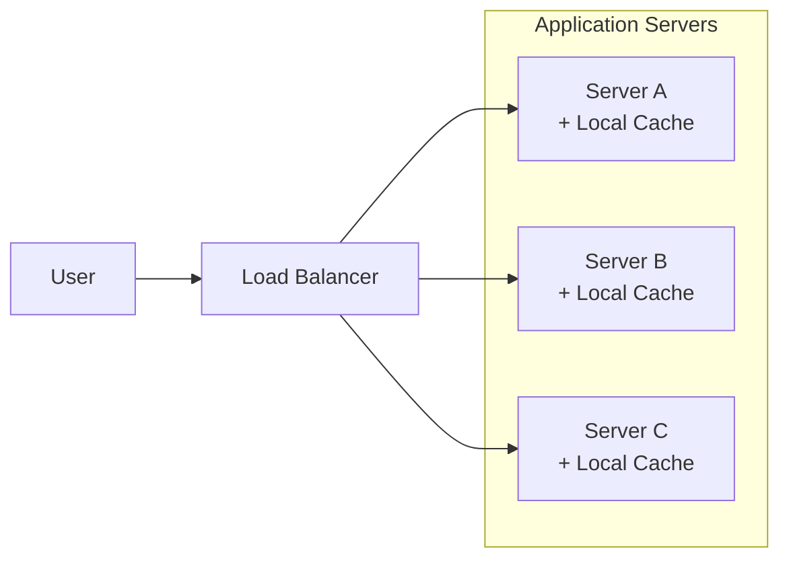
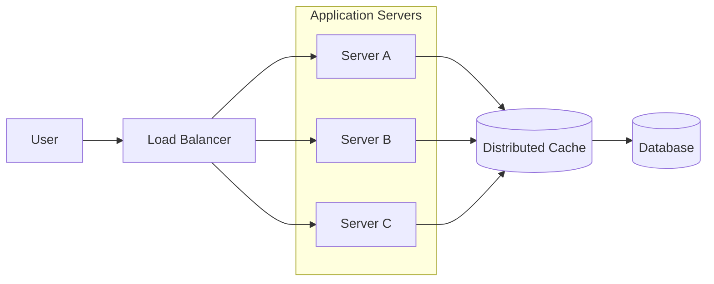
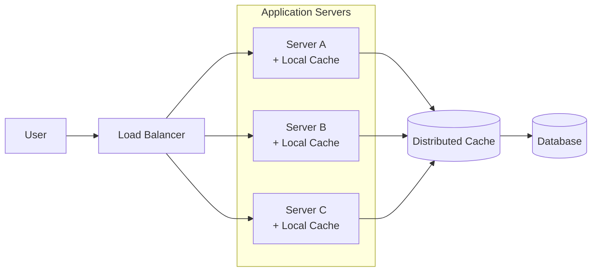
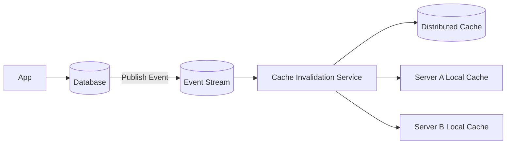
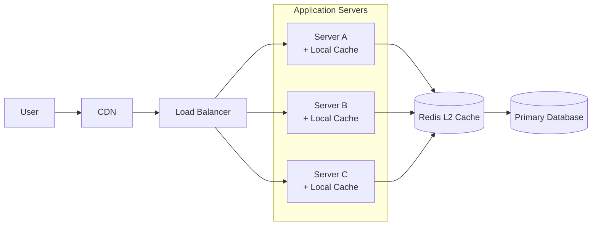

## 1. Why Multiple Cache Layers Exist

---

As systems scale, a single cache layer is often not enough to achieve both **low latency** and **horizontal scalability**.

To address this, modern systems frequently use **multiple layers of caching**.

A common architecture uses:

- **Local Cache (L1)** – memory inside each application server
- **Distributed Cache (L2)** – a shared cache such as Redis or Memcached

These layers work together to balance **speed, consistency, and scalability**.

---

## 2. Local Cache (L1 Cache)

---

A **local cache** is stored directly in the memory of an application instance.

Each server maintains its own independent cache.

### Example



### Characteristics

- extremely fast (memory access)
- no network latency
- simple to implement

### Limitations

Each server has **its own independent cache**.

This means:

- data may become inconsistent across servers
- cache updates on one server are not visible to others

Example issue:

```
Server A cache → new value
Server B cache → old value
```

This problem becomes more severe as the number of servers grows.

---

## 3. Distributed Cache (L2 Cache)

---

A **distributed cache** is shared across multiple application servers.

Instead of storing cache entries inside each application instance, the cache is stored in a **separate system**.

Examples include:

- Redis
- Memcached

### Example Architecture



### Characteristics

- shared across all application servers
- consistent view of cached data
- scalable across multiple nodes

### Trade-offs

- network latency compared to local cache
- additional infrastructure to manage

Despite these trade-offs, distributed caches are essential for **large-scale systems**.

---

## 4. Multi-Layer Caching (L1 + L2)

---

High-performance systems often combine both caching strategies.

Example architecture:



Request flow:

1. Application checks **local cache (L1)**.
2. If missing, it checks **distributed cache (L2)**.
3. If still missing, it queries the **database**.

This approach provides both:

- extremely fast reads (L1)
- shared cache consistency (L2)

---

## 5. Cache Invalidation in Multi-Layer Systems

---

When multiple cache layers exist, invalidation becomes more complex.

Example scenario:

```
Database updated
```

The system must ensure that:

- distributed cache entries are invalidated
- local caches across all application servers are refreshed

A common approach uses **event-driven cache invalidation**.



This ensures all cache layers eventually reflect the latest data.

---

## 6. When to Use Local vs Distributed Cache

---

The choice depends on system requirements.

| Cache Type        | Best For                                      |
| ----------------- | --------------------------------------------- |
| Local Cache       | extremely fast access to frequently used data |
| Distributed Cache | shared cache across multiple servers          |

In practice, many systems use **both layers together**.

---

## 7. Real-World Example

---

A typical production architecture might look like this:



In this architecture:

- **CDN** caches static assets
- **L1 caches** store frequently accessed data locally
- **Redis (L2)** provides shared caching
- **Database** remains the source of truth

---

## Key Takeaways

---

- Local caches (L1) store data inside application servers.
- Distributed caches (L2) provide a shared cache across services.
- Multi-layer caching combines the speed of local caches with the consistency of distributed caches.
- Event-driven invalidation is often required to keep multiple cache layers synchronized.

---

### 🔗 What’s Next?

Caching significantly reduces pressure on the database and improves read performance.  
However, caching alone cannot solve every scalability problem.

As traffic grows, a single application server can still become a bottleneck:

- CPU resources become saturated
- memory usage increases
- concurrent requests exceed what one machine can handle

At this stage, improving performance is no longer about **serving data faster**, but about **handling more requests in parallel**.

This is where **Horizontal Scaling** becomes essential.

Instead of relying on a single server, the system begins distributing traffic across **multiple application instances**, allowing the workload to be shared.

👉 **Up next we explore:**  
**[Horizontal Scaling](/learning/advanced-skills/high-level-design/7_concepts-phase2/7_7_horizontal-scaling)**, where systems move from **one server to many servers**, enabling applications to handle growing traffic reliably.
