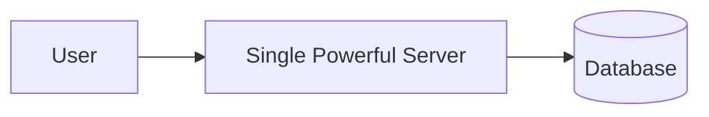
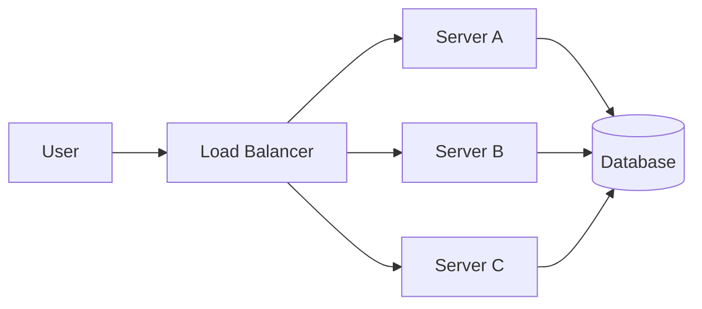
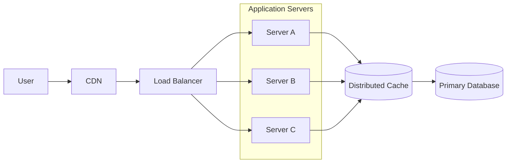

## 1. Why Scaling Becomes Necessary

---

Caching helps reduce the load on the database, but it does not solve every scalability problem.

As an application grows, the **application server itself can become a bottleneck**.

Common symptoms include:

- CPU saturation
- memory pressure
- long request queues
- increased response latency

At some point, a single server can no longer handle the incoming traffic.

To support more users and requests, the system must scale.

---

## 2. Two Ways to Scale a System

---

Systems typically scale in two fundamental ways.

### Vertical Scaling (Scale Up)

Vertical scaling means **increasing the resources of a single machine**.

Example:

- more CPU cores
- more RAM
- faster storage

Example progression:

```
Small Server → Larger Server → Even Larger Server
```

### Vertical Scaling Architecture



### Advantages

- simple to implement
- minimal architectural changes

### Limitations

- hardware limits eventually reached
- expensive at large scale
- single point of failure

Because of these limitations, large systems rarely rely solely on vertical scaling.

---

## 3. Horizontal Scaling (Scale Out)

---

Horizontal scaling means **adding more machines to share the workload**.

Instead of upgrading a single server, the system runs **multiple instances of the application**.

Example progression:

```
1 Server
→ 3 Servers
→ 10 Servers
→ 100 Servers
```

### Horizontal Scaling Architecture



Here, incoming requests are distributed across multiple servers.

Each server handles a portion of the traffic.

---

## 4. Benefits of Horizontal Scaling

---

Horizontal scaling offers several important advantages.

### Increased Capacity

Adding more servers increases the system's ability to handle concurrent requests.

### Fault Tolerance

If one server fails, other servers can continue serving traffic.

### Elastic Growth

Servers can be added or removed depending on demand.

This enables modern **cloud auto-scaling systems**.

---

## 5. New Challenges Introduced by Horizontal Scaling

---

While horizontal scaling improves capacity, it also introduces new architectural challenges.

### Request Distribution

Requests must be routed across servers efficiently.

This requires a **load balancer**, which we will explore in the next concept.

---

### State Management

If application servers store session data locally, users must be routed to the same server.

This limits scalability.

The common solution is to design **stateless application servers**, which we will discuss later.

---

### Shared Resources

Multiple servers now share the same resources such as:

- databases
- distributed caches
- message queues

These shared systems must also be designed to handle higher traffic.

---

## 6. Horizontal Scaling in Modern Architectures

---

A typical horizontally scaled architecture may look like this:



In this architecture:

- **CDN** reduces latency for static assets
- **Load balancer** distributes requests
- **multiple application servers** handle traffic
- **Redis** provides shared caching
- **database** remains the source of truth

This is the foundation of most modern web architectures.

---

## Key Takeaways

---

- Horizontal scaling increases capacity by adding more servers.
- It improves availability and fault tolerance.
- It allows systems to grow elastically as traffic increases.
- However, it introduces new challenges such as request distribution and state management.

---

## What’s Next

Once multiple servers are introduced, the system must decide **how incoming requests are distributed across them**.

👉 **Up next:**  
**[Load Balancing](/learning/advanced-skills/high-level-design/7_concepts-phase2/7_8_load-balancing)**, where we explore how traffic is intelligently routed across application servers.
