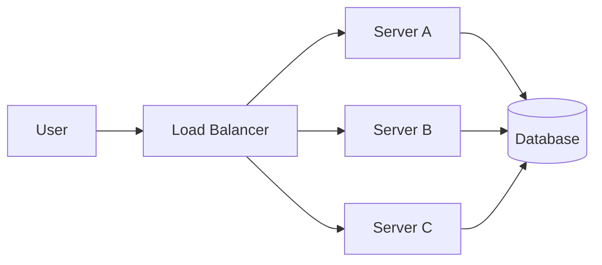
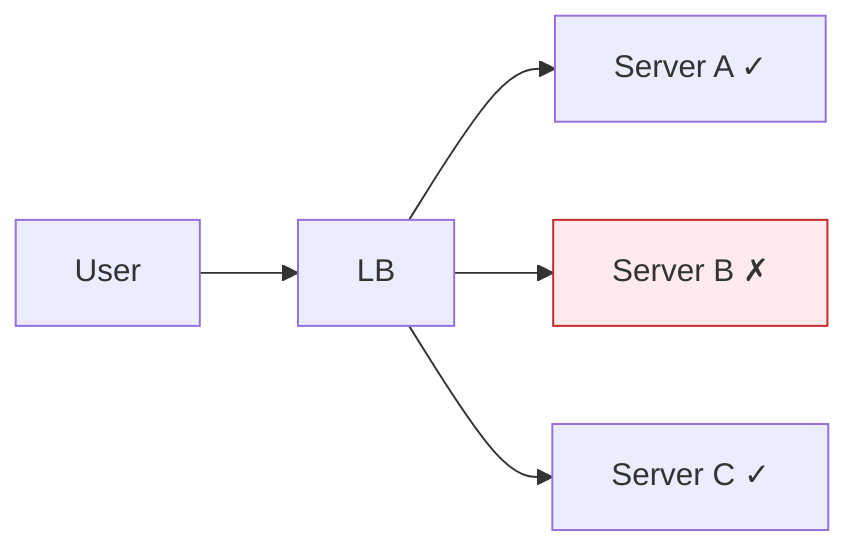
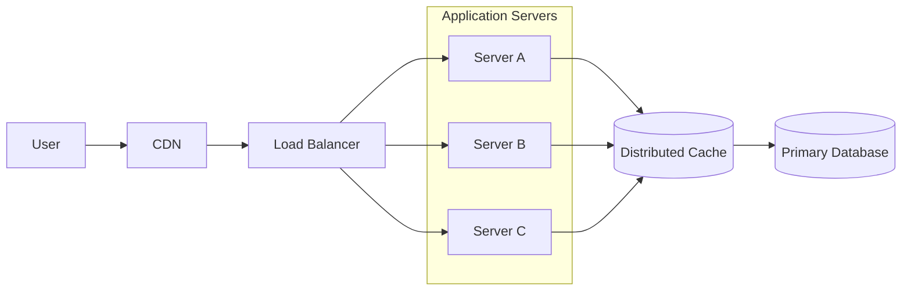

## 1. Why Load Balancing Is Needed

---

In the previous article we introduced **Horizontal Scaling**, where systems add multiple servers to handle growing traffic.

However, once multiple servers exist, a new question appears:

**How does the system decide which server should handle each request?**

If all traffic still goes to one server, the benefits of horizontal scaling disappear.

This is where **Load Balancers** become essential.

A **load balancer** is responsible for **distributing incoming traffic across multiple servers**, ensuring that no single machine becomes overloaded.

---

## 2. Basic Load Balancing Architecture

---

A load balancer sits between users and application servers.



Instead of users connecting directly to servers, all requests first go through the **load balancer**, which decides where the request should be routed.

---

## 3. What a Load Balancer Actually Does

---

A load balancer performs several critical functions.

### 3.1 Traffic Distribution

The primary job of a load balancer is to distribute requests evenly across servers.

Example:

```
Request 1 → Server A
Request 2 → Server B
Request 3 → Server C
Request 4 → Server A
```

This prevents a single server from becoming overwhelmed.

---

### 3.2 Health Checks

Load balancers continuously monitor the health of servers.

If a server becomes unavailable, the load balancer stops sending traffic to it.



This improves **system reliability and fault tolerance**.

---

### 3.3 High Availability

If one server crashes, traffic automatically shifts to other servers.

Users may not even notice the failure.

---

## 4. Load Balancing Algorithms

---

Load balancers use different algorithms to decide where to route requests.

### 4.1 Round Robin

Requests are distributed sequentially across servers.

```
Request 1 → A
Request 2 → B
Request 3 → C
Request 4 → A
```

Simple and widely used.

---

### 4.2 Least Connections

Traffic is sent to the server with the **fewest active connections**.

This works well when requests have different processing times.

---

### 4.3 IP Hash

The client’s IP address determines which server receives the request.

This ensures that requests from the same user often reach the same server.

---

### 4.4 Weighted Distribution

Servers can receive different traffic weights.

Example:

```
Server A (weight 3)
Server B (weight 1)
```

Server A receives more requests because it has more capacity.

---

## 5. Types of Load Balancers

---

Load balancers can operate at different layers of the network stack.

### 5.1 Layer 4 Load Balancer (Transport Layer)

Operates at the **TCP/UDP level**.

Routing decisions are based on:

- IP address
- port numbers

Example technologies:

- AWS Network Load Balancer
- HAProxy (TCP mode)

Layer 4 load balancers are **extremely fast** because they do not inspect application data.

---

### 5.2 Layer 7 Load Balancer (Application Layer)

Operates at the **HTTP/HTTPS level**.

Routing decisions can be based on:

- URL paths
- headers
- cookies
- hostnames

Example:

```
/api → API servers
/images → image servers
```

Example technologies:

- Nginx
- AWS Application Load Balancer
- Traefik

Layer 7 load balancers enable **smarter routing strategies**.

---

## 6. Load Balancers in Modern Architectures

---

A typical production architecture may look like this:



In this architecture:

- **CDN** handles static content
- **Load balancer** distributes application traffic
- **multiple servers** process requests
- **Redis** provides caching
- **database** stores persistent data

This structure allows systems to handle **large amounts of traffic reliably**.

---

## 7. Load Balancers and System Evolution

---

As systems scale, load balancers become central infrastructure components.

A typical evolution looks like this:

```
Single Server
↓
Multiple Servers
↓
Load Balancer introduced
↓
Traffic distributed across servers
```

Without load balancing, horizontal scaling would not work effectively.

---

## Key Takeaways

---

- Load balancers distribute incoming traffic across multiple servers.
- They prevent individual servers from becoming overloaded.
- They improve system reliability through health checks and failover.
- Load balancing algorithms determine how requests are distributed.
- Layer 4 and Layer 7 load balancers operate at different levels of the network stack.

---

## What’s Next

Load balancing introduces another important design consideration.

If application servers store **session state locally**, the load balancer may be forced to send the same user to the same server.

This reduces the flexibility of traffic distribution.

👉 Up next we explore **Stateless Application Servers**, a design approach that allows load balancers to distribute requests freely across servers.
