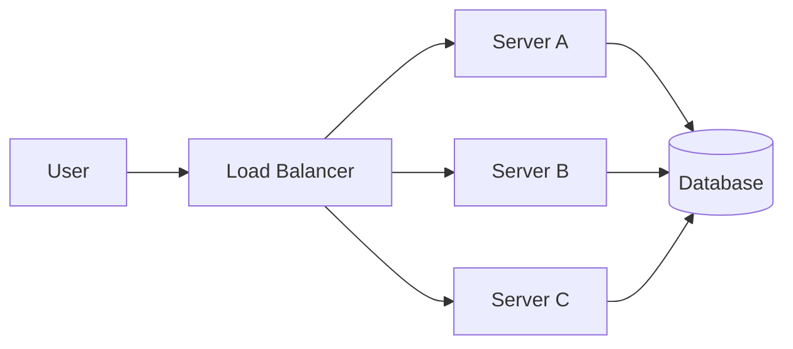
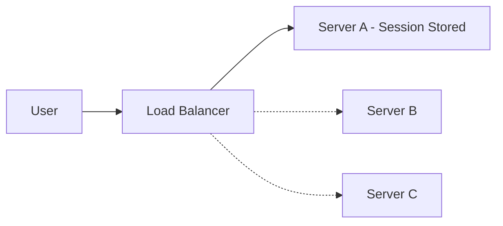
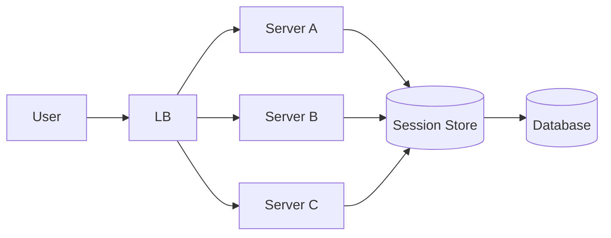
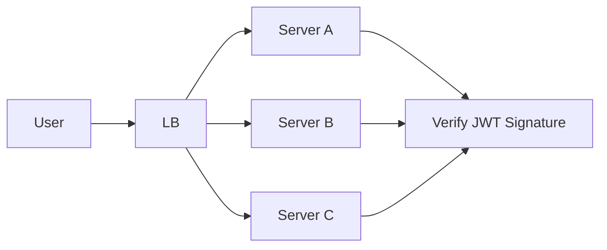
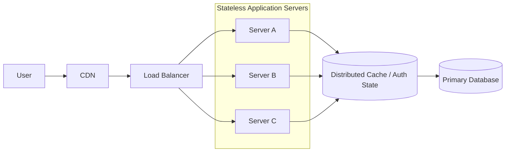

## 1. Why Stateless Servers Matter

---

In the previous articles we introduced:

- **Horizontal Scaling** — running multiple application servers
- **Load Balancing** — distributing traffic across those servers

However, this architecture introduces a new challenge.

If application servers store **user session data locally**, the load balancer may need to route requests from the same user to the **same server** every time.

This limits the flexibility of load balancing and reduces system scalability.

To solve this problem, modern systems are designed with **stateless application servers**.

---

## 2. What “Stateless” Means

---

A **stateless server** does not store any user session information between requests.

Each request contains all the information required for processing.

Example request:

```
GET /profile
Authorization: Bearer <token>
```

Because the server does not rely on stored session state, **any server in the cluster can process the request**.

---

## 3. Stateless Architecture

---



In this architecture:

- requests can go to **any server**
- servers do not depend on previous requests
- the system scales easily by adding more servers

---

## 4. What Happens If Servers Store Sessions

---

Many early web architectures stored **session state directly in server memory**.

Example:

```
User logs in
Session stored in Server A memory
```

Now every future request from that user must go back to **Server A**.

This creates a dependency between the user and the server.

---

## 5. Sticky Sessions (Session Affinity)

---

To support server-side sessions, load balancers sometimes use **sticky sessions**.

Sticky sessions ensure that requests from the same user are routed to the same server.

### Sticky Session Architecture



Here the load balancer remembers which server handled the user’s first request.

Future requests from that user are always routed to the same server.

---

## 6. Problems With Sticky Sessions

---

Sticky sessions introduce several problems in distributed systems.

### Uneven Traffic Distribution

Some servers may receive more traffic than others.

### Reduced Fault Tolerance

If the server storing the session crashes, the user session is lost.

### Poor Scalability

Adding new servers does not help existing sessions because users remain bound to their original servers.

For these reasons, modern architectures try to **avoid sticky sessions whenever possible**.

---

## 7. Modern Solution: External Session Storage

---

Instead of storing sessions inside application servers, modern systems often move session data to **external shared storage**.

Common options include:

- Redis
- Memcached
- distributed databases

In this model the **session still exists on the server side**, but it is stored in a **shared infrastructure component** instead of inside a single application server.

### Architecture



### How It Works

1. A user logs in.
2. The server creates a **session object**.
3. The session is stored in **Redis (or another shared store)**.
4. The client receives a **session ID cookie**.
5. On each request, the server retrieves the session from Redis.

Because all servers share the same session store, **any server can process the request**.

### Important Clarification

Even though sessions are no longer stored inside the application server, the system is **still considered stateful**.

This is because **user session state is still maintained by server-side infrastructure (Redis or a database)**.

The server must perform a **session lookup on every request**, which means the system still maintains user state.

This approach removes the need for sticky sessions and improves scalability, but it is **not fully stateless**.

---

## 8. Token-Based Stateless Authentication

---

Another approach removes server-side session storage entirely.

Instead of storing session data on the server, authentication state is encoded inside a **token** that the client sends with every request.

Example:

```
JWT Token
```

The token typically contains information such as:

- user identity
- permissions
- expiration time

Because this information travels **with every request**, the server does not need to store session data or perform a session lookup.

Instead, the server simply **verifies the token**.

---

### 8.1 Token Verification

Each application server is able to verify the token **independently**.

This works because JWT tokens are **cryptographically signed**.

During authentication:

1. The authentication service generates a JWT.
2. The token is signed using a **secret key or private key**.
3. The client stores the token.
4. The token is sent with each request.

When a request arrives, the application server:

1. extracts the token
2. verifies the **signature**
3. checks expiration time
4. reads the claims (user id, roles, etc.)

Because the verification only requires the **signing key**, every server can validate the token without contacting another system.



This makes the system **fully stateless**, because user state is no longer stored in server infrastructure.

This approach is widely used in **modern APIs and microservices architectures**.

---

### 8.2 Why JWT Alone Is Sometimes Not Enough

While JWT eliminates server-side session storage, it introduces a new challenge.

Because the token is self-contained, **the server cannot easily revoke it**.

Example scenario:

```text
User logs out
JWT token still valid until expiry
```

The server has no built-in way to invalidate the token before its expiration.

This creates operational problems such as:

- logout handling
- token revocation
- compromised account recovery
- refresh token management

---

### 8.3 Why Systems Still Use Redis

To solve these problems, many systems introduce **shared storage such as Redis** alongside JWT.

Example uses include:

- storing **refresh tokens**
- maintaining **token revocation lists**
- managing **login sessions**
- tracking **active devices**

Architecture example:

```code
Access Token → JWT (short lived)
Refresh Token → stored in Redis or database
```

This allows the system to remain **stateless for normal requests**, while still maintaining **control over authentication sessions**.

---

### 8.4 When Systems Use Both

In many real systems, both approaches are combined:

- **JWT** is used for authentication
- **Redis or a database** may still store refresh tokens, revocation lists, or other shared data

This hybrid approach balances:

```code
stateless request handling
+
centralized session control
```

It is widely used in modern **API gateways and microservice architectures**.

---

## 9. Stateless Systems in Practice

---

A typical modern architecture combines several concepts we have covered so far.



Here:

- servers remain **stateless**
- Redis may store shared data such as caches, sessions, refresh tokens, or other distributed state.
- the load balancer can route traffic freely

This architecture supports **high scalability and reliability**.

---

## Key Takeaways

---

- Stateless servers do not store session state between requests.
- This allows load balancers to route requests to any server.
- Sticky sessions bind users to specific servers and reduce scalability.
- Modern systems use shared session storage or tokens instead of server-side sessions.

---

### 🔗 What’s Next?

So far we scaled systems using:

- caching
- horizontal scaling
- load balancing
- stateless servers

The next step is improving **global performance and latency**.

👉 Up Next: **Content Delivery Networks (CDN)**, which allow systems to serve users from locations closer to them.
