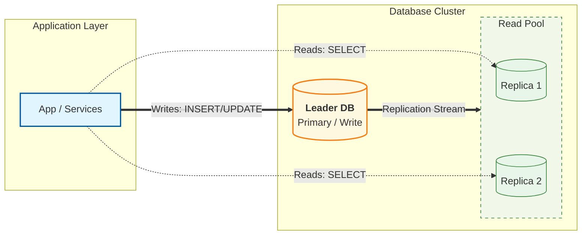

# Database Replication — Leader/Replica Basics

---

In Phase 3, once we scaled the payment service fleet, the next pressure moved to the database:

- more service instances → more concurrent reads
- read traffic grows faster than write traffic in many systems

A common first step to scale reads is **database replication**.

Replication helps with:

- **read scalability** (serve reads from replicas)
- **availability** (a replica can become leader on failover)

But replication also changes the correctness picture:

> you can now read data that is not up-to-date.

This article introduces the baseline replication model and the mental shift it requires.

---

## 1. What Replication Is (Practical Definition)

---

**Replication** means keeping copies of the same dataset on multiple nodes.

Typically:

- one node is the **leader (primary)**
- one or more nodes are **replicas (followers)**

The leader accepts writes and produces a stream of changes.

Replicas apply those changes to stay in sync.

---

## 2. Baseline Model: Writes to Leader, Reads from Replicas

---

A common baseline setup:

### Why this scales reads

- reads can be distributed across replicas
- leader is protected from heavy read load
- you gain capacity without sharding data

### What doesn’t change

- writes still go through one leader
- the leader remains a bottleneck for write-heavy systems (sharding is a later topic)

---

## 3. How Replication Happens (High-Level)

---

Most systems replicate using a change stream:

- leader commits a transaction
- leader emits changes (WAL/binlog/redo log)
- replicas apply changes in order

Two important points:

1. replicas are always “catching up”
2. the speed of catching up is not always equal to the speed of incoming writes

That gap is replication lag (next article).

---

## 4. Replication Modes (Baseline vs Advanced)

---

### 4.1 Asynchronous replication (common baseline)

- leader commits immediately
- replicas catch up after

Pros:

- low write latency
- high throughput

Cons:

- replicas can be stale
- failover can lose the last few committed writes (depending on setup)

### 4.2 Synchronous replication (advanced)

- leader waits for replica acknowledgements before commit

Pros:

- stronger durability guarantees across nodes

Cons:

- higher write latency
- reduced throughput
- more complex operations

We treat synchronous replication as an advanced option (we will cover this in later article).

---

## 5. What Replication Changes in System Design

---

Once you add replicas, you must answer:

### 5.1 Where do reads go?

Not all reads are equal.

- **critical reads** (payment status right after a charge) must be correct
- **non-critical reads** (history page) can tolerate slight staleness

This becomes a deliberate routing decision (we will cover in this later article).

### 5.2 What happens on failover?

If the leader fails, a replica may be promoted.

Failover introduces:

- a period of unavailability during promotion
- risk of losing very recent writes (async case)
- need for client retry logic

We keep failover details high-level in this phase; deep operations belong later.

---

## 6. Phase 3 Connection (Payments)

---

Payments are correctness-sensitive.

So Phase 3 chose an explicit baseline policy:

- **Writes → Leader**
- **Critical reads → Leader**
- **Non-critical reads → Replicas**
- plus a short **read-your-writes window** for user experience

Replication helps scale reads, but correctness requires careful read routing (next articles).

---

## Key Takeaways

---

- Replication keeps copies of data across multiple DB nodes.
- Baseline model: **writes to leader**, **reads can be served from replicas**.
- Replication improves read scalability and availability, but introduces a new correctness risk: stale reads.
- Asynchronous replication is the common baseline; synchronous replication is an advanced trade-off.
- System design now requires deliberate read routing and failover thinking.

---

## TL;DR

---

Leader/replica replication is the standard way to scale reads.

It improves capacity and availability, but changes correctness: replicas may be stale. That’s why you must decide which reads can go to replicas and which must go to the leader.

---

### 🔗 What’s Next

Next we’ll focus on the core problem replication introduces:

- replication lag windows
- how stale reads happen in practice
- symptoms and real production impact

👉 **Up Next: →**  
**[Database Replication — Replication Lag & Stale Reads](/learning/advanced-skills/high-level-design/8_concepts-phase3/8_12_database-replication-lag-stale-reads)**
