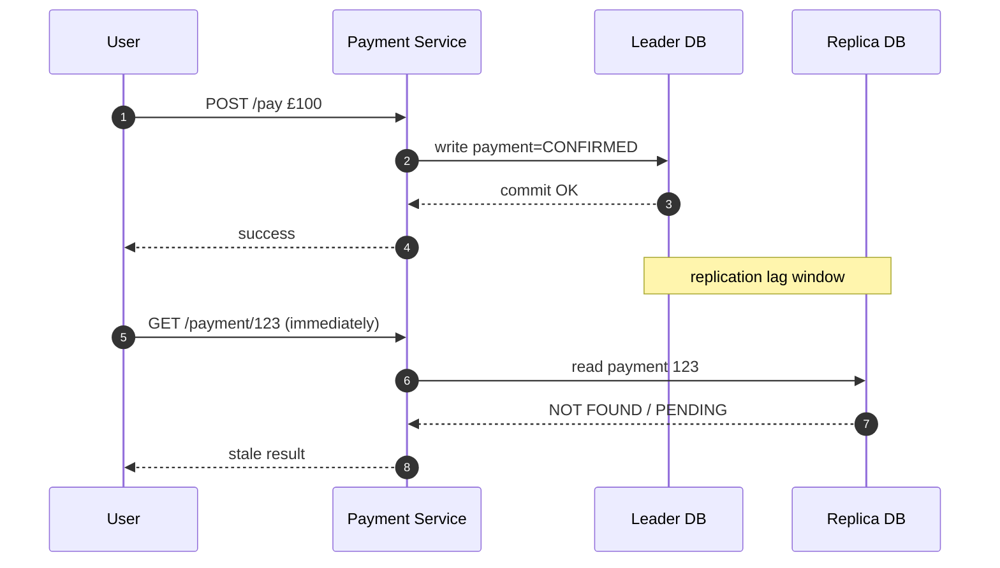

# Database Replication — Replication Lag & Stale Reads

---

Replication is a powerful scaling tool:

- writes go to the leader
- reads can be distributed across replicas

But replication introduces a new correctness problem:

> **the leader and replicas can temporarily disagree.**

That disagreement window is called **replication lag**.

Replication lag is not rare.

It appears in normal production conditions due to:

- traffic spikes
- heavy writes
- slow disks
- network jitter
- replica overload

This article explains what lag is, why it happens, and how it creates stale reads.

---

## 1. What Replication Lag Actually Means

---

Replication lag means:

- the leader has committed changes
- the replica has not applied them yet

So:

- leader state is **newer**
- replica state is **older**

Even if lag is “only” hundreds of milliseconds, it can break correctness for user-facing flows that expect read-after-write consistency.

---

## 2. The Stale Read Scenario (The Classic Failure)

---

A typical stale read looks like this:

1. user makes a write (payment confirmed)
2. user immediately reads status/history
3. the read is routed to a replica
4. replica has not applied the write yet
5. user sees “payment missing” or “still pending”

From the user’s perspective:

> “I just paid, but the system says it didn’t happen.”

That becomes:

- support tickets
- duplicate retries
- distrust

---

## 3. Why Replication Lag Happens

---

Replication is a pipeline:

- leader produces changes
- replicas consume and apply them

Lag happens when replicas cannot keep up.

Common reasons:

### 3.1 Write bursts and backlog

During spikes:

- leader commits many transactions quickly
- replicas get a backlog of changes to apply

### 3.2 Network latency and jitter

The replication stream is delivered over the network.

Network instability introduces delay.

### 3.3 Replica resource constraints

Replicas need CPU/IO to apply changes.

Lag grows when replicas are:

- under-provisioned
- sharing resources
- overloaded by heavy read queries

### 3.4 Long-running queries on replicas

Replicas often serve reads.

Long-running queries can:

- consume IO
- hold resources
- slow down applying replication changes

This creates the ironic failure:

> “We added replicas to scale reads, and reads made replicas stale.”

---

## 4. Why Stale Reads Are Dangerous (Not Just a UX Issue)

---

Some reads are “nice to have”.

Some are correctness-critical.

Stale reads can cause:

- double actions (“I didn’t see it, so I retried”)
- incorrect business decisions (fraud/risk based on stale state)
- inconsistent workflows (next step depends on a read)

In payment systems, stale reads are especially dangerous for:

- payment status immediately after confirmation
- balance checks
- duplicate detection logic if it relies on reads

This is why Phase 3 explicitly separated:

- **critical reads**
- **non-critical reads**

---

## 5. The Lag Window Is a Consistency Model

---

Replication lag creates a natural consistency model:

- leader is strongly consistent (for committed writes)
- replicas are eventually consistent

So the system behaves like:

- **read-your-writes is not guaranteed on replicas**
- “eventual” convergence happens after lag window closes

This is not a bug.

It is a trade-off you make for scaling.

The question becomes:

> which reads can tolerate this trade-off?

That is what we solve next.

---

## 6. Early Warning Signals in Production

---

Replication lag is measurable.

Common production signals:

- lag metrics (seconds behind leader)
- replica apply backlog (queued WAL/binlog bytes)
- rising p99 for replica reads
- increased “not found” or “pending” right after writes
- spikes in retries and duplicate requests

Lag is often the hidden root cause behind:

- users retrying actions
- systems “flapping” between states
- “it eventually shows up” complaints

---

## Key Takeaways

---

- Replication lag is the window where leader has committed writes but replicas haven’t applied them.
- Lag causes stale reads: read-after-write can return old state if routed to replicas.
- Lag happens due to bursts, network jitter, replica resource limits, and heavy read load.
- Stale reads are dangerous for correctness-critical flows (payments, balances, state transitions).
- Replication lag effectively creates eventual consistency for replica reads.

---

## TL;DR

---

Replicas are not instantly consistent with the leader.

Replication lag creates a stale-read window where users can see old state immediately after a successful write. This is normal in async replication, so systems must route critical reads to the leader and treat replica reads as eventually consistent.

---

### 🔗 What’s Next

Next we’ll convert this into a practical design toolkit:

- critical vs non-critical reads
- read-your-writes window
- safe read routing strategies
- what Phase 3 explicitly chose for payments

👉 **Up Next: →**  
**[Database Replication — Read Strategies (Critical vs Non-critical + Read-your-writes)](/learning/advanced-skills/high-level-design/8_concepts-phase3/8_13_database-replication-read-strategies)**
