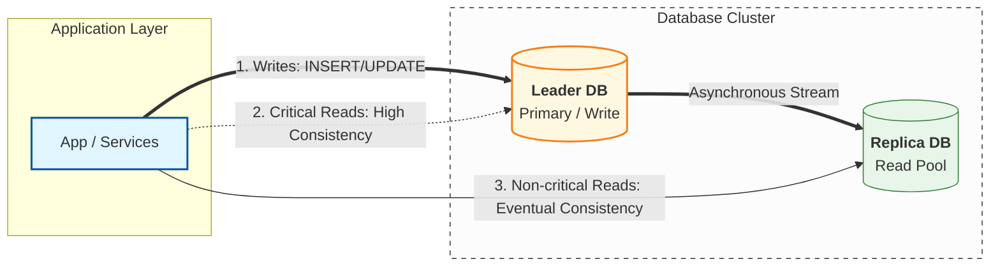
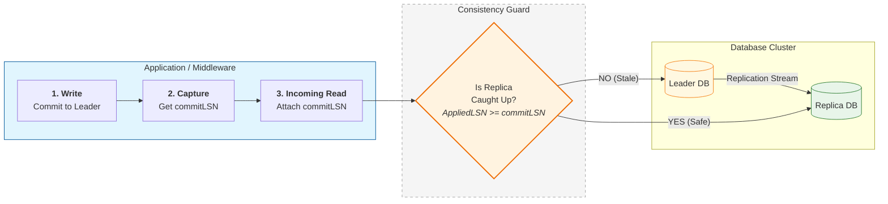

# Database Replication — Read Strategies (Critical vs Non-critical + Read-your-writes)

---

In the previous article, we saw the unavoidable truth of replica reads:

> replicas can be stale during the replication lag window.

That means replication is not just a scaling feature.

It is also a **consistency decision**.

So the practical question becomes:

> **Which reads can tolerate staleness, and which cannot?**

This article gives a toolkit to route reads safely:

- critical vs non-critical read classification
- leader vs replica routing strategies
- how to provide read-your-writes for good UX after a write

---

## 1. Classify Reads: Critical vs Non-critical

---

Not all reads are equal.

### 1.1 Critical reads (must be correct “now”)

These reads directly affect:

- money correctness
- workflow progression
- user trust immediately after an action

Payment examples:

- payment status immediately after confirmation
- current available balance before another debit
- “has this idempotency key already been processed?”
- fraud/risk checks based on freshest state

For critical reads:

- stale results can cause incorrect actions (or duplicate retries)

So critical reads should go to the **leader**.

### 1.2 Non-critical reads (can tolerate slight staleness)

These reads are used for:

- history and browsing
- analytics and dashboards
- delayed UX consistency

Examples:

- transaction history list (older pages)
- notification inbox list (except immediately after write)
- “recent payments” on account overview

For non-critical reads:

- serving from replicas is usually acceptable
- the UI can tolerate eventual convergence

---

## 2. Baseline Policy: Writes to Leader, Critical Reads to Leader

---

A simple baseline policy for correctness-sensitive systems:

- **Writes → Leader**
- **Critical reads → Leader**
- **Non-critical reads → Replicas**

This policy is easy to reason about and usually matches production reality.

---

## 3. Read-your-writes (RYW): The UX Consistency Trick

---

Users expect a simple guarantee:

> If I just did something successfully, I should see it immediately.

Replication breaks this if you route the next read to a replica.

So many systems provide a practical guarantee called:

- **Read-your-writes (RYW)**

RYW means:

- after a successful write, route that user’s reads to the leader for a short window
- then return to normal replica routing for non-critical reads

---

## 4. Practical RYW Strategies

---

There are multiple ways to implement RYW. You can choose based on complexity.

### 4.1 Time-window “sticky leader reads” (baseline approach)

After a write:

- set `forceLeaderReadsUntil = now + 30s` (example)
- for that user/session, route reads to leader until the deadline

This works because replication lag windows are usually shorter than that window.

Pros:

- easy
- good UX

Cons:

- over-routes some reads to leader during the window

### 4.2 Session stickiness / routing hint token

The backend returns a routing hint:

- “for the next N seconds, read from leader”

This can be embedded in:

- session
- JWT claim
- cookie or header

Pros:

- explicit and controllable
- avoids server-side session state if you encode it

Cons:

- more moving parts (clients and gateways must propagate)

### 4.3 Version-based reads (advanced)

Instead of using a time window (“read from leader for 30 seconds”), you can make **read-your-writes** precise by routing reads using a replication progress marker.

Most replicated databases expose a monotonic “log position” such as:

- **LSN** (Log Sequence Number) in WAL-based systems, or
- binlog position / GTID in others

**How it works (conceptually):**

1. After a write commits on the **leader**, record its commit position (e.g., `commitLSN`).
2. For the next read, choose a replica only if that replica has applied changes up to at least that position:
   - route to replica if `replicaAppliedLSN >= commitLSN`
   - otherwise route to leader (or wait briefly)

This ensures the user never reads from a replica that is “behind” their last write.

Pros:

- more precise than a time-based window
- reduces unnecessary leader reads when replicas are already caught up

Cons:

- requires visibility into replica progress (applied LSN/position per replica)
- adds routing complexity and operational edge cases (failover, stale metrics)

This is typically beyond a baseline payment system design, but it’s a common approach in mature platforms that need strong UX consistency while still using replicas heavily.

---

## 5. What Our Payment Design Chooses (Phase 3 Baseline)

---

Phase 3 explicitly chose:

- **Writes → Leader**
- **Critical reads → Leader**
- **Non-critical reads → Replicas**
- plus **RYW for a short window after payment** (better UX and fewer retries)

This matches the user-facing truth:

- users tend to refresh immediately after an action
- stale reads create retries and distrust
- forcing leader reads for a short period reduces these incidents

---

## 6. Common Mistakes (What to Avoid)

---

### Mistake A — “Send everything to replicas”

This creates:

- stale read bugs in workflows
- retries that generate duplicates (even with idempotency)
- incorrect user-facing state right after writes

### Mistake B — “RYW forever”

If you never return to replica reads, you lose the main value of replication.

RYW should be:

- bounded
- used only for a short window or for critical flows

### Mistake C — “Treat all reads as critical”

This over-protects correctness and under-delivers scalability.

The whole point of replication is:

- move safe reads off the leader

---

## Key Takeaways

---

- Replication introduces lag → stale reads are normal.
- The safe toolkit is **read classification**:
  - critical reads → leader
  - non-critical reads → replicas
- Read-your-writes is a practical UX consistency feature:
  - after a write, route reads to leader briefly
- Phase 3 baseline used leader reads for critical paths and RYW after payment.

---

## TL;DR

---

With replication, you must choose where reads go.

Send critical reads to the leader, route non-critical reads to replicas, and use a short read-your-writes window after writes to prevent confusing stale results and duplicate retries.

---

### 🔗 What’s Next

Next we’ll go operational:

- how replication lag is measured
- what metrics and alerts matter
- how systems degrade safely when lag spikes

👉 **Up Next: →**  
**[Database Replication — Monitoring Lag & Safe Degradation](/learning/advanced-skills/high-level-design/8_concepts-phase3/8_14_database-replication-monitoring-safe-degradation)**
