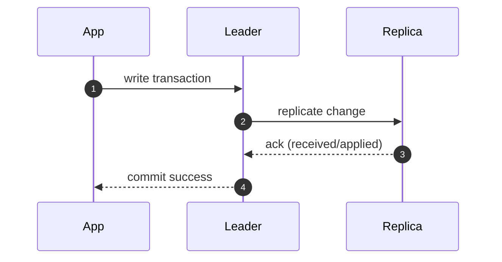

# Database Replication — Synchronous Replication & Quorum Reads (Advanced)

---

In earlier replication concepts, we assumed the common baseline:

- leader commits
- replicas catch up asynchronously
- stale reads are normal during lag

That baseline gives great performance, but it trades away freshness and, in some configurations, durability under failure.

This article covers stronger (and more expensive) options:

- **synchronous replication** (stronger write durability / freshness)
- **quorum reads/writes** (a tunable approach used in distributed databases)

These are not baseline choices for a simple payment system, but they are important tools to understand.

---

## 1. Why Stronger Replication Exists

---

Async replication introduces two common concerns:

1. **Read freshness:** replicas may be stale after a commit.
2. **Failover durability risk:** if the leader dies before replicas apply the last commits, you may lose those commits (depending on topology and failover policy).

If your system cannot tolerate these windows, you may choose stronger replication.

---

## 2. Synchronous Replication (What It Means)

---

In **synchronous replication**, a leader considers a transaction “committed” only after one or more replicas confirm they have received (or applied) the change.

High-level model:

### 2.1 What you gain

- stronger durability across node failure
- fewer stale reads (replicas are closer to leader)

### 2.2 What you pay

- higher write latency (commit waits for replica acks)
- reduced throughput during replica slowness
- sensitivity to network jitter (replication path becomes part of write latency)

In practice, “synchronous” is often configurable:

- wait for 1 replica (semi-sync)
- wait for majority
- wait for “received” vs “applied”

Each choice is a different cost/benefit point.

---

## 3. Quorum Reads and Writes (Distributed DB Model)

---

In leader/replica relational setups, quorum is not the most common model.

But in distributed databases (and some replicated stores), you often see:

- replication factor **N**
- reads require **R** acknowledgements
- writes require **W** acknowledgements

The classic quorum rule:

> If **R + W > N**, a read quorum overlaps a write quorum, which increases the chance of reading the latest value.

Example:

- N=3 replicas
- W=2 (write waits for 2)
- R=2 (read consults 2)

Then any read quorum overlaps with the last write quorum, making stale reads less likely.

### 3.1 What quorum reads/writes give you

- tunable balance of latency vs consistency
- flexibility under failures

### 3.2 What they do not magically guarantee

Even with R+W>N:

- you still need conflict resolution if multiple writers exist
- you can still observe older values depending on timing and “applied vs received”
- operational complexity increases

Quorum is a powerful tool, but not a free correctness guarantee.

### 3.3 Important: Where quorum is actually implemented

Quorum reads/writes are typically **not something you implement in application code** on top of a normal leader–replica SQL setup.

They are usually a **database feature** exposed by distributed storage systems (Dynamo/Cassandra-style designs), where the client can choose per-operation consistency:

- set replication factor **N**
- choose **R** (how many replicas must respond to a read)
- choose **W** (how many replicas must acknowledge a write)

**Example (distributed DB style):**

- `N = 3`, `W = QUORUM`, `R = QUORUM` → stronger freshness (with higher latency)
- `N = 3`, `W = QUORUM`, `R = ONE` → faster reads, may be stale

In these systems, the choice is often exposed as a **consistency level** (e.g., `ONE / QUORUM / ALL`) on each read/write operation.

So treat quorum as an _advanced model supported by some distributed databases_, not something you “bolt onto” every replication setup.

### 3.4 How this maps to Postgres/MySQL (practical takeaway)

In traditional relational leader/replica setups (Postgres/MySQL):

- there is typically **one leader** that accepts writes
- replicas apply changes asynchronously (or semi-synchronously)
- you usually **do not** configure per-request quorum `R/W` like Dynamo/Cassandra

So the common “SQL replication” toolkit for correctness is:

- **critical reads → leader**
- **non-critical reads → replicas**
- **read-your-writes** (time window or LSN/binlog-position based routing)
- optional **synchronous / semi-synchronous replication** if you’re willing to pay write latency

**Examples (SQL world):**

- **PostgreSQL:** synchronous replication can be configured so commits wait for replica acknowledgement (stronger durability, higher latency).
- **MySQL:** semi-synchronous replication can be used to wait for at least one replica to receive the transaction before acknowledging the commit.

In other words:

- distributed quorum systems give you **R/W knobs**
- SQL leader/replica systems give you **read routing + optional sync replication**

That’s why Phase 3 uses leader routing + read-your-writes as the baseline, and treats quorum as an advanced model.

---

## 4. When Synchronous or Quorum Is Worth It

---

These approaches are used when:

- correctness requires stronger freshness guarantees
- you cannot tolerate losing recent commits on leader failover
- you are willing to pay latency for stronger durability

Examples:

- financial ledger systems with strict durability expectations
- inventory systems where oversell is unacceptable
- coordination metadata stores (critical configuration/state)

But many payment systems still run:

- async replication
- critical reads from leader
- RYW windows

because it gives good UX and performance with simpler operations.

---

## 5. Why This Is Not the Baseline for Phase 3

---

Phase 3’s baseline design chooses simpler, more common production defaults:

- async replication for read scaling
- leader reads for critical flows
- replicas for non-critical flows
- short RYW window after write

Reasons:

- it’s easier to reason about
- less write latency penalty
- avoids turning replication health into a direct payment latency driver

Synchronous/quorum options are tools to know, not defaults to start with.

---

## Key Takeaways

---

- **Synchronous replication** improves durability/freshness by waiting for replica acknowledgements before commit.
- It costs write latency and throughput, especially under network jitter or slow replicas.
- **Quorum reads/writes (N,R,W)** provide tunable consistency in distributed replicated stores.
- These are used when you must pay latency for stronger guarantees.
- Phase 3 baseline stays with async replication + leader routing + RYW for simplicity and performance.

---

## TL;DR

---

Async replication is the common baseline, but it creates lag windows.

Synchronous replication and quorum reads/writes reduce those windows by waiting for more acknowledgements, at the cost of higher write latency and operational complexity. Use them when durability/freshness requirements justify the cost.

---

### 🔗 What’s Next

Next we’ll move from replication mechanics to the vocabulary that system designers use to reason about correctness:

- strong vs eventual vs causal
- read-your-writes and monotonic reads
- why “consistency” has multiple meanings

👉 **Up Next: →**  
**[Consistency Models — Vocabulary That Actually Matters](/learning/advanced-skills/high-level-design/8_concepts-phase3/8_16_consistency-models-vocabulary)**
