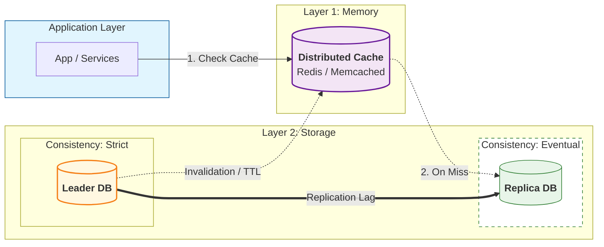

# Consistency Models — Consistency With Caches (Bridge)

---

Phase 2 introduced caching for scalability.

Phase 3 introduced replication for read scaling.

In production systems, you often have **both**:

- caches (Redis, CDN, local caches)
- database replicas (leader/replica)

That means there are now multiple places where stale reads can appear:

- cache may be stale
- replica may be stale
- cache might be built from a replica (even staler)

This article gives a simple mental model:

> caching adds a second consistency layer on top of replication.

If you don’t reason about both together, you’ll misdiagnose issues.

---

## 1. Cache Staleness vs Replication Lag (Key Difference)

---

### 1.1 Replication lag (DB-level staleness)

- leader commits
- replica catches up later
- stale reads occur during lag window

This is caused by:

- delayed propagation in replication pipeline

### 1.2 Cache staleness (application-level staleness)

Cache staleness occurs when:

- the cache still contains an old value
- even though the underlying DB has the new value

This is caused by:

- missing or delayed invalidation
- TTL not expired yet
- write-through/write-behind delays
- multiple cache layers

Replication lag is about **copying data between DB nodes**.

Cache staleness is about **what you choose to serve from cache** and when you refresh it.

---

## 2. When Both Exist, Staleness Can Stack

---

If you have:

- cache in front of replicas

Then you can stack staleness:

1. replica is behind leader (lag)
2. cache is built from replica (already behind)
3. cache persists the stale value for TTL duration

Result:

> a small replication lag becomes a much longer stale window.

This is why correctness-sensitive systems often avoid caching critical reads.

---

## 3. Typical Architecture With Both Layers

---

Two independent stale windows exist:

- replica lag window
- cache TTL / invalidation window

---

## 4. Consistency Rules of Thumb (Practical)

---

### 4.1 Do not cache correctness-critical reads

Examples (payments):

- balance checks
- payment status right after payment
- idempotency key lookups
- workflow step transitions

These should go to:

- leader reads
- or leader + RYW logic

### 4.2 Cache non-critical, high-read endpoints

Examples:

- history pages
- feed pages
- reference data
- “recent transactions” list (not immediately after payment)

These are safer because:

- eventual convergence is acceptable
- you can tolerate TTL windows

### 4.3 Prefer explicit invalidation over TTL for important UX

TTL-only caching creates time-based uncertainty:

- you don’t know when it becomes fresh

Invalidation ties cache freshness to writes:

- write triggers invalidation/update

But invalidation is hard; treat it as a design decision (Phase 2 deep dives).

---

## 5. Read-your-writes With Caches (Harder Than It Sounds)

---

RYW becomes harder when cache is involved:

- user writes
- next read hits cache
- cache still has old value
- user does not see their write

If you must provide RYW:

- bypass cache for that user/session during the RYW window, or
- cache must be updated/invalidated on the write path (write-through), or
- use versioned cache keys (advanced pattern)

For Phase 3 baseline, the simplest rule is:

> RYW reads should bypass caches and replicas and go to leader.

---

## 6. Operational Symptoms (How These Issues Appear)

---

Cache consistency issues often look like:

- “it fixed itself after a minute” (TTL expiry)
- stale values persisting longer than replication lag
- inconsistent results depending on which cache node is hit
- “hard refresh” fixes it (bypasses client caches)

Replication lag issues often look like:

- “right after payment, status is missing”
- “it shows up after some seconds”
- correlated with lag metrics and replica overload

Diagnosing production incidents requires knowing which layer is stale.

---

## Key Takeaways

---

- Replication lag and cache staleness are different causes of stale reads.
- When both exist, staleness can stack and become much longer than expected.
- Don’t cache correctness-critical reads; route them to leader with RYW.
- Cache non-critical read-heavy endpoints and accept eventual convergence.
- RYW is harder with caches; simplest safe approach is to bypass cache for RYW reads.

---

## TL;DR

---

Caching introduces another consistency layer.

A system with caches + replicas can serve stale data from either layer (or both). Keep critical reads off caches/replicas, and be explicit about which endpoints can tolerate staleness.

---

### 🔗 What’s Next

Next we move from “consistency within one database cluster” to “consistency across services”:

- why global ACID is hard
- what distributed transactions try to solve
- why microservices rarely use global transactions as the baseline

👉 **Up Next: →**  
**[Distributed Transactions — Why “Global ACID” is Hard](/learning/advanced-skills/high-level-design/8_concepts-phase3/8_20_districuted-transactions-why-global-acid-is-hard)**
