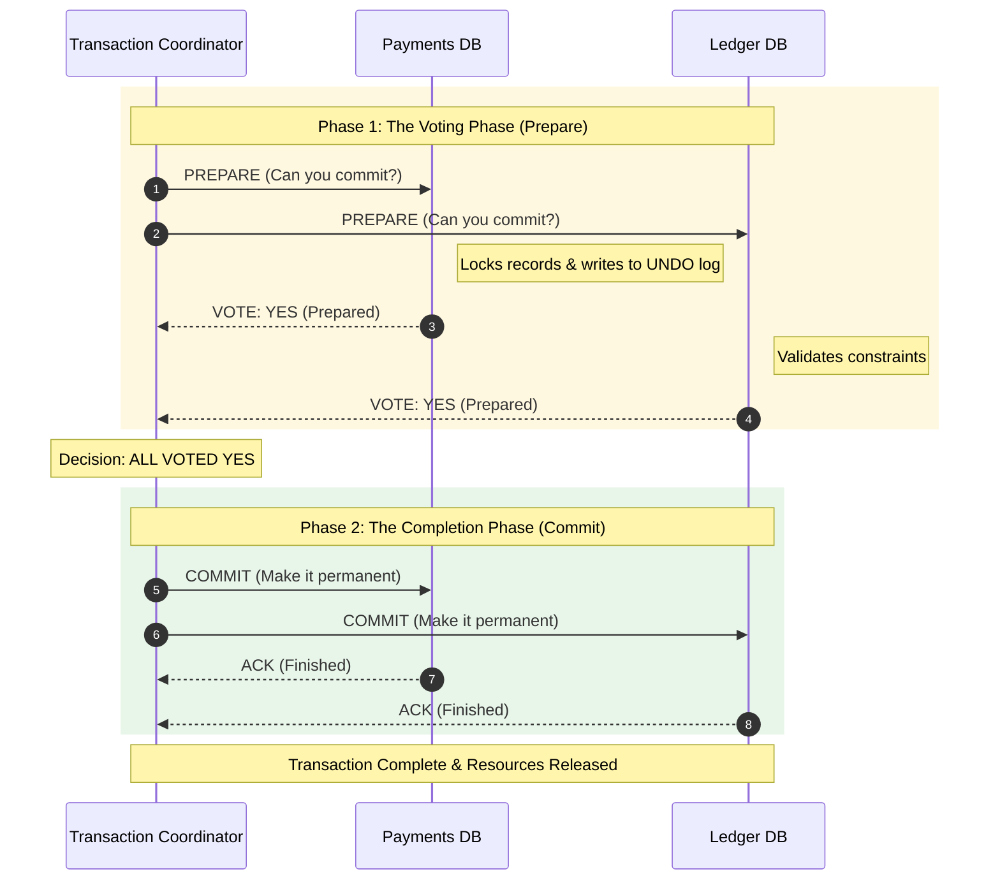
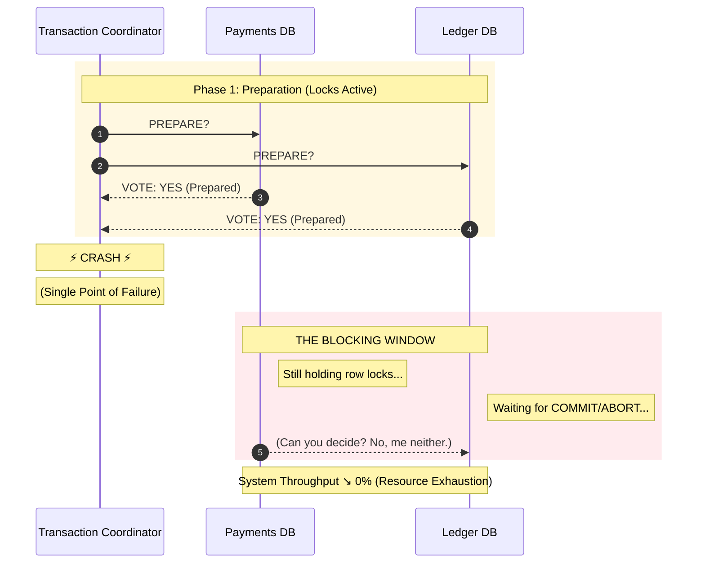

# Distributed Transactions — Two-Phase Commit (2PC) in Plain English

---

Two-Phase Commit (2PC) is the classic protocol designed to achieve:

> **global atomicity** across multiple participants.

It tries to make a distributed transaction behave like a local ACID transaction:

- either everyone commits
- or everyone rolls back

This sounds ideal.

But 2PC has a major cost:

> it can **block** the system under failures.

This article explains 2PC with a clear mental model and the exact failure modes that make it uncommon in modern microservices.

---

## 1. Who’s Involved: Coordinator and Participants

---

2PC has two roles:

- **Coordinator**: the orchestrator of the transaction
- **Participants**: the databases/services that must commit/rollback together

Example participants in a payment workflow might be:

- Payments DB
- Ledger DB

(Real microservices usually include more, which makes coordination harder.)

---

## 2. The Two Phases

---

### Phase 1 — Prepare (Vote)

The coordinator asks:

> “Can you commit this transaction?”

Each participant:

- performs checks
- writes “prepare” to durable log
- replies with a vote:
  - **YES** (ready to commit)
  - **NO** (cannot commit)

### Phase 2 — Commit (Decision)

If all vote YES:

- coordinator sends **COMMIT** to all

If any vote NO:

- coordinator sends **ROLLBACK** to all

This is the core idea.

---

## 3. 2PC Flow (Happy Path)

---

In the happy path, this works.

---

## 4. What “Prepared” Actually Means (Key Detail)

---

When a participant replies YES, it typically means:

- it has written enough to disk so it _can commit later_
- it may be holding locks/resources to keep the transaction stable
- it cannot unilaterally decide to commit/rollback after voting YES

This is crucial:

> “Prepared” is a durable promise to follow the coordinator’s final decision.

---

## 5. The Blocking Problem (Why 2PC Hurts)

---

2PC fails badly when the coordinator fails at the wrong time.

### The worst case

- participants voted YES (prepared)
- coordinator crashes before sending COMMIT/ROLLBACK
- participants are now stuck waiting

They cannot safely decide on their own because:

- committing might violate global atomicity if others roll back
- rolling back might violate global atomicity if others commit

So they block.

This is the core weakness of 2PC:

> progress depends on the coordinator being available.

---

## 6. 2PC Failure Mode Example (Coordinator Crash)

---

The worst-case 2PC failure is when participants have already **prepared** (and are often holding locks), but the coordinator crashes before sending the final decision.

Operational consequences:

- locks/resources are held longer than normal
- throughput drops and tail latency spikes
- timeouts rise, triggering retries (amplifying load)
- the system can appear “hung” until recovery completes

---

## 7. Why 2PC Is Rare in Microservices

---

Microservices architecture is designed for:

- independent deployability
- isolated failures
- high availability

2PC conflicts with this because:

- it couples services at runtime
- it can block when any participant or coordinator is unhealthy
- it often requires holding locks across network calls

In practice, this causes:

- operational fragility
- tail latency spikes
- difficult incident recovery

So most microservices avoid 2PC as the baseline.

---

## 8. The Modern Alternative Mindset

---

Instead of global atomicity, modern systems often prefer:

- local commits per service
- idempotent steps
- retryable workflows
- compensations
- reconciliation

That is exactly what sagas implement.

We’ll cover those alternatives next.

---

## Key Takeaways

---

- 2PC attempts to provide global atomicity across multiple participants.
- It works by a prepare/vote phase followed by a commit/rollback decision phase.
- Participants that vote YES become dependent on the coordinator’s final decision.
- If the coordinator fails after prepare, participants can block holding locks/resources.
- Blocking and tight runtime coupling make 2PC uncommon in modern microservices.

---

## TL;DR

---

2PC is the classic way to do distributed transactions, but it blocks under coordinator failures and tightly couples services.

That’s why most modern systems prefer sagas and idempotent workflows over global transactions.

---

### 🔗 What’s Next

Next we’ll move from theory to what engineers actually use:

- saga pattern and compensations
- outbox/inbox for publish consistency
- reconciliation for mismatch repair

👉 **Up Next: →**  
**[Distributed Transactions — Practical Alternatives](/learning/advanced-skills/high-level-design/8_concepts-phase3/8_22_distributed-transaction-2pc-practical-alternatives)**
