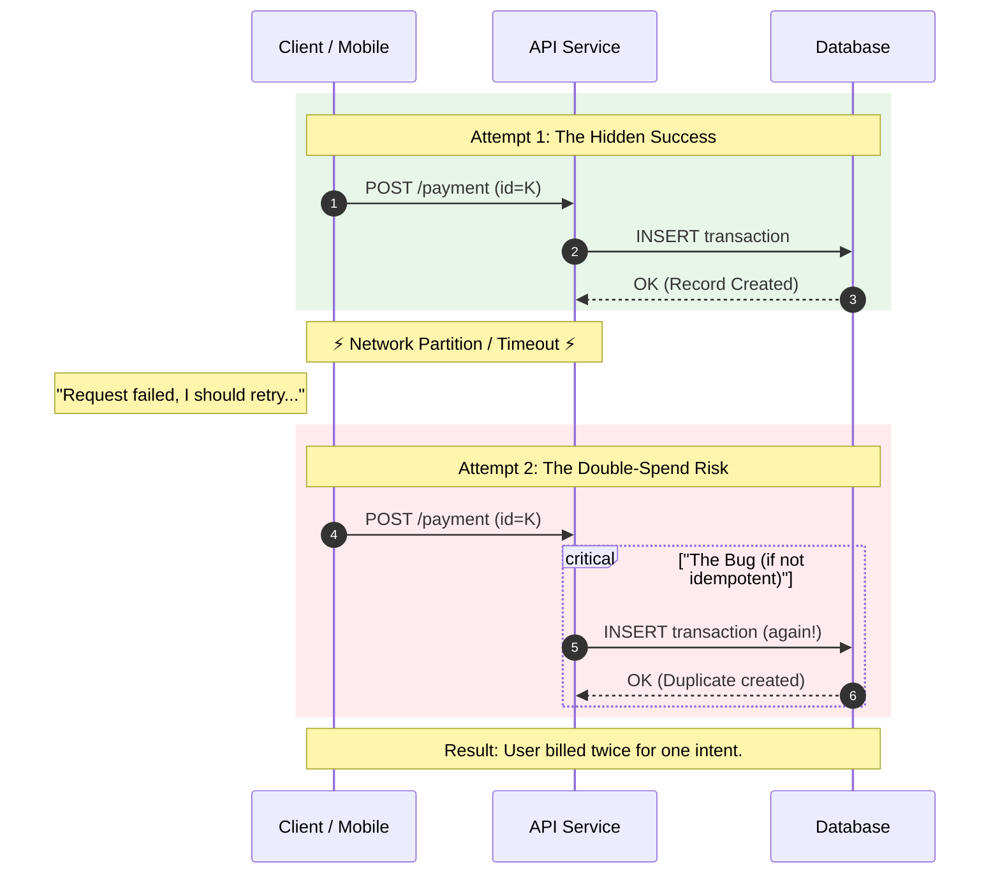
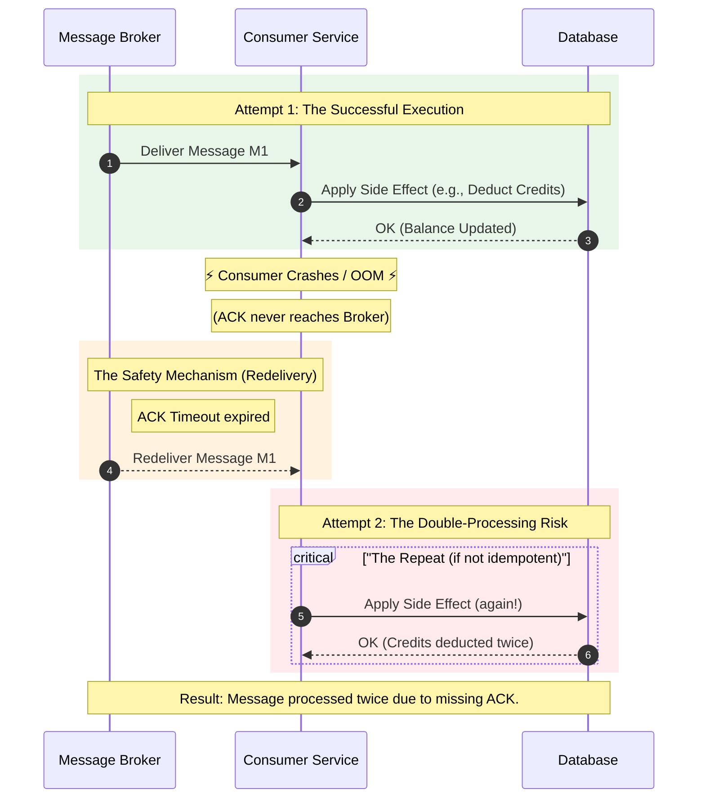
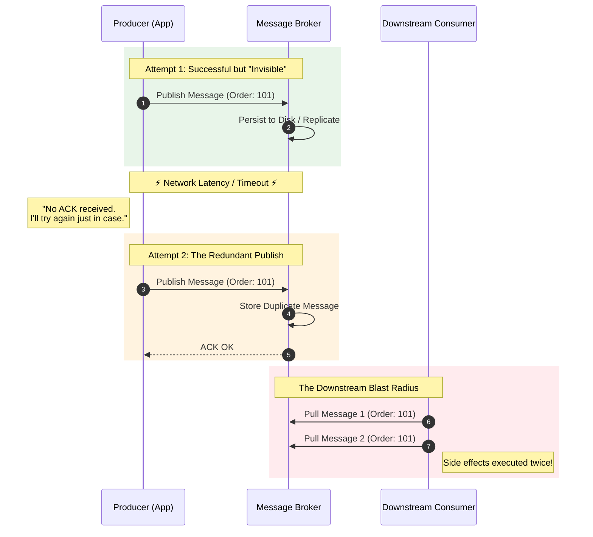
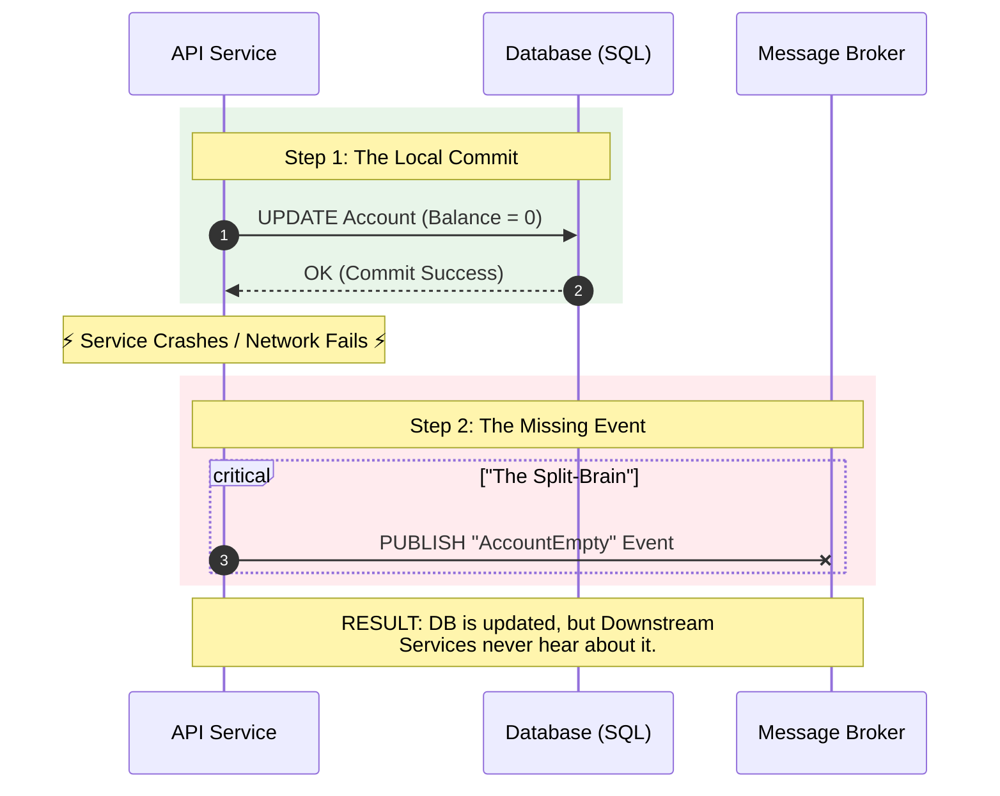

# Processing Guarantees — Why Duplicates Happen

---

If you choose at-least-once delivery, duplicates are not a surprise.

They are a natural consequence of trying not to lose work.

The core reason is simple:

> the system must retry whenever it cannot prove the previous attempt completed.

That “cannot prove” happens in multiple places:

- client ↔ server
- producer ↔ broker
- broker ↔ consumer
- consumer ↔ database

This article walks through the most common duplicate scenarios and what they imply for design.

---

## 1. The Fundamental Ambiguity: Timeout ≠ Failure

---

A timeout only tells you:

- “I didn’t get a response in time”

It does not tell you:

- whether the operation happened

So the safe default in reliable systems is:

- retry

But retry is the act that produces duplicates unless downstream effects are idempotent.

---

## 2. Duplicate Scenario A: Response Lost After Success

---

Classic client/server case:

1. server processes request successfully
2. response is lost or delayed
3. client retries
4. server processes again unless idempotent

---

## 3. Duplicate Scenario B: Consumer Crashes After Processing But Before Ack

---

In message systems, one of the most common causes is:

- consumer processes the message
- then crashes before acknowledging it
- broker retries delivery

So the broker is correct to redeliver.

But the consumer may have already performed the side effect.

---

## 4. Duplicate Scenario C: Ack Sent, But Broker Doesn’t Receive It

---

The reverse happens too:

- consumer sends ACK
- ACK is lost
- broker thinks delivery failed and redelivers

From broker’s perspective:

- no ACK = not processed

So it retries.

This is correct behavior for at-least-once delivery.

---

## 5. Duplicate Scenario D: Producer Retries Publish (Uncertain Publish Outcome)

---

Producers also face ambiguity:

- did the broker receive my message?

If the producer times out, it retries publish.

If the broker actually did receive it, retries create duplicates.

This is why publishing often needs:

- idempotent producer support, or
- outbox pattern (publish after durable DB commit), or
- message keys with dedup on broker (where supported)

---

## 6. Duplicate Scenario E: “DB Commit + Message Publish” Split-Brain

---

A particularly dangerous gap:

- service commits to DB
- then publishes an event
- publish fails (or service crashes)
- service retries and re-publishes or re-processes

This can create:

- duplicate events
- missing events (if it never retries)
- inconsistent downstream projections

This is why the **transactional outbox** exists.

---

## 7. What This Means for System Design

---

If duplicates are normal, you must design for them:

### 7.1 Idempotent effects

- idempotency keys
- unique constraints
- atomic updates
- inbox/dedup store

### 7.2 Clear processing boundaries

- “mark processed” should be atomic with side effect
- avoid “do side effect then later mark processed” without durability

### 7.3 Operational design

- retries with backoff
- DLQs for poison messages
- observability for duplicate rate spikes

---

## Key Takeaways

---

- Duplicates happen because reliable systems retry under uncertainty.
- Timeouts create ambiguity; retries create repeats.
- Common causes:
  - response lost after success
  - consumer crash before ACK
  - ACK lost
  - producer publish retries
  - DB + publish split-brain
- Therefore: at-least-once delivery requires idempotent consumers and safe publishing patterns.

---

## TL;DR

---

Duplicates are the price you pay for reliability.

Any time a system cannot prove an attempt completed, it retries. That creates duplicates unless you design idempotent effects and safe processing boundaries.

---

### 🔗 What’s Next

Next we’ll turn duplicates into a solved problem:

- idempotent consumers
- “already processed” stores
- exactly-once effects in practice

👉 **Up Next: →**  
**[Processing Guarantees — Idempotent Consumers (Exactly-once Effects)](/learning/advanced-skills/high-level-design/8_concepts-phase3/8_26_processing-guarantees-idempotent-consumers)**
