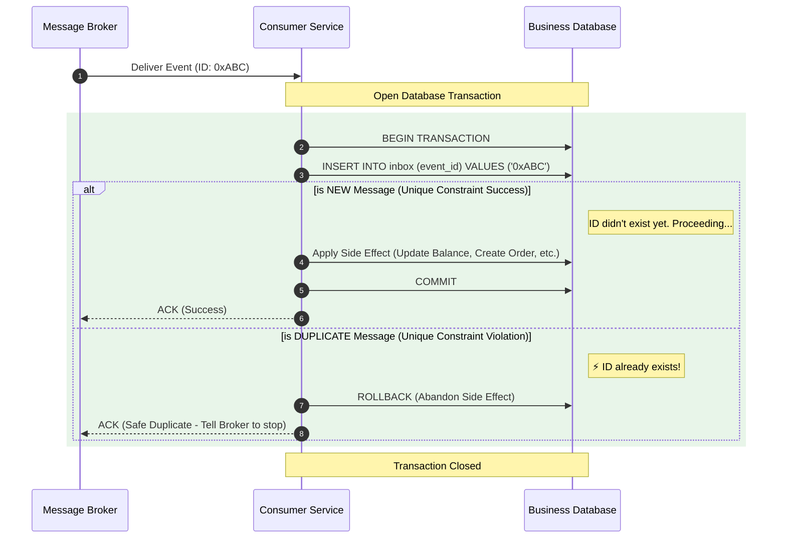

# Processing Guarantees — Idempotent Consumers (Exactly-once Effects)

---

In the previous articles, we established the core reality:

- at-least-once delivery is common
- duplicates are inevitable

So the goal shifts from “prevent duplicates” to:

> **make duplicates harmless.**

That target is often called:

- **exactly-once effects**

Meaning:

- a message may be delivered/processed multiple times
- but the external side effect happens once

This article shows the standard patterns to implement idempotent consumers.

---

## 1. The Core Idea: “Have I Already Applied This?”

---

An idempotent consumer must be able to answer:

- have I already processed event `E`?

If yes:

- do nothing (or return the same result)

If no:

- apply the side effect
- record that `E` is now processed

That “record processed” step must be durable.

---

## 2. The Inbox / Dedup Store Pattern (Canonical)

---

The standard approach is to store:

- `eventId → processed`

This store is often called:

- inbox table
- dedup table
- processed-events table

A typical schema (conceptual):

- `event_id` (unique)
- `processed_at`
- optional: `result_snapshot`

The most important property is:

> `event_id` has a **unique constraint**.

---

## 3. The Only Rule That Matters: Atomicity

---

To achieve exactly-once effects, you must avoid this split:

1. apply side effect
2. later mark event processed

If you crash between 1 and 2:

- event will be redelivered
- side effect will happen twice

So the correct pattern is:

> apply side effect and mark processed **in the same transaction**.

This turns at-least-once delivery into exactly-once effects.

---

## 4. Typical Idempotent Consumer Flow

---

This is the essential algorithm.

Everything else is optimization.

---

## 5. What to Use as `eventId`

---

You need a stable unique ID for the event.

Common choices:

- producer-generated UUID
- paymentId + step name (for workflow commands)
- message broker offset is **not** a stable global eventId across replays

Rule:

> eventId must remain stable across retries/redelivery and reprocessing.

---

## 6. Failure Cases and How This Pattern Handles Them

---

### 6.1 Consumer crashes before commit

- inbox insert not committed
- event is redelivered
- consumer processes again safely

### 6.2 Consumer crashes after commit but before ACK

- broker redelivers
- consumer attempts inbox insert
- insert fails → duplicate detected → no side effect

This is exactly why inbox + atomic transaction works.

---

## 7. Trade-offs and Operational Notes

---

### 7.1 Inbox table growth

The inbox table grows forever unless you manage it.

Common strategies:

- TTL cleanup for old event IDs (if replay window is bounded)
- partition by time
- keep only recent window + rely on DLQ for very old replays

### 7.2 Idempotency granularity

Too coarse:

- may incorrectly treat different events as duplicates

Too fine:

- increases storage and dedup load

Pick an eventId that matches the side effect boundary.

### 7.3 Cross-service side effects

Inbox solves consumer DB side effects.

If the consumer calls external APIs, you still need:

- idempotent external calls, or
- durable orchestration around them

---

## 8. Phase 3 Connection

---

Phase 3 used the same idea repeatedly:

- idempotency keys prevent duplicate payments at API boundary
- step-level idempotency prevents duplicate ledger entries
- durable workflow state prevents repeating steps incorrectly

Idempotent consumers are the event-driven version of that same principle.

---

## Key Takeaways

---

- At-least-once delivery creates duplicates; the goal is exactly-once effects.
- Idempotent consumers require a durable “already processed” record (inbox/dedup store).
- The side effect and the inbox insert must be in the same transaction.
- Unique `eventId` is the core primitive; everything else is optimization.
- Manage inbox growth with TTL/partitioning based on replay requirements.

---

## TL;DR

---

You can’t prevent duplicates in at-least-once systems, so you make processing idempotent.

Do this by inserting a unique `eventId` into an inbox table and applying the side effect in the same transaction. Redeliveries become harmless no-ops, giving you exactly-once effects.

---

### 🔗 What’s Next

Next we’ll solve the producer-side reliability gap:

- DB commit succeeds but event publish fails
- event publish succeeds but DB commit fails

We’ll introduce the **transactional outbox** pattern.

👉 **Up Next: →**  
**[Processing Guarantees — Transactional Outbox Pattern](/learning/advanced-skills/high-level-design/8_concepts-phase3/8_27_processing-guarantees-transactional-outbox-pattern)**
