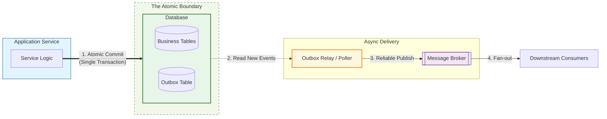
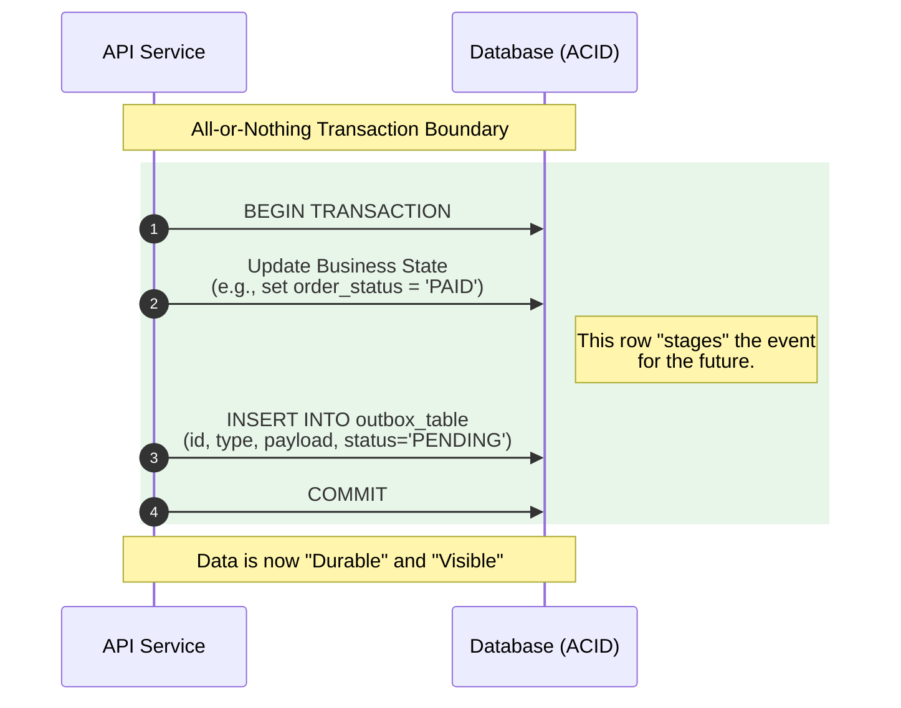
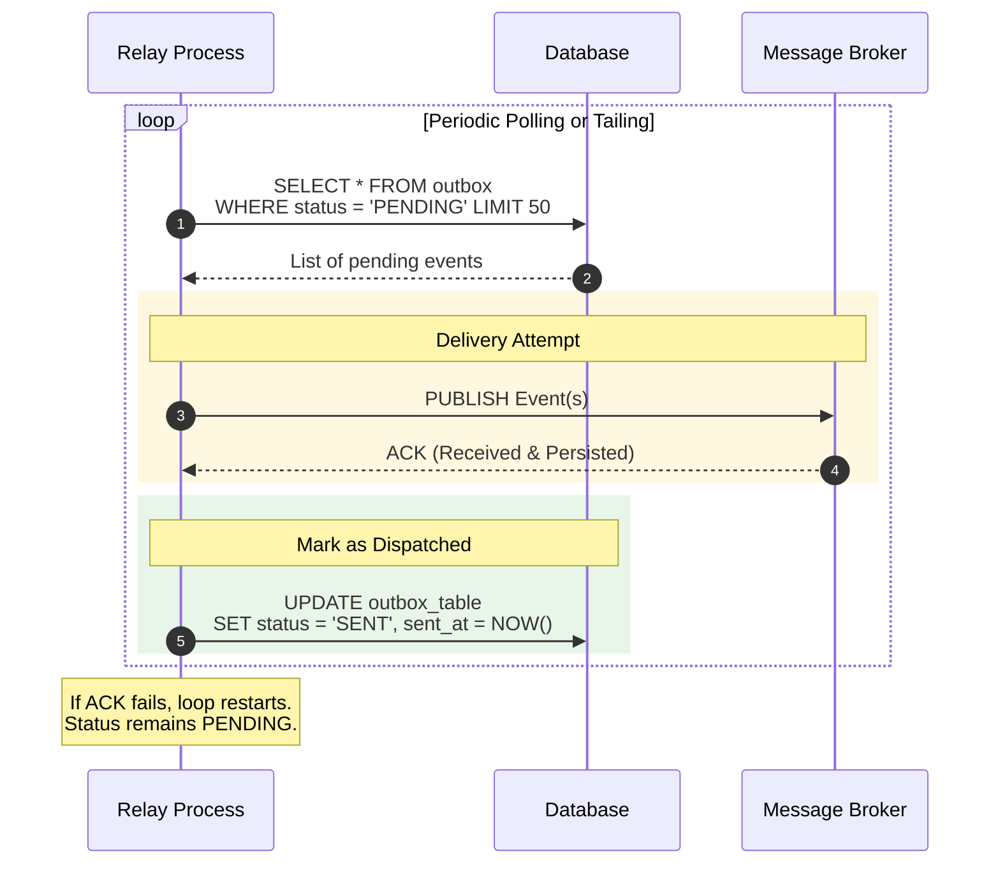

# Processing Guarantees — Transactional Outbox Pattern

---

A huge number of distributed systems failures come from one gap:

> the database commit and the message publish are not atomic.

Typical workflow:

1. write business state to DB
2. publish an event so downstream services react

If step 1 succeeds but step 2 fails, downstream systems never learn the truth.

If step 2 succeeds but step 1 fails, downstream systems react to a state that never existed.

This article explains the **transactional outbox** pattern, which turns this distributed correctness gap into a local ACID guarantee.

---

## 1. The Problem: DB + Broker Split-Brain

---

Consider a payment system producing an event:

- `PaymentConfirmed(paymentId=123)`

Naive approach:

1. commit payment record
2. publish event

Failure modes:

- DB commit succeeds, publish fails → **missing event**
- publish succeeds, DB commit fails → **ghost event**

Both are unacceptable if downstream systems depend on the event.

---

## 2. The Outbox Idea (One Sentence)

---

The outbox pattern says:

> write the event into the database in the same transaction as the business write, then publish it asynchronously from the DB.

So “publish” becomes a replayable operation, not a fragile side effect.

---

## 3. Outbox Architecture (Baseline)

---

Key components:

- **Business tables** (payments, accounts, etc.)
- **Outbox table** (events to publish)
- **Relay/publisher** process that reads outbox and publishes to broker

---

## 4. How It Works (Step-by-Step)

---

### 4.1 In the service transaction (atomic)

Inside one DB transaction:

1. write business state
2. insert an outbox row representing the event

Example outbox row:

- eventId
- eventType
- payload
- status (PENDING, SENT)
- timestamps

#### Conceptual flow:

Now, either both business write and outbox insert happen, or neither does.

So no split-brain.

---

### 4.2 Relay loop (publish reliably)

A separate relay process:

- polls outbox rows (status=PENDING)
- publishes to broker
- marks rows as sent

If the relay crashes:

- outbox rows remain in DB
- relay resumes later
- events are published eventually

That is the reliability win.

---

## 5. Delivery Guarantees and Duplicates (Important)

---

Outbox does not magically make delivery exactly-once.

It usually gives you:

- **at-least-once publishing**

Because a relay can publish, crash before marking `SENT`, and then publish again.

So consumers must still be idempotent:

- inbox/dedup store (next article)
- idempotent effects (previous article)

The combination yields:

- at-least-once delivery
- exactly-once effects

---

## 6. Ordering and Throughput Notes (Practical)

---

### 6.1 Ordering

Outbox preserves order per producer transaction stream (often per partition key).

But global ordering across multiple producers is not guaranteed.

### 6.2 Throughput

Relay throughput depends on:

- polling strategy
- batching
- DB load
- broker throughput

At scale, you may shard outbox by:

- tenant
- aggregate id
- time partitions

But baseline outbox works fine for most systems.

---

## 7. Common Implementation Choices

---

### 7.1 Polling vs CDC (change data capture)

Two ways to implement relay:

- **polling** outbox table (simpler baseline)
- **CDC** from WAL/binlog (more efficient, advanced)

Baseline for your learning path:

- start with polling
- mention CDC as an upgrade path

### 7.2 Marking `SENT` safely

Avoid “exactly once” assumptions.

Common safe approach:

- publish event with `eventId`
- mark `SENT` after publish
- if published twice, consumers dedupe by `eventId`

---

## Key Takeaways

---

- DB write and event publish are not atomic → split-brain failure modes.
- Transactional outbox fixes this by storing events in DB within the same transaction as business writes.
- A relay publishes outbox events reliably with replay on crash.
- Outbox usually provides at-least-once publishing → consumers must be idempotent.
- Polling is the simplest baseline; CDC is an advanced optimization.

---

## TL;DR

---

Transactional outbox converts “DB + broker split-brain” into a local ACID guarantee by writing events to an outbox table in the same transaction as business data, then publishing them asynchronously via a relay.

You still assume at-least-once delivery and build idempotent consumers.

---

### 🔗 What’s Next

Next we’ll cover the consumer-side mirror of outbox:

- inbox / dedup store pattern
- how consumers become safe under at-least-once delivery
- how outbox + inbox yields exactly-once effects end-to-end

👉 **Up Next: →**  
**[Processing Guarantees — Inbox / Dedup Store Pattern](/learning/advanced-skills/high-level-design/8_concepts-phase3/8_28_processing-guarantees-inbox-dedup-store)**
