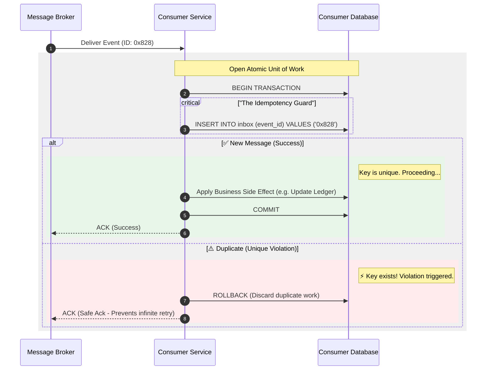

# Processing Guarantees — Inbox / Dedup Store Pattern

---

In the previous article, we introduced the transactional outbox:

- producers publish reliably (at-least-once)

But once you have at-least-once publishing, you must accept the mirror reality:

> consumers will see duplicates.

Duplicates happen because:

- brokers redeliver
- consumers crash before ack
- producers may publish again during recovery

So consumer correctness requires one key capability:

> detect “already processed” and skip side effects safely.

That’s exactly what the inbox (dedup store) pattern provides.

---

## 1. The Inbox Pattern (One Sentence)

---

The inbox pattern says:

> store the event ID in a durable dedup store, and apply side effects only if the event ID is new.

The inbox is the consumer-side equivalent of idempotency keys.

---

## 2. Why It’s Needed Even With a Perfect Broker

---

Even if your broker is stable, duplicates still occur because:

- consumers crash
- acknowledgements can be lost
- replay/reprocessing is necessary after incidents

So the consumer must not assume “exactly-once delivery”.

---

## 3. Inbox Table Structure (Minimal)

---

A minimal inbox table typically contains:

- `eventId` (unique)
- `processedAt`
- optional: `source` / `topic`
- optional: `resultSnapshot` (rare but useful for some workflows)

The crucial requirement:

> `eventId` is protected by a **unique constraint**.

---

## 4. The Canonical Algorithm (Exactly-once Effects)

---

The core algorithm:

1. start a DB transaction
2. insert `eventId` into inbox
3. if insert succeeds → apply side effects + commit
4. if insert fails → duplicate → no-op + ack

This achieves:

- at-least-once delivery
- exactly-once effects (per consumer DB)

---

## 5. Inbox + Outbox (End-to-End Story)

---

Outbox solves producer correctness:

- DB commit and publish don’t split-brain

Inbox solves consumer correctness:

- duplicates don’t create duplicate effects

Together, they give a clean mental model:

> at-least-once delivery end-to-end,  
> exactly-once effects at the boundaries that matter.

This is one of the most reusable reliability patterns in system design.

---

## 6. Operational Details (That Matter)

---

### 6.1 Inbox growth and retention

Inbox tables grow indefinitely unless controlled.

Choose retention based on:

- how far back you might replay events
- regulatory/audit needs

Common strategies:

- TTL cleanup for old `eventIds`
- time partitioning (daily/weekly partitions)
- keep recent N days + rely on DLQ for older replays

### 6.2 Choosing a stable eventId

Good event IDs are:

- producer-generated UUIDs
- paymentId + step name
- deterministic identifiers for commands

Avoid using broker offsets as the only identity (replays can change offsets).

### 6.3 External side effects

Inbox protects your DB writes.

If your consumer calls external APIs (email/SMS), you also need:

- idempotent external calls, or
- outbox-style buffering for outbound calls, or
- orchestration to control side effects

---

## 7. Common Mistakes

---

### Mistake A — Dedup outside the transaction

If you check “already processed” in one query, then apply side effects later:

- a crash between those steps can still create duplicates

The insert-and-commit must be in the same transaction.

### Mistake B — Storing inbox in Redis only

Redis eviction or restart can drop your dedup state.

For correctness-sensitive workflows, inbox must be durable.

### Mistake C — Event IDs not stable

If eventId changes across retries, dedup cannot work.

---

## Key Takeaways

---

- At-least-once delivery implies duplicates; consumers must be idempotent.
- Inbox/dedup store pattern achieves exactly-once effects by storing `eventId` durably.
- The inbox insert + side effect must be atomic (same transaction).
- Inbox + outbox is a standard end-to-end reliability toolkit.
- Retention and stable event IDs are operational requirements, not optional details.

---

## TL;DR

---

Outbox makes publishing reliable; inbox makes consuming safe.

Store a unique `eventId` in a durable inbox table and apply side effects only once per event ID in the same transaction. Duplicates become harmless no-ops.

---

### 🔗 What’s Next

Next we’ll cover the operational reality that appears immediately after at-least-once delivery:

- ordering vs reordering
- replay and reprocessing
- DLQs and poison messages

👉 **Up Next: →**  
**[Processing Guarantees — Ordering, Reprocessing, and DLQs](/learning/advanced-skills/high-level-design/8_concepts-phase3/8_29_processing-guarantees-ordering-reprocessing-dlqs)**
