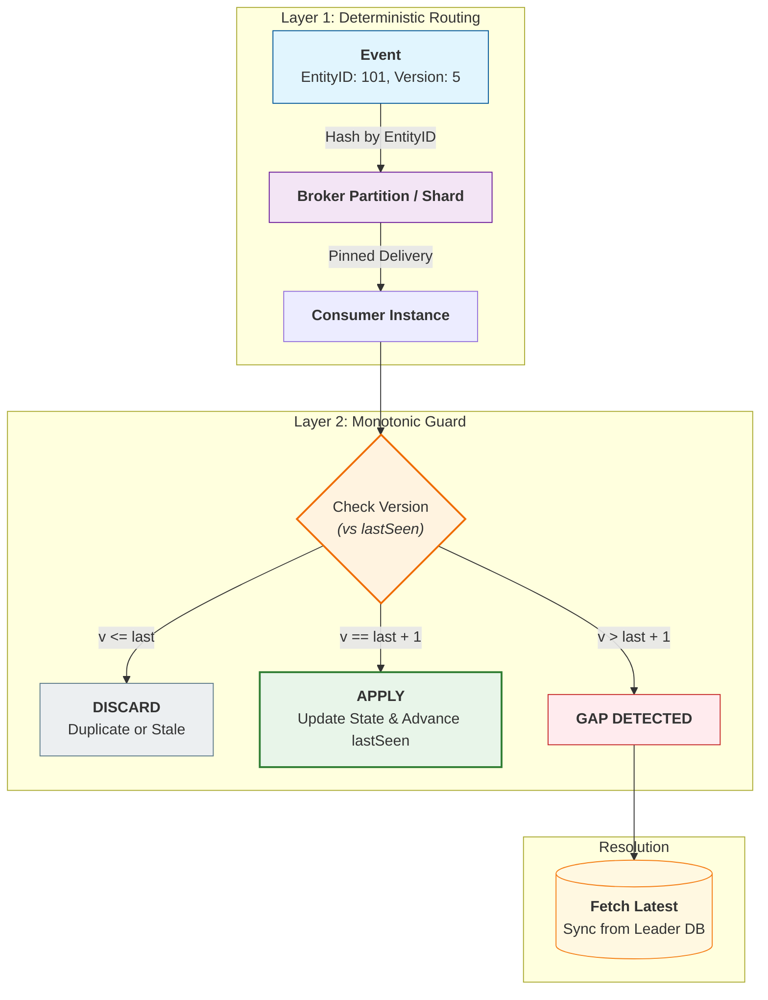

# Processing Guarantees — Ordering, Reprocessing, and DLQs

---

At-least-once delivery solves “don’t lose work”, but it introduces operational realities:

1. events can be delivered multiple times (duplicates)
2. events can be delivered **out of order**
3. some events will **fail repeatedly** (poison messages)

If you don’t design for these, you get:

- broken projections (“balance went backwards”)
- stuck consumer groups
- retry storms that take down the system

This article gives a practical toolkit:

- what ordering guarantees you can realistically expect
- how to reprocess safely
- how to use DLQs without hiding problems

---

## 1. Ordering: What You Want vs What You Get

---

### 1.1 What users expect

Users expect monotonic progress:

- a payment moves `PENDING → CONFIRMED` once
- a balance doesn’t “time travel”
- a message list doesn’t reorder randomly

### 1.2 What distributed systems provide

Most systems do **not** guarantee global ordering.

Common practical guarantees are:

- ordering **within a partition/key** (if configured correctly)
- no ordering across different partitions
- reordering is possible during retries/rebalances

So ordering is a design decision:

> choose an ordering scope and enforce it with partitioning and consumer logic.

---

## 2. Out-of-Order Delivery (Why It Happens)

---

Events arrive out of order due to:

- partitioned brokers (different partitions)
- retries and redelivery
- consumer parallelism
- rebalancing
- network delays between producers and broker

A simple example:

- Event 1: `PaymentConfirmed`
- Event 2: `PaymentRefunded`

If they arrive swapped, naive consumers can show impossible state transitions.

---

## 3. Practical Ordering Strategy (What Most Systems Do)

---

Ordering is handled in two layers:

1. **Routing related events to an ordered stream** (broker partitioning / single-writer path)
2. **Enforcing monotonic progress at the consumer** (version/sequence checks)

This makes ordering robust even under retries and reprocessing.

---

### 3.1 Define an ordering scope (payments: per `paymentId`)

Most systems do not attempt global ordering.

They pick an ordering scope that matches the domain entity.

For payments, the natural scope is:

- **per payment** → key = `paymentId`

All events/commands for the same payment should be routed through the same ordered stream (or processed by a single-writer component).

This ensures the broker (or the service) can preserve **relative order** for that payment.

---

### 3.2 Include a monotonic version/sequence (consumer-enforced)

Even with partitioning, consumers can see:

- duplicates
- replayed events
- out-of-order deliveries during rebalances

So each event should carry a monotonic field such as:

- `version` (payment state transitions)
- or `sequence`

Example (payment):

- `PENDING` → version 1
- `CONFIRMED` → version 2
- `REFUNDED` → version 3

Consumer maintains:

- `lastSeenVersion[paymentId]`

Then apply strict monotonic rules:

- if `event.version <= lastSeenVersion` → **duplicate/old** → ignore
- if `event.version == lastSeenVersion + 1` → apply and advance
- if `event.version > lastSeenVersion + 1` → **gap detected** → do not apply blindly

What to do on a gap depends on domain criticality.

For payments, a safe baseline is:

- **fallback to source of truth** (read the latest state from the leader DB)
- optionally buffer briefly, but never guess state transitions

This prevents “time travel” like showing `REFUNDED` before `CONFIRMED`.

---

### 3.3 A quick note on chat ordering (Phase 4 preview)

Chat uses the same two-layer idea, but the ordering key and behavior differ:

- ordering scope: **per conversation** (`conversationId`)
- monotonic field: **message sequence** assigned at write time
- gaps are handled by fetching missing history (cursor/sequence-based sync)

We’ll cover chat ordering deeply in Phase 4 (ordering expectations vs system guarantees), but the core mechanism is the same:
**partition by key + enforce monotonic sequence.**

---

## 4. Reprocessing (Replay) Without Breaking Correctness

---

Reprocessing happens for normal reasons:

- bug fix in consumer logic
- rebuilding projections
- recovering from outages

Safe replay requires two properties:

### 4.1 Idempotent consumers (inbox/dedup)

- same event can arrive again
- consumer must not duplicate effects

Inbox pattern is the core tool.

### 4.2 Deterministic processing

Reprocessing should produce the same outcome given the same input stream.

Avoid non-determinism like:

- “current time” used in business rules without event time
- external calls without stable idempotency

---

## 5. Poison Messages (When Retries Never Succeed)

---

A poison message is an event that fails every time:

- invalid payload
- schema mismatch
- missing required downstream state
- code bug

If you retry forever, you can stall the entire consumer.

So you need a strategy.

---

## 6. DLQ (Dead Letter Queue): The Practical Tool

---

A DLQ is a place to send messages that cannot be processed after reasonable retries.

### 6.1 A simple DLQ policy

- retry N times with backoff
- if still failing, send to DLQ with error context
- alert and investigate
- optionally replay after fix

### 6.2 What must go into DLQ payload

Include:

- original event payload
- eventId
- partition/key
- failure reason + stack trace
- consumer version (important!)
- timestamp and retry count

This makes DLQ actionable.

---

## 7. DLQ Is Not “Ignore Errors” (Common Mistake)

---

DLQ is not a trash bin.

If you silently drop messages into DLQ, you are building inconsistency.

So good DLQ usage includes:

- alerting
- dashboards and ownership
- replay workflows
- reconciliation checks

DLQ is part of operability, not just error handling.

---

## 8. Phase 3 / Phase 4 Connection

---

Phase 3 (payments) and Phase 4 (real-time systems) both require:

- ordering decisions (payment status transitions, message ordering)
- replay safety (reconciliation, rebuild, incident recovery)
- DLQs for poison messages (bad events must not stall the pipeline)

This concept is the bridge between “correctness theory” and production operational reality.

---

## Key Takeaways

---

- Global ordering is unrealistic; define ordering scope (usually per entity key).
- Out-of-order delivery is normal due to retries, partitions, and rebalancing.
- Use partitioning + version/sequence fields to enforce monotonic state.
- Reprocessing is normal; it must be safe (idempotent consumers + deterministic processing).
- DLQs handle poison messages, but must be operationally owned and replayable.

---

## TL;DR

---

At-least-once delivery means duplicates, reordering, and poison messages are normal.

Define ordering per key, enforce monotonicity with versions, make consumers idempotent for safe replay, and use DLQs with alerting and replay—not as a silent dumping ground.

---

### 🔗 What’s Next

Now that we understand delivery reality, we move to the core coordination pattern for multi-service correctness:

- saga pattern fundamentals
- local transactions + compensation
- what Phase 3 evolves into for partial failures

👉 **Up Next: →**  
**[Saga Pattern — Core Idea (Local Tx + Compensation)](/learning/advanced-skills/high-level-design/4_correct-reliable-systems/concepts/8_30_saga-core-)**
