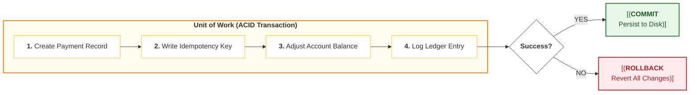
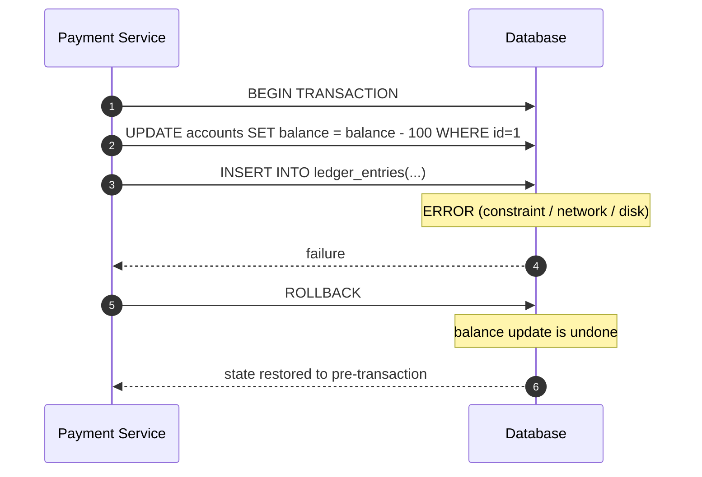
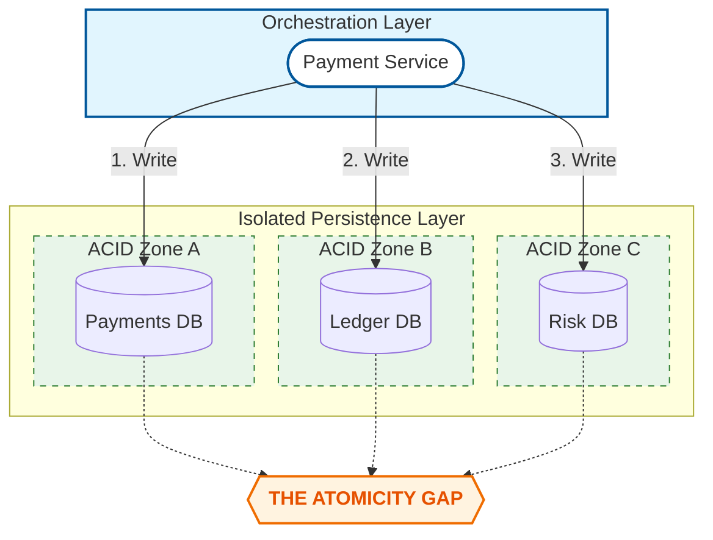

# ACID Transactions — What Transactions Guarantee

---

ACID transactions are the first and most important correctness tool in database-backed systems.

In Phase 3 (Payment System), we repeatedly relied on one idea:

> If money correctness depends on multiple writes, those writes must succeed or fail **together**.

That is exactly what a transaction gives you — inside a single database boundary.

This article explains:

- what ACID guarantees _in practice_
- what it does _not_ guarantee
- how to use transactions as the foundation of local correctness

(We’ll cover isolation levels, locking, and contention in the next ACID concept articles.)

---

## 1. What Is a Transaction (Practical Definition)

---

A **transaction** is a unit of work that the database treats as **one logical operation**.

Either:

- all changes are committed, or
- none of them are.

A typical payment-related transaction might include:

- write a payment record
- write an idempotency record
- update an account balance
- insert a ledger entry

In production systems, you want these changes to move together because partial progress can break correctness.

---

## 2. ACID — The Four Guarantees (What They Mean in Reality)

---

### 2.1 Atomicity — “All or Nothing”

Atomicity means:

- either every write in the transaction commits,
- or the database rolls everything back.

**Payment example**

Inside one transaction:

- decrement balance
- insert transaction record

If the second write fails, atomicity guarantees the balance decrement is rolled back too.

This prevents partial outcomes like:

- money deducted, but no transaction record exists

---

### 2.2 Consistency — “Invariants Stay True”

Consistency is often misunderstood.

It does **not** mean “the database is always correct by magic”.

It means:

> a transaction takes the database from one valid state to another valid state,  
> assuming constraints/invariants are defined and enforced.

Examples of invariants:

- `balance >= 0`
- transaction IDs are unique
- foreign key references exist
- status transitions follow rules (`PENDING → CONFIRMED`, not random jumps)

How consistency is enforced:

- constraints (PK, FK, unique)
- check constraints
- application logic inside the transaction
- atomic update patterns

Consistency is really about **protecting invariants**.

---

### 2.3 Isolation — “Concurrent Transactions Don’t Corrupt Each Other”

Isolation means multiple transactions running at the same time do not produce incorrect results due to interleaving.

This is where most real-world bugs happen:

- double-spend problems
- lost updates
- incorrect reads during concurrent writes

Isolation is not a single on/off switch.

Databases provide _isolation levels_ (Read Committed, Repeatable Read, Serializable, etc.), each trading off:

- correctness guarantees
- throughput and locking

We’ll deep dive isolation levels and read phenomena in **later article**.

---

### 2.4 Durability — “Committed Means Survives”

Durability means:

- once a transaction commits, its result will not be lost even if the process crashes.

In practice, this is enforced via:

- write-ahead logs (WAL)
- fsync / log flush policies
- replication/backup (for disaster scenarios)

Durability is what lets you treat “commit” as a real boundary.

---

## 3. Why ACID Matters for Payment Systems (Local Correctness)

---

Payments are correctness-sensitive because small inconsistencies become expensive:

- money deducted twice
- ledger and balance mismatch
- confirmed payment without a durable record

ACID is your baseline defense because it lets you define a **transactional boundary**:

> inside this boundary, we can guarantee local correctness.

This is why Phase 3 chose relational databases as the default storage for payments:

- ACID makes it easier to enforce invariants (balance, uniqueness, status transitions).

---

## 4. What ACID Does Not Guarantee (Important)

---

ACID guarantees apply only inside a single transactional boundary.

They do _not_ automatically solve:

### 4.1 Cross-service correctness

If your payment flow updates:

- Payments DB
- Ledger DB
- Fraud DB

those are separate transactional boundaries.

ACID does not make them commit together.

That’s why Phase 3 introduced:

- sagas
- compensations
- durable workflow state

### 4.2 Correctness under replication reads

Even if a write commits on the leader:

- a replica may not have it yet (replication lag)

So a read can still be stale.

This is a _consistency model / replication_ concern, not an ACID failure.

### 4.3 Exactly-once delivery in distributed systems

Transactions do not prevent:

- retries
- duplicates
- message redelivery

To handle those you need:

- idempotency
- outbox/inbox patterns
- processing guarantees

---

## 5. The Practical ACID Mental Model (What to Apply)

---

Use ACID transactions when:

- multiple writes must succeed/fail together
- you need to enforce invariants under concurrency
- money correctness is at stake

Common payment “atomic bundles” include:

- create payment record + idempotency record
- update balance + insert ledger entry
- update payment status + insert audit record

Then, once you cross service boundaries:

- ACID is not enough
- you move to sagas and coordination

---

## Key Takeaways

---

- A transaction is a unit of work that commits as one logical operation.
- **Atomicity** prevents partial outcomes inside a DB boundary.
- **Consistency** is about protecting invariants (constraints + logic), not magic correctness.
- **Isolation** prevents concurrency interleavings from corrupting results (deep dive next).
- **Durability** makes “commit” survive crashes.
- ACID guarantees are **local** — they do not solve cross-service workflows, replication staleness, or duplicates.

---

## TL;DR

---

ACID is the foundation of local correctness.

It guarantees “all-or-nothing”, invariant safety, concurrency protection, and durable commits — but only within one database boundary.

As soon as correctness spans multiple services or relies on replicas/events, you need additional patterns (idempotency, replication strategies, sagas).

---

### 🔗 What’s Next

Next we’ll deep dive the most misunderstood part of ACID:

- isolation levels
- read phenomena (dirty/non-repeatable/phantom reads)
- what you actually need for money correctness

👉 **Up Next: →**  
**[ACID Transactions — Isolation Levels & Read Phenomena](/learning/advanced-skills/high-level-design/8_concepts-phase3/8_3_acid-isolation-levels-and-read-phenomena)**
