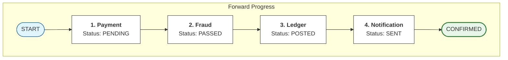
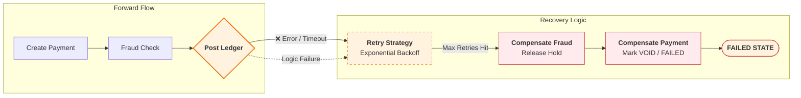

# Saga Pattern — Core Idea (Local Transactions + Compensation)

---

Distributed workflows fail in a specific way:

> one step succeeds, another step fails.

In Phase 3 (Payment System), this showed up once we moved beyond “single DB write” and added dependencies:

- ledger posting
- fraud checks
- notifications

Each service can be locally correct in its own database.

But the workflow can still be globally inconsistent.

A saga is the standard pattern used to handle this reality without relying on global ACID transactions.

---

## 1. What a Saga Is (Practical Definition)

---

A **saga** is a distributed workflow composed of:

- a sequence of **local transactions** (one per service)
- plus **compensations** (recovery actions) for steps that have already committed if the workflow later fails

Instead of trying to commit everything atomically:

- each step commits locally
- the saga tracks progress
- failures are handled with retries, compensation, or manual review

---

## 2. The Core Shift: Atomicity → Progress + Recovery

---

Local ACID gives you atomicity in one database.

Sagas give you something different:

- progress through steps
- recovery when failures happen

So the mindset becomes:

> not “all-or-nothing commit”,  
> but “eventually reach a correct terminal outcome”.

Terminal outcomes usually include:

- `CONFIRMED` / `SUCCEEDED`
- `FAILED` / `DECLINED`
- `FAILED_COMPENSATED` (we reversed earlier steps)
- `NEEDS_REVIEW` (in-doubt cases that require reconciliation)

---

## 3. A Payment Saga Example (Simplified)

---

A simplified payment workflow:

1. validate / create payment record
2. fraud check
3. post ledger entry
4. notify user

Each step is a local transaction in its own service.

Now introduce failure.

---

## 4. What Happens on Failure (The Whole Point)

---

Suppose the ledger step fails after fraud succeeded.

We have a choice:

- retry ledger
- or compensate earlier steps if we can’t complete

A saga makes this explicit.

### Why “compensation” exists

If earlier steps already committed, you cannot “un-commit” them globally.

So you perform a compensating action, such as:

- void payment record
- reverse reserved funds
- issue refund/reversal if money moved

Compensation is not always perfect “undo”.

It is a domain-specific recovery action that restores invariants.

---

## 5. Compensation vs Retry vs Manual Review

---

A real saga needs clear rules:

### 5.1 Retry

Use retries when:

- failures are transient
- the step is idempotent
- the system can wait

Examples:

- temporary network timeout to ledger service
- broker publish failure

### 5.2 Compensation

Use compensation when:

- the workflow cannot complete
- a safe reversal exists

Examples:

- reverse a reservation
- issue refund

### 5.3 Manual review / reconciliation

Use review when:

- the system is in an uncertain state
- you cannot safely retry or compensate automatically

Example:

- downstream service might have processed the request but response was lost
- outcome is “in doubt”

This is why `NEEDS_REVIEW` states exist in payment systems.

---

## 6. Why Sagas Require Idempotency

---

Sagas assume retries and replays.

So every step must be safe under repetition:

- step-level idempotency keys
- inbox/dedup store for consumers
- atomic state transitions

Without idempotency, the saga “recovery” path creates duplicates.

---

## 7. Why Sagas Are the Default Over 2PC in Microservices

---

Sagas trade:

- global atomicity

for:

- better availability
- better isolation of failures
- non-blocking progress
- operational control over retries and compensation

This matches the goals of microservices.

2PC can be correct, but it often blocks.

Sagas accept distributed reality and build correctness through recovery.

---

## 8. Coordinator Durability (Real-world Implementation Note)

---

In orchestration-based sagas, the coordinator must be a **durable state machine**.

That means workflow state is persisted (not kept only in memory), so if the coordinator crashes it can:

- reload the workflow instance from storage
- retry the next step safely (steps must be idempotent)
- continue until a terminal state (`CONFIRMED`, `FAILED_COMPENSATED`, `NEEDS_REVIEW`)

In real projects, teams typically implement durable orchestration in one of two ways:

1. **Workflow engines** (built-in durability + retries + timers)  
   Examples: Temporal/Cadence, Camunda/Zeebe, AWS Step Functions, Azure Durable Functions.

2. **DB-backed orchestrator service** (lightweight, common in microservices)  
   A service persists workflow state in tables (workflow instance/steps) and uses an outbox+relay to publish commands reliably.

Either approach makes coordinator failure a **pause and resume** problem, not a correctness corruption problem.

---

## Key Takeaways

---

- A saga coordinates a multi-step workflow using local transactions plus compensations.
- It replaces global atomicity with progress tracking and recovery.
- Failures are handled via retries, compensation, or manual review (`NEEDS_REVIEW`).
- Sagas require idempotent steps and durable workflow state.
- This is why sagas are the default coordination pattern in modern microservices.

---

## TL;DR

---

Sagas handle partial failures by committing locally step-by-step and recovering when something fails.

They don’t give global ACID; they give correct outcomes using retries, compensations, and durable workflow tracking.

---

### 🔗 What’s Next

Next we’ll compare the two ways to implement a saga:

- orchestration (central coordinator)
- choreography (event-driven coordination)

We’ll discuss trade-offs and why Phase 3 uses orchestration as the baseline.

👉 **Up Next: →**  
**[Saga Pattern — Orchestration vs Choreography](/learning/advanced-skills/high-level-design/8_concepts-phase3/8_31_saga-pattern-orchestration-vs-choreography)**
