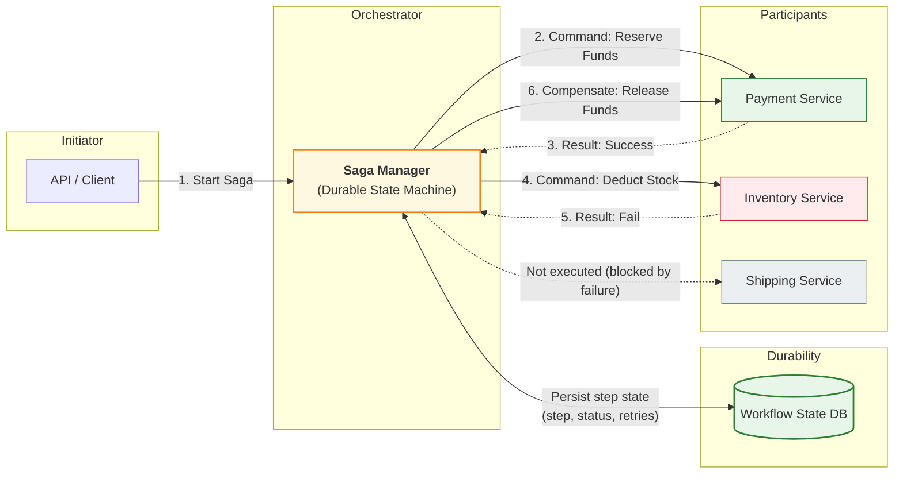
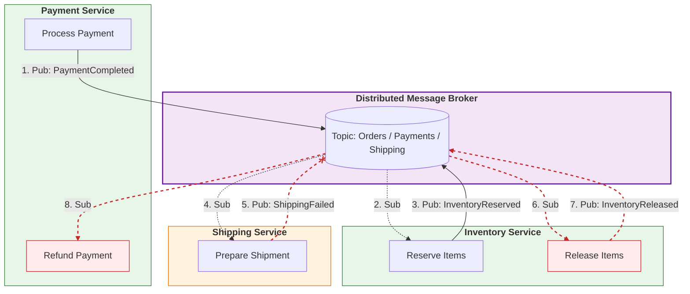

# Saga Pattern — Orchestration vs Choreography

---

Once you accept that “global ACID” is not the baseline, a saga becomes the coordination pattern.

But sagas can be implemented in two major ways:

1. **Orchestration** — one component coordinates the workflow
2. **Choreography** — services coordinate by reacting to events (no central coordinator)

Both are valid.

But they have very different operational profiles.

This article explains the trade-offs and clarifies why Phase 3 uses orchestration as the baseline.

---

## 1. Orchestration (Central Coordinator)

---

### 1.1 What it means

In orchestration:

- a **saga orchestrator** owns the workflow state machine
- it tells each participant what to do next
- it decides retries, timeouts, and compensations

Participants are “workers” from the saga point of view.

### 1.2 Conceptual flow

Orchestrator responsibilities:

- track workflow state durably
- emit commands (step execution)
- handle retries/timeouts
- trigger compensations
- route uncertain outcomes to NEEDS_REVIEW

### 1.3 Why teams like orchestration

- single place to understand workflow progress
- easier debugging and observability
- explicit control over timeouts and retries
- compensations are centralized and consistent

---

## 2. Choreography (Event-driven Coordination)

---

### 2.1 What it means

In choreography:

- there is no central coordinator
- each service publishes events after local commits
- other services react to those events

The workflow emerges from event subscriptions.

### 2.2 Conceptual flow

Choreography relies heavily on:

- outbox/inbox patterns
- idempotent consumers
- clear event contracts

### 2.3 Why teams choose choreography

- no central coordinator service
- participants remain loosely coupled
- can scale naturally with event-driven architectures

---

## 3. Trade-offs (The Real Comparison)

---

### 3.1 Observability and debugging

- **Orchestration:** easier (one place has the workflow state)
- **Choreography:** harder (workflow is distributed across services/events)

Choreography often requires extra tooling:

- correlation IDs
- tracing
- workflow projection services

### 3.2 Complexity distribution

- **Orchestration:** complexity centralized
- **Choreography:** complexity distributed across services

In choreography, each service must implement:

- retry rules
- dedup logic
- compensation triggers (or publish compensation events)

### 3.3 Coupling and change management

- **Orchestration:** orchestrator knows participants (some coupling)
- **Choreography:** coupling shifts into event contracts (versioning becomes critical)

### 3.4 Failure handling

- **Orchestration:** explicit timeouts and recovery logic in one place
- **Choreography:** failure handling emerges via events; harder to guarantee completeness

### 3.5 “Workflow loops” risk

Choreography can accidentally create loops:

- service A emits event → triggers B → triggers A again

Orchestration avoids this because it controls the step sequence explicitly.

---

## 4. What We Choose in Phase 3 (Baseline)

---

For Phase 3 (Payment System), we choose **orchestration** as the baseline because:

- correctness-critical workflows need a clear owner of progress
- it is easier to explain and reason about in interviews
- it gives a natural place for:
  - durable workflow state
  - retry/timeout policy
  - compensation design
  - `NEEDS_REVIEW` handling

We still cover choreography as a valid approach (and it often appears in large event-driven platforms), but orchestration is the clean baseline for learning and correctness.

---

## 5. A Practical Decision Guide

---

Choose **orchestration** when:

- workflow is correctness-critical (payments, orders)
- you want explicit control over retries/timeouts
- you need strong observability and auditability
- compensation logic is non-trivial

Choose **choreography** when:

- your platform is heavily event-driven already
- workflows are loosely coupled and can tolerate eventual coordination
- you have mature observability and event versioning discipline
- teams want autonomy without a centralized coordinator

---

## Key Takeaways

---

- Orchestration uses a central coordinator with a durable workflow state machine.
- Choreography uses events and distributed reactions (no central coordinator).
- Orchestration centralizes complexity and observability; choreography distributes both.
- Phase 3 chooses orchestration as the baseline for correctness-critical payments.

---

## TL;DR

---

Both orchestration and choreography can implement sagas.

Orchestration is easier to reason about and operate for correctness-critical workflows (payments), while choreography fits event-driven platforms but requires stronger discipline around events, tracing, and distributed failure handling.

---

### 🔗 What’s Next

Next we’ll go deeper into what makes orchestration reliable:

- durable workflow state machines
- step statuses and transitions
- retry + timeout policy
- `NEEDS_REVIEW` as a first-class state

👉 **Up Next: →**  
**[Saga Pattern — Durable Workflow State Machine](/learning/advanced-skills/high-level-design/8_concepts-phase3/8_32_saga-pattern-durable-workflow-state-machine)**
