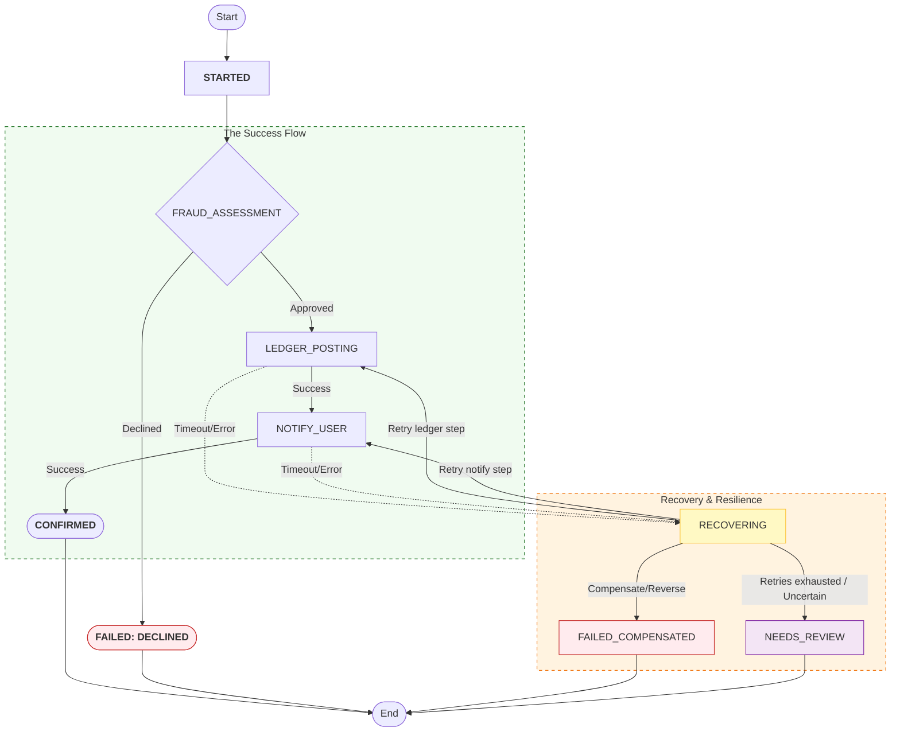
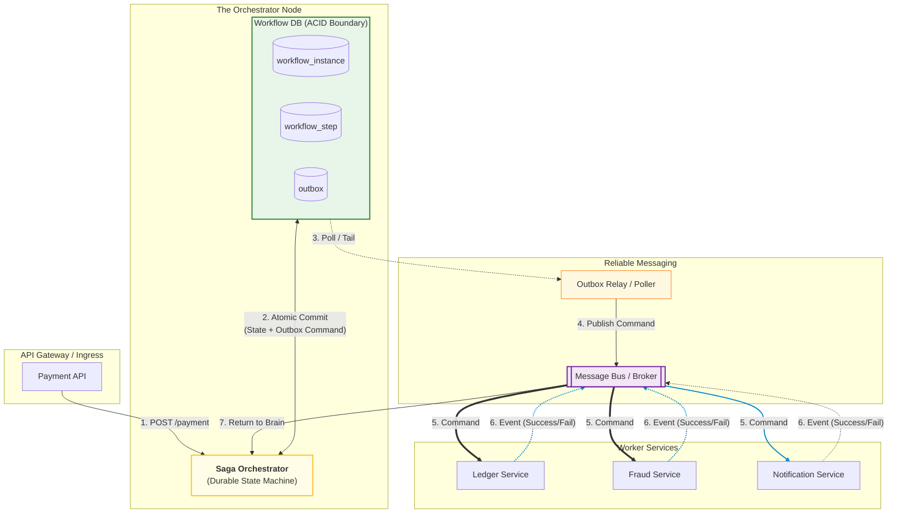

# Saga Pattern — Durable Workflow State Machine

---

In the previous articles, we introduced the Saga pattern (local transactions + recovery), compared orchestration vs choreography and chose **orchestration** as the baseline for correctness-critical payment workflows.

Now we answer the most important implementation question:

> **What makes an orchestrator “durable”?**  
> What happens when the coordinator crashes mid-workflow?

A durable orchestrator is not “a service that runs steps”.

It is a **persistent state machine**.

- workflow progress is stored durably
- steps are idempotent
- retries and timeouts are explicit
- recovery is safe after restarts

---

## 1. The Core Problem: Coordinator Failure Creates Ambiguity

---

Suppose the orchestrator sends a command:

- `PostLedger(paymentId=123, stepKey=123:LEDGER_POST)`

Then it crashes.

Did the ledger service process it?

- maybe yes (but response/event was lost)
- maybe no (command never reached)
- maybe it processed and then crashed before responding

This is the same ambiguity we saw with retries and idempotency:

> timeout ≠ failure, and absence of confirmation ≠ absence of execution.

So a saga orchestrator must treat **unknown outcomes** as a first-class state.

---

## 2. What “Durable” Means (Practical Definition)

---

A saga orchestrator is **durable** if:

- it can crash and restart without losing workflow progress
- it can resume from persisted state
- retries do not create duplicate effects

This requires **persistent workflow state**.

Not in memory. Not only logs. Not only metrics.

A durable store that survives restarts.

---

## 3. Real-world Orchestrator Implementations (Examples)

---

Teams usually implement durable orchestration in one of two ways:

### Option A — Workflow engines (built-in durability)

These systems persist workflow state, retries, and timers for you:

- **Temporal** (and its predecessor **Cadence**): very common for microservice orchestration
- **Camunda / Zeebe**: BPMN-style workflow engine (enterprise-heavy, but durable)
- **AWS Step Functions** / **Azure Durable Functions** / **Google Workflows**: managed orchestration
- **Netflix Conductor**: orchestration engine used in some orgs

They provide a durable coordinator “out of the box”, but introduce platform dependency and operational footprint.

### Option B — DB-backed orchestrator service (common in microservices)

A service implements a durable state machine itself:

- workflow state stored in DB tables
- commands emitted via **transactional outbox**
- step results consumed from the message bus
- retries/timeouts driven by persisted state

This approach is simpler to explain in system design interviews and is widely used when a full workflow engine is not desired.

---

## 4. The Minimal Data Model (What Must Be Persisted)

---

A practical orchestrator persists two things:

### 4.1 Workflow instance state

#### Minimal fields:

- `workflowId` (often the `paymentId`)
- `status` (`RUNNING`, `SUCCEEDED`, `FAILED`, `NEEDS_REVIEW`)
- `currentStep` (pointer to the next step to execute)
- `updatedAt`
- retry scheduling:
  - `retryCount`
  - `nextRetryAt`

#### Optional but useful:

- correlation IDs / trace IDs
- last known leader version/commit (for debugging)
- last error summary

### 4.2 Step execution state (per step)

For each step:

- `stepName` (e.g., `FRAUD_ASSESSMENT`, `LEDGER_POSTING`)
- `stepStatus` (`NOT_STARTED`, `IN_PROGRESS`, `SUCCEEDED`, `FAILED`)
- `idempotencyKey` (e.g., `paymentId:LEDGER_POST`)
- attempt count + last error + timestamps

You can store this in a separate table (`workflow_step`), or embed it as structured data.

The point is: the orchestrator must know what has been tried and what is safe to retry.

---

## 5. The State Machine (A Payment Example)

---

A simple orchestrated payment saga could be:

1. `FRAUD_ASSESSMENT`
2. `LEDGER_POSTING`
3. `NOTIFY_USER`

With durable recovery paths.

Key points:

- The orchestrator always knows the **current step**.
- Recovery is step-aware (retry the failed step, not the whole workflow).
- There is a terminal “in-doubt” state: NEEDS_REVIEW.

---

## 6. How the Orchestrator Executes Steps (Command + Result)

---

Orchestration is usually “commands and results”.

- orchestrator emits a command: `PostLedger(paymentId, stepKey)`
- step handler performs local transaction
- step handler returns result or emits an event the orchestrator consumes

The important rule:

> commands must be **idempotent** (step-level idempotency), because orchestrator retries are normal.

---

## 7. How Recovery Works After a Crash (The Resume Loop)

---

A DB-backed orchestrator typically runs a simple loop:

1. Find workflows that are runnable:
   - status = RUNNING
   - nextRetryAt <= now (or step is pending)
2. For each workflow:
   - load the persisted currentStep + step statuses
   - decide the next action:
     - send next command
     - retry current step
     - compensate
     - mark NEEDS_REVIEW
3. Persist progress before doing external work (more on outbox next)

So after a crash:

- the service restarts
- the loop resumes from DB state
- idempotent steps make retries safe

Coordinator failure becomes:

- **pause and resume**, not corruption.

---

## 8. Retry and Timeout Rules (Make Them Explicit)

---

A durable orchestrator defines explicit policies:

- max retries per step
- exponential backoff with jitter
- timeouts per step (how long we wait for confirmation)
- circuit-breaker behavior for degraded dependencies

A common pattern:

- retry transient errors
- stop retrying on deterministic errors (e.g., fraud declined)
- route ambiguous outcomes to `NEEDS_REVIEW`

---

## 9. Basic Architecture (DB-backed Orchestrator + Outbox)

---

If you implement orchestration yourself, the architecture typically looks like this:

This architecture makes two important things explicit:

- workflow state is **persisted**
- command dispatch is **replayable** (outbox)

---

## 10. The Outbox Link (Durable Command Dispatch)

---

A subtle reliability gap:

- orchestrator updates workflow state in DB
- orchestrator sends command to message bus
- what if it crashes between them?

This is the same “DB + publish split” problem.

So orchestrators often use **transactional outbox**:

- persist workflow state update + outbox command record in one transaction
- relay publishes command reliably

This is how orchestration becomes truly durable under crashes.

---

## Key Takeaways

---

- A durable saga orchestrator is a **persistent state machine**, not an in-memory process.
- Coordinator failures create ambiguity; durable state + idempotent steps make recovery safe.
- Real-world orchestration is implemented via:
  - workflow engines (Temporal/Camunda/Step Functions), or
  - DB-backed orchestrator service + outbox (common baseline)
- Persist workflow state (current step, status, retries) and step state (idempotency keys, outcomes).
- Recovery resumes from persisted state and retries step-aware commands.
- `NEEDS_REVIEW` is a first-class terminal state for in-doubt outcomes.
- Transactional outbox is often required to make command dispatch durable.

---

## TL;DR

---

To make sagas reliable, the coordinator must be durable.

Persist workflow progress, make steps idempotent, retry with explicit timeout/backoff rules, and use outbox for durable command dispatch. Then coordinator crashes become safe pauses rather than correctness failures.

---

### 🔗 What’s Next

Next we’ll design compensations properly:

- what can be compensated vs what cannot
- refund vs reversal vs release
- invariants and auditability in compensation logic

👉 **Up Next: →**  
**[Saga Pattern — Compensation Design (Rules & Pitfalls)](/learning/advanced-skills/high-level-design/8_concepts-phase3/8_33_saga-pattern-compensation-design)**
