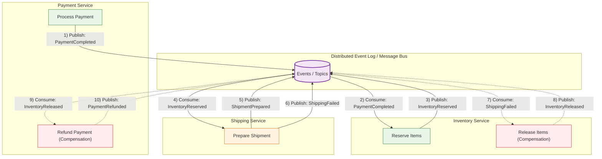

# Saga Pattern — Choreography Reliability (Deep Dive)

---

Choreography-based sagas remove the central orchestrator.

Instead:

- services publish events after local commits
- other services react and publish their own events
- compensations are also triggered via events

This can be a good fit for highly event-driven platforms.

But the trade-off is clear:

> orchestration centralizes reliability logic,  
> choreography distributes reliability logic across services and event contracts.

So reliability in choreography depends on discipline:

- outbox/inbox everywhere
- explicit correlation IDs
- clear event contracts and versions
- workflow projection for observability
- compensation events as first-class messages

This article shows what “reliable choreography” looks like in practice.

---

## 1. The Core Reliability Problem: At-least-once + No Central State

---

In choreography:

- delivery is often at-least-once
- duplicates happen
- events can arrive out of order
- there is no single component that “knows the workflow state”

So each service must be able to answer:

- “have I already processed this event?”
- “what do I do if I see it again?”
- “how do I trigger compensation safely?”

That’s why outbox/inbox patterns are not optional.

---

## 2. Outbox/Inbox per Service (Non-negotiable)

---

Choreography requires:

### 2.1 Producer safety (Outbox)

Each service must publish events reliably:

- commit local state
- write event to outbox in same transaction
- relay publishes to event bus

This prevents missing/ghost events.

### 2.2 Consumer safety (Inbox / dedup)

Each service must handle duplicates:

- store `eventId` in inbox table
- apply side effects only if `eventId` is new
- commit atomically

This prevents duplicate side effects.

In other words:

> choreography works only if each service is independently reliable.

---

## 3. Event Design: Make Commands and Compensations Explicit

---

In orchestration, the orchestrator sends commands.

In choreography, “commands” often appear as events.

A common mistake is to rely on implicit “triggering”.

Instead, make events explicit:

- forward progress events:
  - `PaymentCompleted`
  - `InventoryReserved`
  - `ShipmentPrepared`

- compensation request events:
  - `ReleaseInventoryRequested`
  - `RefundPaymentRequested`

- compensation completion events:
  - `InventoryReleased`
  - `PaymentRefunded`

This makes the workflow legible and reduces accidental loops.

---

## 4. Correlation IDs (How You Debug Anything)

---

Without a central coordinator, debugging relies on correlation.

Every event should carry:

- `workflowId` (e.g., paymentId/orderId)
- `eventId` (unique)
- `causationId` (what caused this event)
- `correlationId` (trace across services)

This enables:

- tracing across services
- workflow reconstruction
- post-incident auditing

Without correlation IDs, choreography becomes “distributed mystery”.

---

## 5. Workflow Projection (A Practical Observability Upgrade)

---

Because no service owns global state, teams often build a projection:

- a “workflow view” service or table
- built by consuming events and updating a read model

This projection answers:

- where is paymentId=123 in the workflow?
- which step failed?
- what compensations ran?
- is it stuck?

Projection is not the source of truth.

It is an observability tool and support surface.

---

## 6. Failure Handling in Choreography (Practical Rules)

---

### 6.1 Duplicates are normal

- inbox/dedup store required

### 6.2 Out-of-order is possible

- enforce monotonic state transitions (versioning)
- ignore invalid transitions

### 6.3 Compensation must be idempotent

Compensation events can be replayed too.

So:

- refund/release steps must be idempotent
- compensation completion events must be idempotent for downstream consumers

### 6.4 Avoid accidental loops

Loops happen when:

- events trigger each other cyclically

Mitigations:

- explicit state machines
- causationId checks
- workflow projection audits
- “only react once per workflowId + step” constraints

---

## 7. Example: Event-driven Compensation Chain (Payment + Inventory + Shipping)

---

Below is an event-message based choreography flow:

### Need to complete this section
