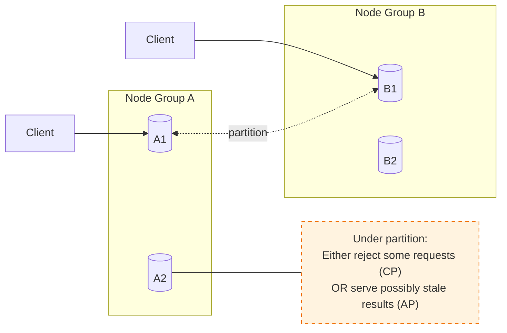

# CAP Theorem — Correct Interpretation (No Myths)

---

CAP is one of the most quoted—and most misunderstood—ideas in distributed systems.

Many designers incorrectly treat CAP as:

- a feature checklist (pick two)
- a permanent system identity ("we are CP")
- a performance statement ("we chose C, so it's slower")

CAP is none of those.

CAP is a **constraint** that becomes relevant under a specific condition:

> **a network partition (or partition-like failure).**

This article clarifies what CAP actually says, defines C/A/P precisely, and removes the myths.

---

## 1. The Only Situation Where CAP Matters: Partition

---

CAP is about what happens when your system is split and nodes cannot reliably communicate.

A **partition** means:

- messages between some nodes are delayed, dropped, or timed out
- the system cannot tell whether the other side is down or just unreachable

In real systems, many failures behave like partitions:

- network outages
- packet loss / high jitter
- overloaded nodes that time out
- GC pauses / stop-the-world events ("alive but unresponsive")

So CAP is not a theoretical corner case.

But it is also not a constant day-to-day trade-off.

The CAP trade-off is forced **during partition-like conditions**.

---

## 2. Define C, A, and P (Precisely)

---

### 2.1 Consistency (CAP consistency)

In CAP, **Consistency** means:

> every read receives the most recent write (or an error).

This is closer to **linearizability** than “ACID consistency”.

It is about _visibility of writes_ across nodes.

### 2.2 Availability

In CAP, **Availability** means:

> every request to a non-failing node receives a non-error response.

Important detail:

- "non-error response" does not mean "correct" or "fresh".
- it only means the node responds.

So an AP system may respond with stale data.

### 2.3 Partition tolerance

**Partition tolerance** means:

> the system continues operating despite network partitions.

In practice, for any distributed system that spans machines (or AZs/regions), you must assume partitions happen.

So P is not a choice.

Most real systems are **partition tolerant by necessity**.

---

## 3. The Real CAP Statement (The Correct Form)

---

A useful way to say it:

> **When a partition happens, you must choose between:**
>
> - **Consistency** (reject/err on some requests to avoid stale results), or
> - **Availability** (respond to all requests, possibly serving stale/divergent results).

So CAP is really:

- **P is a condition you must handle**
- under P, you choose **C or A** for a given operation

---

## 4. The Most Common Myths (And Fixes)

---

### Myth 1 — “Pick two” is a permanent choice

Reality:

- systems make choices **per request / per endpoint / per workflow state**
- you might choose CP for payment confirmation reads
- and AP for history feeds

CAP is not a one-time label.

### Myth 2 — “CP means the system is down during partitions”

Reality:

- CP systems remain available for some operations
- but they may return errors/timeouts for operations that would violate consistency

CP means:

- correctness is prioritized over responding successfully during partition

### Myth 3 — “AP means incorrect data”

Reality:

- AP means “respond even during partition”
- responses may be stale, but they can still be acceptable for non-critical UX

AP is often a product decision:

- show cached/stale data rather than failing the request

### Myth 4 — “CAP is about latency”

Reality:

- CAP is about **network partitions**, not normal latency.
- coordination for strong consistency can add latency, but that’s not CAP itself.

(There is a related idea: **PACELC** — if no partition, choose latency vs consistency — but CAP alone is not that.)

---

## 5. A Simple Diagram: What CAP Forces Under Partition

---

The key point:

- if A-side accepts a write
- and B-side cannot see it
- a B-side read must either:
  - fail (CP) or
  - return stale data (AP)

---

## 6. CAP vs What We Already Learned in Phase 3

---

CAP becomes much easier once you map it to concrete behaviors from Phase 3.

During partition-like conditions, systems often choose:

### CP-style behavior

- route critical reads to a single leader
- reject/timeout rather than lie
- use `NEEDS_REVIEW` when outcome is uncertain

### AP-style behavior

- serve history/feed reads from replicas/caches
- allow “eventual” convergence
- prefer degraded UX over errors

The important idea:

> CAP is a lens for the _trade-offs you were already making_.

---

## 7. What CAP Does NOT Tell You

---

CAP does not give you a full design.

It does not tell you:

- which endpoints should be CP vs AP
- how to do failover
- how to do idempotency
- how to coordinate sagas

CAP only forces one truth:

> under partitions, you cannot have both fresh reads and always-successful responses.

Everything else is design.

---

## Key Takeaways

---

- CAP matters **only under partition-like conditions**.
- In CAP:
  - Consistency = fresh/linearizable reads
  - Availability = every request gets a non-error response
  - Partition tolerance is necessary in real distributed systems
- The real statement is:
  - **under partitions, choose C or A** (per operation)
- “Pick two” is a simplification; real systems mix choices per endpoint.
- CAP is not a performance rule; it’s a failure-mode constraint.

---

## TL;DR

---

CAP says: **when the network partitions, you must choose between responding to every request (availability) and guaranteeing fresh reads (consistency).**

It’s not a permanent label and not about normal latency—it's a constraint that shows up under partition-like failures.

---

### 🔗 What’s Next

Next we’ll apply CAP to the specific decisions we made in Phase 3:

- leader reads for critical paths
- read-your-writes windows
- sagas + `NEEDS_REVIEW`

👉 **Up Next: →**  
**[CAP Theorem — Applying CAP to Phase 3 Decisions](/learning/advanced-skills/high-level-design/8_concepts-phase3/8_37_cap-theorem-applying-to-phase3/)**
