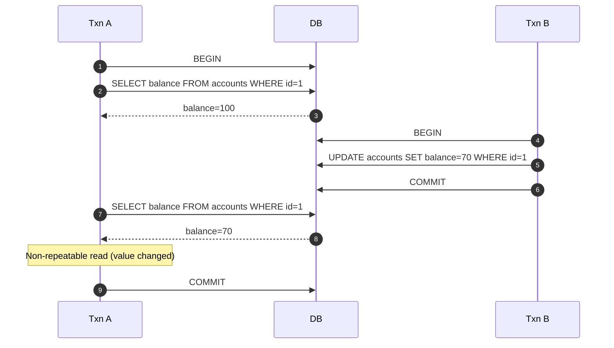
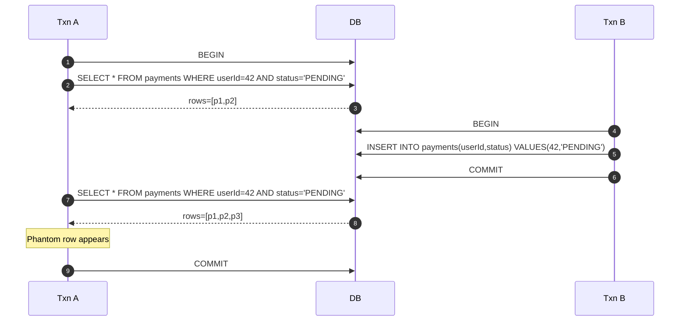
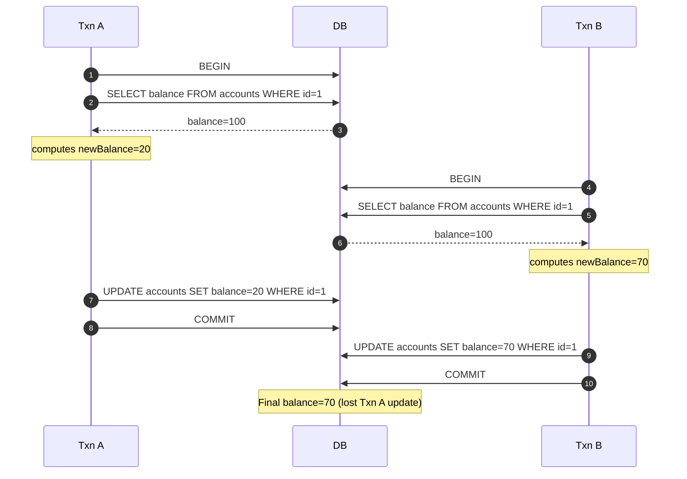
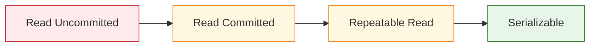
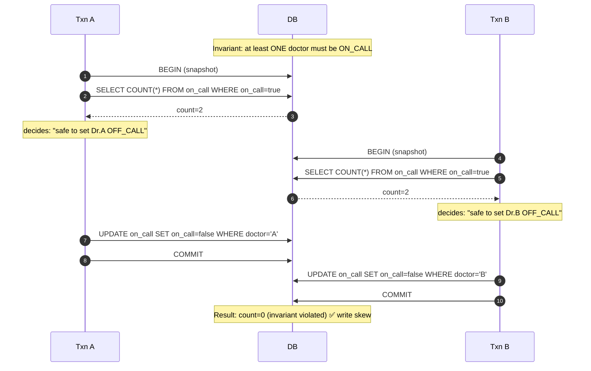
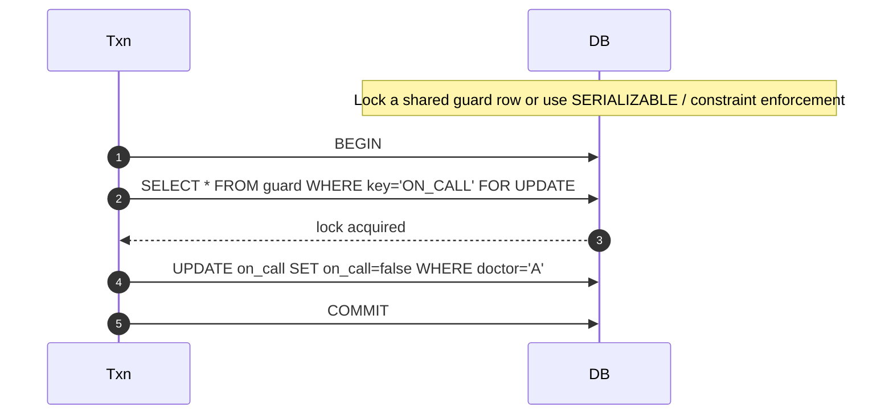
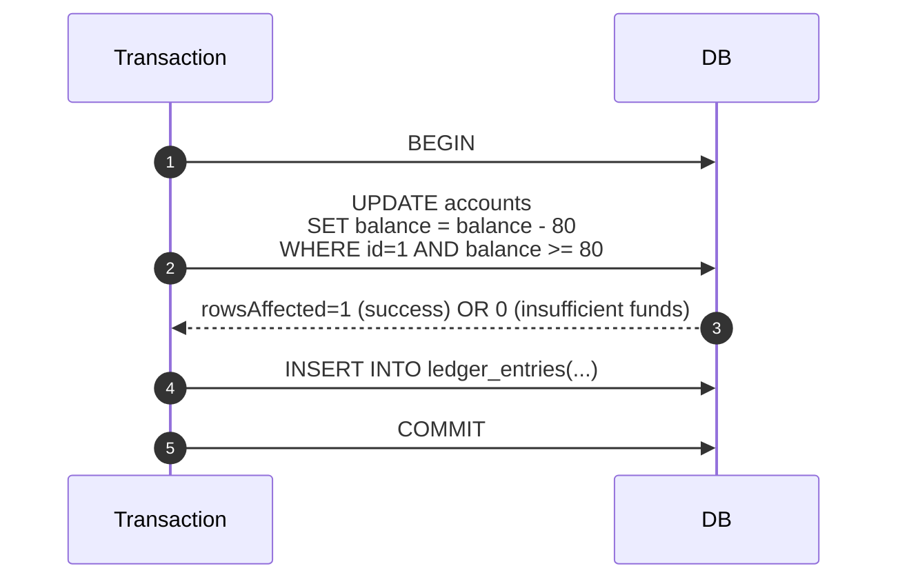

# ACID Transactions — Isolation Levels & Read Phenomena

---

In the previous article, we established that ACID transactions give you **local correctness**.

But most correctness bugs in real systems don’t come from missing transactions.

They come from:

> **multiple transactions interleaving in surprising ways.**

This article makes isolation practical by focusing on:

- the exact anomalies isolation levels prevent
- what you should expect at common defaults (like Read Committed)
- what payment-like systems typically require

---

## 1. What Isolation Is (In One Sentence)

---

**Isolation** controls how a transaction behaves when other transactions run at the same time.

It answers questions like:

- if I read a row twice, can it change?
- if I read “all rows that match X”, can new matching rows appear?
- can two concurrent updates overwrite each other?
- can I observe another transaction that later rolls back?

Isolation exists because concurrency is required for throughput.

But concurrency without rules breaks correctness.

---

## 2. The Read Phenomena (What Can Go Wrong)

---

Most databases and textbooks describe isolation using “read phenomena”.

We’ll anchor them in intuitive stories.

### 2.1 Dirty Read

**Definition:** Transaction A reads data written by Transaction B **before B commits**.

If B later rolls back, A has read a value that never truly existed.

**Why it’s bad:** you made decisions based on a value that was never committed.

Dirty reads are usually unacceptable in financial logic.

Most mainstream relational databases do **not** allow dirty reads at their default settings.

---

### 2.2 Non-Repeatable Read

**Definition:** Transaction A reads the same row twice and gets different results because another transaction committed an update in between.

Example:

- A reads `balance = 100`
- B commits `balance = 70`
- A reads again and sees `balance = 70`

**Why it matters:** if A assumes the value is stable during its transaction, it can make incorrect decisions.

---

### 2.3 Phantom Read

**Definition:** Transaction A runs the same query twice and sees a different set of rows because another transaction inserted or deleted rows that match the query.

Example:

- A queries “all pending payments for user X”
- B inserts a new pending payment for X and commits
- A runs the query again and sees an extra row (a “phantom”)

**Why it matters:** range queries and “exists” checks can become unstable.

---

### 2.4 Lost Update (Most Common Payment Bug)

Lost update isn’t always listed as a “read phenomenon”, but it is the most practical concurrency bug.

**Definition:** Two transactions read the same value and then both write based on that old value, causing one write to overwrite the other.

Example (balance update):

- T1 reads balance 100, computes 100 - 80 = 20
- T2 reads balance 100, computes 100 - 30 = 70
- T1 writes 20
- T2 writes 70 (overwrites T1)
- final balance becomes 70 (incorrect, should be 20 or should reject)

Lost updates are exactly why payment systems use:

- locking (`SELECT ... FOR UPDATE`)
- optimistic concurrency (version/CAS)
- atomic updates (`UPDATE ... WHERE balance >= amount`)

We’ll connect this back to Phase 3 in section 5.

---

## 3. Common Isolation Levels (Practical View)

---

Isolation levels are not just names — they are bundles of guarantees.

The exact behavior varies slightly by database, but the mental model is consistent.

### 3.1 Read Uncommitted

- may allow dirty reads
- rarely used in correctness-sensitive systems

### 3.2 Read Committed (Common Default)

Guarantees:

- no dirty reads (you only read committed data)

But it may allow:

- non-repeatable reads
- phantom reads
- lost updates (unless updates are protected)

Read Committed is often fine for:

- browsing views
- dashboards
- “non-critical reads”

But payment correctness usually needs stronger protections on writes.

### 3.3 Repeatable Read

Guarantees (conceptually):

- repeated reads of the same row are stable

But depending on DB, it may still allow:

- phantom reads (unless implemented as true snapshot + range locking)

Repeatable Read is stronger for workflows that:

- read then act based on what they read

### 3.4 Serializable (Strongest)

Conceptually:

- transactions behave as if executed one-by-one in some order.

This prevents:

- dirty reads
- non-repeatable reads
- phantoms
- many forms of write skew

Trade-off:

- reduced concurrency (more locking / retries / aborts)
- often heavier operational cost

Serializable is the closest thing to “no surprises”, but you pay for it.

---

## 4. Snapshot Isolation and “Write Skew” (Important Edge)

---

Many modern databases implement isolation using snapshots (MVCC).

Snapshot isolation prevents many read anomalies, but it can allow a subtle bug called **write skew**.

**Write skew story (conceptual):**

- Two transactions check a constraint using reads
- Both see the constraint is satisfied
- Both write different rows
- Together they violate the constraint

> Both transactions made a correct decision based on their own snapshot, but their combined writes violated the global invariant.

This is why some invariants require:

- explicit locking, or
- serializable isolation, or
- a single atomic update statement that enforces the constraint

We’ll revisit this in later article (atomic update patterns).

---

## 5. What Payment Systems Typically Need (Practical Guidance)

---

In Phase 3, the high-risk area was:

> **concurrent debits / balance updates / state transitions**

For money correctness, you generally do not rely only on “Read Committed reads”.

Instead, you use one of these safe patterns:

### Pattern A — Pessimistic locking

- `SELECT ... FOR UPDATE`
- ensures only one transaction can modify the row at a time

Good for:

- high correctness
- moderate contention

Risk:

- lock waits and deadlocks at scale

### Pattern B — Optimistic concurrency

- version column / compare-and-swap (CAS)
- update succeeds only if version matches

Good for:

- lower contention scenarios
- retry-friendly systems

### Pattern C — Atomic updates (preferred for balances)

Single statement enforces invariant:

- `UPDATE accounts SET balance = balance - amount WHERE balance >= amount`

This prevents lost updates and overspending without requiring a prior read.

In practice, payment systems mix:

- Read Committed or Repeatable Read
- plus explicit locking or atomic statements on critical rows

That is often better than running everything at full Serializable.

---

## 6. Choosing Isolation: A Simple Decision Guide

---

When you choose an isolation level, ask:

1. **What invariants must never break?**  
   (balance ≥ 0, unique transaction, valid status transitions)

2. **Where can you tolerate stale/non-repeatable reads?**  
   (history views can; balance checks cannot)

3. **What is the contention profile?**  
   (hot accounts, hot merchants, hot rows)

4. **Can you use atomic updates instead of read-then-write?**  
   (often yes, and it’s the best solution)

Isolation levels are part of the answer, but “safe write patterns” are usually the real solution.

---

## Key Takeaways

---

- Isolation controls how concurrent transactions interleave.
- Main anomalies:
  - dirty reads
  - non-repeatable reads
  - phantom reads
  - lost updates (most practical bug)
- Read Committed prevents dirty reads but not many others.
- Serializable is strongest but costs concurrency.
- Payment correctness usually relies on:
  - explicit locking, optimistic versioning, or atomic updates
    rather than “just crank isolation up everywhere”.

---

## TL;DR

---

Isolation levels exist to prevent concurrency anomalies.

For payment-like systems, the most important risk is lost updates and invariant violations under concurrent writes.

Instead of relying only on isolation level names, use safe write patterns (locking, optimistic concurrency, atomic updates) where correctness matters.

---

### 🔗 What’s Next

Next we’ll look at what actually happens inside the database when you apply these patterns:

- row locks and lock waits
- deadlocks and how they happen
- why “correctness” can become “contention” at scale

👉 **Up Next: →**  
**[ACID Transactions — Locking, Contention, and Deadlocks](/learning/advanced-skills/high-level-design/8_concepts-phase3/8_4_locking-contention-deadlocks)**
