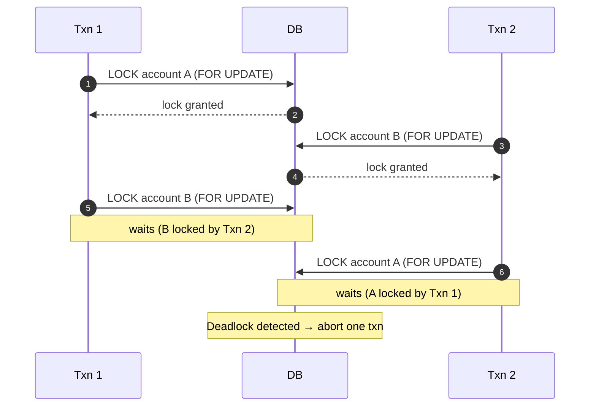
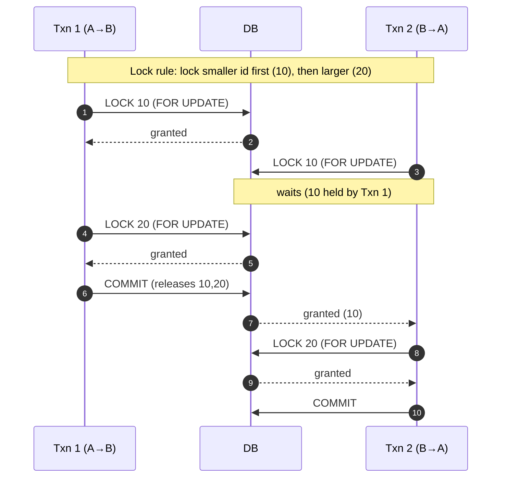

# ACID Transactions — Locking, Contention, and Deadlocks

---

In the previous article, we saw that concurrency anomalies (lost updates, write skew) are the real cause of many correctness bugs.

The most common tool databases use to prevent these anomalies is **locking**.

But locks introduce a trade-off:

> more locking → stronger correctness guarantees → less concurrency.

This article explains:

- what locks are and why they exist
- how contention shows up in real systems (hot rows)
- how deadlocks happen
- practical ways payment systems avoid turning correctness into a scalability bottleneck

---

## 1. Why Locks Exist

---

A database must protect data when multiple transactions operate concurrently.

If two transactions update the same account balance at the same time, we need rules so the result is correct.

Locks are one mechanism to ensure that rules are enforced.

At a high level:

- **Shared lock (S / read lock)**: many readers can read together
- **Exclusive lock (X / write lock)**: only one writer can modify

Modern databases also use MVCC (snapshots), but even with MVCC:

- writes still require coordination
- some reads (like `SELECT ... FOR UPDATE`) intentionally lock

---

## 2. The Most Important Lock in Payments: `SELECT ... FOR UPDATE`

---

When you see a payment system doing “read → validate → write”, the risk is lost updates.

A common safe approach is **pessimistic locking**:

```sql
BEGIN;

SELECT balance
FROM accounts
WHERE account_id = 123
FOR UPDATE;

-- check sufficient funds in application logic

UPDATE accounts
SET balance = balance - 80
WHERE account_id = 123;

INSERT INTO ledger_entries(...);

COMMIT;
```

FOR UPDATE acquires a write-intent lock on the row so no other transaction can modify it until commit/rollback.

This prevents two transactions from simultaneously debiting the same balance based on stale reads.

---

## 3. Lock Contention: When Correctness Becomes a Bottleneck

---

Locks serialize access.

That is good for correctness, but it can become a bottleneck under contention.

### 3.1 Hot rows (the classic source of contention)

Payments often create “hot rows” such as:

- a single popular merchant account
- a shared wallet account
- a high-traffic user account (many concurrent debits)
- a “global counter” table (anti-pattern)

When many transactions compete for the same row lock:

- latency increases (lock waits)
- throughput drops
- tail latency spikes (p99 becomes bad)
- timeouts increase (which triggers retries, making it worse)

This is why payment systems prefer patterns that avoid read-then-write when possible.

---

## 4. Deadlocks: When Two Transactions Wait Forever

---

A **deadlock** happens when:

- Transaction A holds lock X and waits for lock Y
- Transaction B holds lock Y and waits for lock X

Neither can proceed.

Databases detect deadlocks and abort one transaction.

### 4.1 Deadlock example (simple)

Imagine two transfers happening concurrently:

- T1 transfers from Account A → B
- T2 transfers from Account B → A

If the system locks accounts in inconsistent order, a deadlock is possible.



---

## 5. Practical Ways to Reduce Deadlocks and Contention

---

### 5.1 Always lock in a consistent order

Deadlocks usually happen when two transactions lock the **same set of rows** in **different orders**.

If you enforce a deterministic order, transactions may still wait — but they won’t form a cycle.

**Rule:** always lock rows in a fixed order (e.g., increasing `accountId`).

Example: transferring between accounts `A=10` and `B=20`



### 5.2 Keep transactions short

Long transactions hold locks longer.

Avoid doing inside a transaction:

- network calls
- slow remote validations
- large computations

Instead:

- validate outside when possible
- keep the transaction limited to DB work

### 5.3 Prefer atomic update patterns for hot invariants

Instead of:

- `SELECT balance` then `UPDATE`

Use:

- `UPDATE ... SET balance = balance - amount WHERE balance >= amount`

This reduces lock duration and avoids a pre-read.

We’ll cover this deeply in **the next article**.

### 5.4 Use optimistic concurrency when contention is low

When write contention is low:

- versioned updates (CAS) can outperform locks
- retries are acceptable

But for hot rows (balances), optimistic retries can become expensive.

### 5.5 Separate “ledger” from “balance”

A common production pattern:

- ledger is append-only (scales better, fewer updates)
- balance can be derived or updated with careful atomic rules

This reduces direct contention on shared balance rows.

(We’ll keep the deep ledger modeling out of Phase 3, but it’s useful context.)

---

## 6. Correctness vs Throughput: A Clear Trade-off

---

Locking is not “good” or “bad”.

It is the cost you pay for correctness.

When you design a payment-like system, ask:

- Where are the hot rows?
- Which invariants must be strongly enforced?
- Can we use atomic updates instead of long lock-held reads?
- Are retries acceptable, and how do they behave under contention?

These questions determine whether you should:

- lock pessimistically
- use optimistic concurrency
- restructure the data model to avoid contention

---

## Key Takeaways

---

- Locks are a primary mechanism to enforce isolation and prevent lost updates.
- `SELECT ... FOR UPDATE` is the canonical pessimistic locking tool for money correctness.
- Lock contention creates tail latency and can collapse throughput under hot rows.
- Deadlocks happen when transactions lock resources in inconsistent order.
- Practical mitigations:
  - lock in consistent order
  - keep transactions short
  - prefer atomic updates for hot invariants
  - use optimistic concurrency when appropriate

---

## TL;DR

---

Isolation often comes down to locking.

Locks protect correctness, but contention and deadlocks are the price you pay at scale.

Payment systems manage this by keeping transactions short, locking consistently, and using atomic update patterns for critical invariants.

---

### 🔗 What’s Next

Next we’ll cover the most practical technique for money correctness under concurrency:

- atomic update patterns
- enforcing invariants in one statement
- why this often beats “read → check → write” even with locks

👉 **Up Next: →**  
**[ACID Transactions — Atomic Money Updates (Single-statement patterns)](/learning/advanced-skills/high-level-design/8_concepts-phase3/8_5_atomic-money-updates)**
