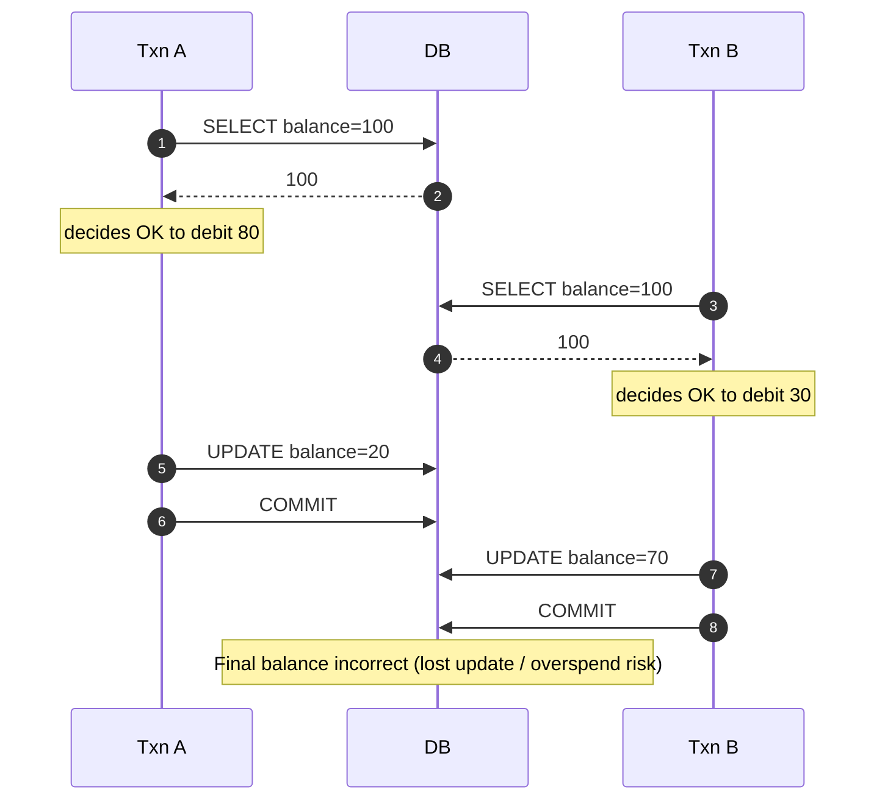
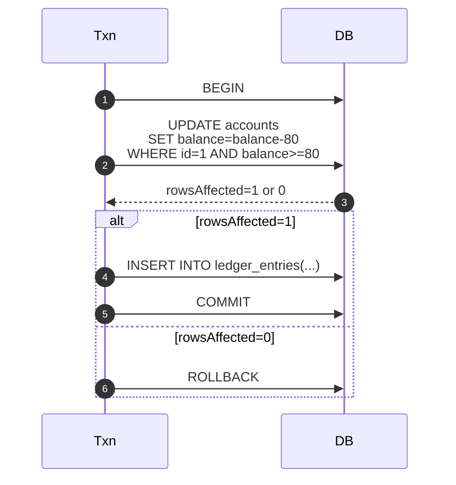

# ACID Transactions — Atomic Money Updates (Single-statement Patterns)

---

In payment-like systems, the most dangerous concurrency bugs come from this pattern:

> read a value → make a decision → write a new value

Under concurrency, that “decision” can be based on stale data, leading to:

- lost updates
- overspending
- inconsistent balances

Atomic single-statement updates are one of the most effective fixes because they enforce an invariant **inside the database** in one operation.

In Phase 3, we used the most common form:

```sql
UPDATE accounts
SET balance = balance - :amount
WHERE account_id = :id
  AND balance >= :amount;
```

This article explains why this works, how to extend it, and when to use it.

---

## 1. The Problem: Read-Then-Write Races

---

A naive debit flow often looks like:

1. SELECT balance
2. check balance >= amount
3. UPDATE balance = balance - amount

Under concurrency, two transactions can both read the same balance and both pass the check.

That is how overspending happens.

### Naive flow under concurrency (race)



You can try to “fix” this with stronger isolation, but the simplest reliable fix is:

> don’t do a separate read + decision + write.

Instead, enforce the decision in the write.

---

## 2. The Core Pattern: Conditional Atomic Update

---

The database can enforce the invariant directly:

```sql
UPDATE accounts
SET balance = balance - :amount
WHERE account_id = :id
  AND balance >= :amount;
```

### Why this is safe

This statement is atomic at the row level:

- it checks the condition (balance >= amount)
- and applies the update (balance = balance - amount)
- as one unit.

So two concurrent updates cannot both “win” if only one should.

### How to interpret the result

- rowsAffected = 1 → success (funds reserved/debited)
- rowsAffected = 0 → failure (insufficient funds OR account missing)

This gives you a clean branch without a race.



---

## 3. Common Variations (Real-World Useful)

---

### 3.1 Reserve then capture (holds vs final debit)

Many payment systems separate:

- **reserve** (authorize/hold funds)
- **capture** (finalize the debit)

You can apply atomic updates to reservations too:

```sql
UPDATE accounts
SET available = available - :amount,
    reserved  = reserved + :amount
WHERE account_id = :id
  AND available >= :amount;
```

### 3.2 Status transitions (prevent illegal state changes)

You can enforce state transitions atomically:

```sql
UPDATE payments
SET status = 'CONFIRMED'
WHERE payment_id = :pid
  AND status = 'PENDING';
```

This ensures:

- only one transaction can confirm a payment
- retries become safe at the DB level

### 3.3 Idempotency checks (insert-once semantics)

A common pattern (simplified):

```sql
INSERT INTO idempotency_keys(key, request_hash)
VALUES (:key, :hash)
ON CONFLICT (key) DO NOTHING;
```

Then you branch on whether you inserted a new row.

(This is a building block; we’ll deep dive idempotency in its dedicated section.)

---

## 4. When Atomic Updates Beat Locks (and When They Don’t)

---

### 4.1 Why this often beats `SELECT ... FOR UPDATE`

Atomic updates:

- reduce lock duration (no “read then compute then write”)
- avoid holding locks while application logic runs
- scale better under contention for hot rows

You still get correctness, but with less blocking.

### 4.2 When you still need locking or stronger isolation

Atomic updates are great when the invariant is expressible in one statement.

You may still need locks when:

- correctness depends on multiple rows/ranges (e.g., complex constraints)
- you need to read a set and ensure it doesn’t change (range stability)
- you need multi-step decisions not expressible in SQL constraints

In those cases, you use:

- locking (shown in previous article)
- serializable transactions
- or redesign the invariant (often the best move)

---

## 5. The Invariant Mindset (What to Remember)

---

This concept is bigger than SQL syntax.

The mental model is:

1. identify the invariant (“balance must not go negative”)
2. enforce it where it is strongest (inside the database)
3. make the write atomic

That is why single-statement updates are so powerful in correctness-sensitive systems.

---

## Key Takeaways

---

- Read-then-write under concurrency creates lost updates and overspending risk.
- Atomic conditional updates enforce invariants in one DB operation.
- The most common money pattern is:
  - `UPDATE ... SET balance = balance - amount WHERE balance >= amount`
- Always branch on `rowsAffected` instead of relying on a prior balance read.
- Atomic updates often scale better than long-held row locks.
- Use locks/stronger isolation only when the invariant cannot be expressed atomically.

---

## TL;DR

---

For money correctness, the safest and most scalable approach is to enforce invariants in a single atomic update statement.

Avoid read-then-write races by making the database perform “check + update” as one operation, and branch on whether the update actually succeeded.

---

### 🔗 What’s Next

Now that we understand local correctness inside one DB boundary, we move to the next major failure source in distributed systems:

- retries after timeouts
- duplicate requests
- “did it succeed or did we just not hear back?”

👉 **Up Next: →**  
**[Idempotency — Why Retries Create Duplicates](/learning/advanced-skills/high-level-design/8_concepts-phase3/8_6_idempotency-why-retries-create-duplicates)**
