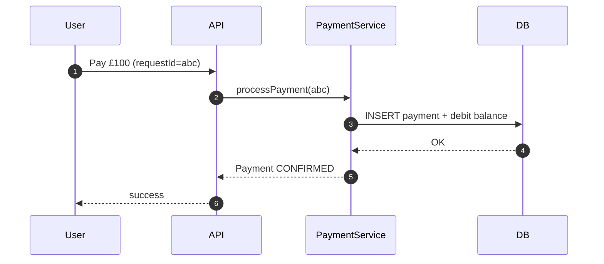
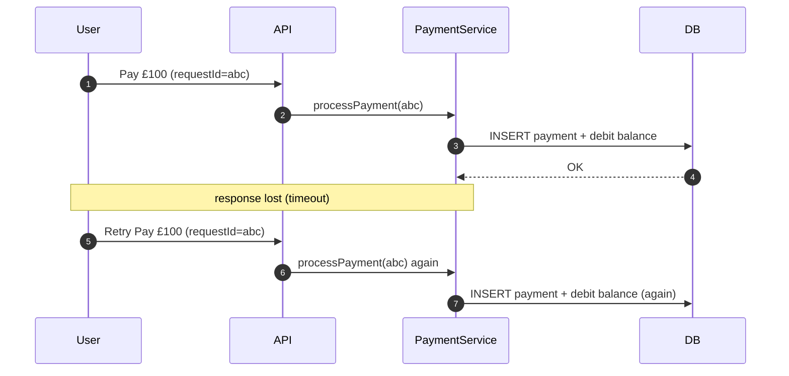

# Idempotency — Why Retries Create Duplicates

---

In Phase 3 (Payment System), the first major reliability problem appeared surprisingly early:

> even in a simple architecture, retries can cause duplicate side effects.

This is not a “coding mistake”.

It is a consequence of how networks behave:

- packets drop
- requests time out
- responses get lost
- clients retry

If your system treats retries like new requests, you will eventually:

- charge a user twice
- create duplicate ledger entries
- send duplicate notifications

This article explains:

- why retries are inevitable
- how duplicates happen in real systems
- what idempotency actually means (practically)
- why payment systems treat idempotency as mandatory

---

## 1. The Core Problem: Timeouts Create Ambiguity

---

When a client times out, it does not know what happened.

Two possibilities exist:

1. the server never received the request
2. the server processed the request, but the response was lost

From the client’s perspective, both look identical:

```
Request timed out
```

So the client retries.

This is the fundamental source of duplicates.

---

## 2. The Duplicate Scenario (Even With Correct Code)

---

Consider a payment request.

### 2.1 Normal path



## 2.2 Response lost → retry → duplicate



If your system does not recognize that the retry is the “same intent”, it performs the side effect again.

This is how you get:

- double charges
- duplicate payments
- mismatched ledger entries

---

## 3. What “Idempotency” Means (Practical Definition)

---

A request is **idempotent** if:

> executing it multiple times produces the same result as executing it once.

For a payment:

- the first attempt may create the payment and debit funds
- a retry should return the same outcome
- it should not create a second payment or debit again

Idempotency is not about avoiding retries.

It is about making retries **safe**.

---

## 4. Why Duplicates Are Not Rare (They Are Guaranteed Eventually)

---

In real systems, retries are common because of:

- transient network failures
- load balancer timeouts
- server restarts
- GC pauses / CPU spikes
- downstream dependencies slowing down
- client mobile networks switching

Even if your code is “correct”, production conditions create retries.

So the right mindset is:

> duplicates are not an edge case.  
> duplicates are a normal case at scale.

---

## 5. The First Solution Pattern: Idempotency Keys

---

The standard mechanism is an **idempotency key**:

- client generates a unique key for the user intent
- server stores the key with the result
- retries with the same key return the same result

Conceptually:

```text
Idempotency Key = "same user intent"
```

A typical flow:

1. Client sends POST /payments with header Idempotency-Key: X
2. Server checks if key X already exists
3. If yes → return stored result
4. If no → process payment, store result under key X

This turns “retry ambiguity” into a deterministic outcome.

We’ll cover where this key should be stored (DB vs Redis) and how to do it safely in later idempotency concept pages.

---

## 6. What Idempotency Does NOT Solve (Important)

---

Idempotency solves duplicate execution of the same intent.

But it does not automatically solve:

- ordering problems (events out of order)
- partial failures across services (sagas)
- exactly-once delivery guarantees in message systems
- correctness across replicas (stale reads)

Idempotency is a foundation, not the full reliability story.

---

## Key Takeaways

---

- Timeouts create ambiguity: the client can’t tell “failed” vs “succeeded but response lost”.
- Retrying is unavoidable in distributed systems.
- Without idempotency, retries create duplicate side effects (double charge, duplicate ledger entry).
- Idempotency means “retry produces the same outcome as the first execution”.
- Idempotency keys are the standard pattern to make retries safe.
- Idempotency is necessary, but not sufficient for end-to-end correctness.

---

## TL;DR

---

Retries are inevitable, and retries create duplicates unless you design for them.

Idempotency makes retries safe by treating repeated requests as the same user intent and returning the same stored outcome instead of repeating side effects.

---

### 🔗 What’s Next

Now that we understand why idempotency exists, we’ll answer the practical design question:

> where should idempotency live?

We’ll compare:

- API edge idempotency
- step-level idempotency (ledger/notify)
- workflow-level idempotency (saga replay)

👉 **Up Next: →**  
**[Idempotency — API Edge vs Step-level vs Workflow-level](/learning/advanced-skills/high-level-design/8_concepts-phase3/8_7_idempotency-where-it-live)**
