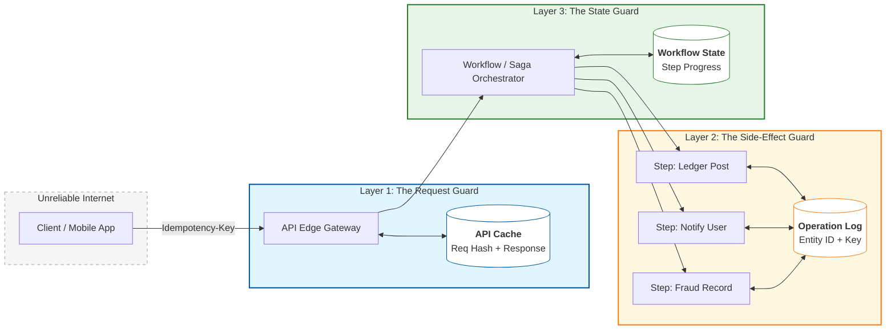

# Idempotency — API Edge vs Step-level vs Workflow-level

---

In the preivous article, we saw why idempotency exists:

- timeouts create ambiguity
- retries are unavoidable
- duplicates are guaranteed eventually

The next practical design question is:

> **Where should idempotency live?**

Many teams implement idempotency only at the API edge and stop there.

That helps — but it is not enough once your system becomes multi-step or multi-service.

In real systems, idempotency exists at three scopes:

1. **API edge idempotency** (repeat the same request → same result)
2. **Step-level idempotency** (repeat the same side effect → no duplicate)
3. **Workflow-level idempotency** (replay saga steps safely)

This article explains each scope, what it protects, and how to choose the right boundary.

---

## 1. A Quick Mental Model: “Same Intent” vs “Same Step”

---

Idempotency is about making repeats safe.

But “repeat” can mean different things:

- repeating the _same user intent_ (API retry)
- repeating the _same internal command_ (ledger post retry)
- replaying a _workflow step_ after a crash (saga recovery)

If you protect only the first, you will still get duplicates internally.

---

## 2. API Edge Idempotency

---

### 2.1 What it protects

API idempotency protects:

- duplicate client submissions
- client retries after timeouts
- load balancer retries

Example:

- `POST /payments` with `Idempotency-Key: K`

If the client retries with the same key, the server returns the same result.

### 2.2 What it does NOT protect

API edge idempotency does not automatically protect internal steps if:

- the request succeeds but the response is lost
- the server crashes mid-workflow
- you later retry downstream calls

In those cases, internal side effects can still be repeated unless each step is idempotent too.

### 2.3 When it’s sufficient

API idempotency is often sufficient when:

- the operation is a single database transaction
- all side effects are contained inside one DB boundary
- there are no cross-service calls

As soon as you have multiple steps or dependencies, you need step-level idempotency.

---

## 3. Step-level Idempotency (Idempotent Side Effects)

---

Step-level idempotency means:

> repeating the same internal command does not create duplicate side effects.

This is mandatory for operations like:

- posting a ledger entry
- sending a notification
- updating a payment status
- publishing an event

### 3.1 Why step-level idempotency is required

Even if the API edge is protected, you can still retry downstream steps because of:

- transient failures
- timeouts waiting for downstream
- retries during incident recovery

Example:

- Payment service calls Ledger service
- Ledger times out (but might have processed it)
- Payment service retries

If the Ledger step is not idempotent, you may create two ledger entries.

### 3.2 What a step-level idempotency key looks like

A common pattern:

- `paymentId:LEDGER_POST`
- `paymentId:NOTIFY_USER`

The receiving service stores this key and returns:

- “already processed” if the key exists

This is the same idea as API idempotency, but scoped to the **side effect**.

### 3.3 The rule

> Any side effect that can be retried must be idempotent.

This becomes even more important in event-driven systems (Phase 4).

---

## 4. Workflow-level Idempotency (Saga Replay Safety)

---

Workflow-level idempotency exists when:

- your system is a saga / multi-step workflow
- the workflow can be resumed after crashes
- steps can be replayed safely

In orchestration:

- the orchestrator persists workflow state
- it can re-issue a step command after restart
- each step must tolerate replay (idempotent)

Workflow-level idempotency is the combined effect of:

- durable workflow state machine
- step-level idempotency
- clear terminal outcomes (`SUCCEEDED`, `FAILED`, `NEEDS_REVIEW`)

This is why “saga reliability” always includes idempotency.

---

## 5. Putting It Together (What Real Payment Systems Do)

---

A production-safe payment workflow typically uses all three scopes:

### 5.1 API Edge

- protect against client retries
- ensure “same user intent” produces one payment

### 5.2 Step-level

- ledger post is idempotent
- notification send is idempotent
- fraud decision recording is idempotent

### 5.3 Workflow-level

- orchestrator can safely retry/resume steps
- workflow state machine ensures progress is tracked
- ambiguous states go to `NEEDS_REVIEW`

In other words:

> API idempotency prevents duplicate _requests_.  
> Step/workflow idempotency prevents duplicate _effects_.

---

## 6. Key Takeaways

---

- Idempotency must exist at multiple scopes in real systems.
- **API edge idempotency** protects the user intent (client retries).
- **Step-level idempotency** protects side effects (ledger/notify/event publish).
- **Workflow-level idempotency** makes saga recovery/replay safe.
- If you stop at API idempotency, you still risk duplicate internal effects.

---

## TL;DR

---

“Idempotency” is not one feature; it is a set of protections at different boundaries.

In production systems you need:

- API idempotency (same request)
- step idempotency (same side effect)
- workflow idempotency (safe saga replay)

Together, these turn retries from a correctness risk into a safe recovery tool.

---

### 🔗 What’s Next

Now we’ll answer the next practical question:

> where do we store idempotency?

We’ll compare:

- DB-first idempotency (atomic with business data)
- Redis/KV as an accelerator
- trade-offs around TTL, cleanup, and consistency

👉 **Up Next: →**  
**[Idempotency — Storage Patterns (DB-first vs Redis/KV)](/learning/advanced-skills/high-level-design/8_concepts-phase3/8_8_idempotency-storage-patterns)**
