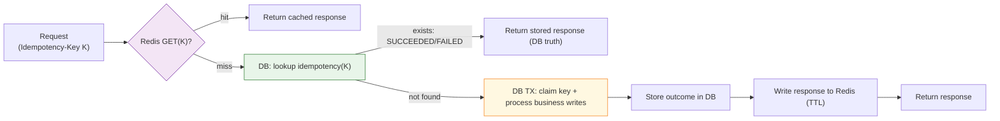

# Idempotency — Storage Patterns (DB-first vs Redis/KV)

---

Once you decide _where_ idempotency must live (API, step, workflow), the next design question is:

> **Where do we store the idempotency record?**

There are two common approaches:

1. **DB-first (recommended baseline)**  
   Store idempotency records in the same relational database as the business data.

2. **Redis/KV (performance accelerator)**  
   Store idempotency keys in a fast key-value store for low-latency lookups.

Both appear in real systems.

But only one is a clean baseline for correctness-sensitive workflows like payments.

---

## 1. What an Idempotency Record Must Contain

---

At minimum, an idempotency store needs to answer:

- Have we already processed key `K`?
- If yes, what should we return?

A practical record stores:

- `key` (idempotency key)
- `requestHash` (optional: protect against reusing key with different payload)
- `status` (`IN_PROGRESS`, `SUCCEEDED`, `FAILED`)
- `responseSnapshot` (what to return on retry)
- timestamps (`createdAt`, `expiresAt`)

The important part is not the schema.

The important part is:

> the record must be durable enough to survive failures and retries.

---

## 2. Pattern A — DB-first (Atomic With Business Data)

---

DB-first means:

- store idempotency records in the same DB as your payment/transaction records
- write them in the same transaction

### 2.1 Why DB-first is the default baseline

Because it gives you the strongest correctness property:

> idempotency state and business state commit together.

So you avoid “split brain” scenarios like:

- payment committed but idempotency record missing
- idempotency record exists but payment not committed

### 2.2 Typical DB-first flow

Inside one transaction:

1. Insert idempotency key if absent
2. If present → return stored response
3. Else process and persist business record
4. Update idempotency record with final outcome + response

A simplified representation:

```sql
BEGIN;

-- 1) Try claim the idempotency key
INSERT INTO idempotency(key, request_hash, status)
VALUES (:k, :hash, 'IN_PROGRESS')
ON CONFLICT (key) DO NOTHING;

-- 2) If insert did nothing, read and return existing response
-- (implementation detail depends on DB + code)

-- 3) Perform business writes
INSERT INTO payments(...);
UPDATE accounts ...;

-- 4) Store response snapshot
UPDATE idempotency
SET status='SUCCEEDED', response_snapshot=:resp
WHERE key=:k;

COMMIT;
```

The key idea is the atomic boundary:

> **business writes + idempotency record move together**

### 2.3 Trade-offs

DB-first is:

- ✅ Correct and easy to reason about
- ✅ Great baseline for payments
- ⚠️ Slower than Redis for lookups
- ⚠️ Adds write load to the DB
- ⚠️ Requires cleanup / TTL management

But in correctness-sensitive systems, DB-first wins by default.

---

## 3. Pattern B — Redis/KV Store (Fast Lookups)

---

A Redis/KV approach stores:

- `idempotencyKey → response snapshot / status`

### 3.1 Why teams use Redis/KV

- very fast lookups
- reduces DB reads for repeated retries
- can offload “hot retry keys” from the DB

This is especially attractive at high scale where you have:

- frequent client retries
- high traffic bursts
- hot keys (e.g., payment initiation retries)

### 3.2 The correctness cost

The main issue is:

> Redis/KV is now a second source of truth.

If you store idempotency only in Redis, you risk:

- Redis eviction or restart losing idempotency state
- Redis replication lag / failover edge cases
- idempotency record exists but DB write failed (or vice versa)

This is why Redis-only idempotency is risky for payments.

In practice:

- Redis is best as an accelerator
- DB remains the source of truth

We’ll cover the “cross-store consistency trap” explicitly in **the next article**.

---

## 4. A Practical Hybrid: DB as Truth, Redis as Cache

---

A common production pattern is:

- DB-first for correctness
- Redis for performance

Example flow:



1. Check Redis for key `K`
2. If hit → return cached response
3. If miss → do DB-first transaction
4. Write result to Redis with TTL

This improves latency without moving correctness responsibility to Redis.

Key point:

> Redis can speed up retries, but DB must be able to reconstruct truth.

---

## 5. TTL and Cleanup (Unavoidable Operational Detail)

---

Idempotency keys cannot live forever.

Otherwise the table/store grows without bound.

### 5.1 TTL choice

TTL depends on:

- client retry behavior
- upstream retry windows
- business semantics

For payments, common windows are:

- minutes to hours (short retry window)
- sometimes longer for “delayed confirmations”

The TTL must be long enough that:

- a retry within expected windows returns the same result

### 5.2 Cleanup strategies

- scheduled job to delete expired keys
- partition tables by date
- keep only metadata for long-lived audit needs (optional)

The key is:

- treat idempotency storage as part of your operational design

---

## 6. What We Choose (Baseline Guidance)

---

For correctness-sensitive workflows (payments), a safe baseline is:

- ✅ **DB-first idempotency (atomic with payment record)**
- optional: Redis/KV as an accelerator

This aligns with the Phase 3 design decisions:

- DB remains source of truth
- optimizations can be layered later without changing correctness guarantees

---

## Key Takeaways

---

- Idempotency storage must be durable enough to survive retries and failures.
- **DB-first** provides the strongest baseline: idempotency state and business state commit together.
- **Redis/KV** is faster but introduces cross-store correctness risk if used as the only store.
- The best production approach is often hybrid: DB truth + Redis cache.
- TTL and cleanup are required to prevent unbounded growth.

---

## TL;DR

---

Use DB-first idempotency as your baseline for correctness.

Use Redis/KV only as a performance accelerator, not as the source of truth, unless you are willing to handle cross-store consistency risks.

---

### 🔗 What’s Next

Next we’ll make the risk explicit:

- what goes wrong when idempotency is split across DB and Redis
- how partial failures create inconsistent outcomes
- safe patterns that avoid correctness regressions

👉 **Up Next: →**  
**[Idempotency — Cross-store Consistency Trap (DB + Redis)](/learning/advanced-skills/high-level-design/8_concepts-phase3/8_9_idempotency-cross-store-consistency-trap)**
