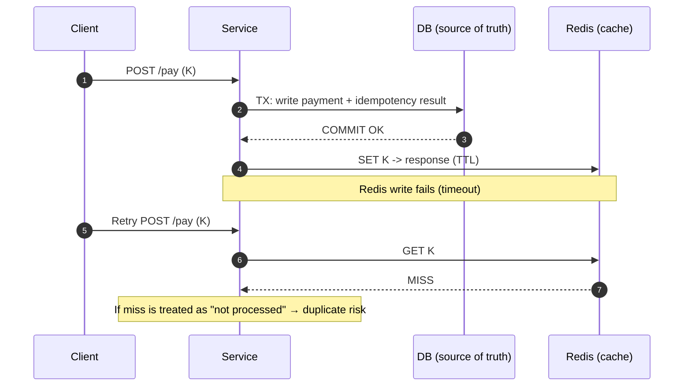
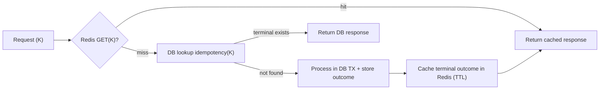

# Idempotency — Cross-store Consistency Trap (DB + Redis)

---

Redis is fast, and it is tempting to store idempotency keys there.

But the moment idempotency state is split across:

- a relational database (business truth)
- and Redis/KV (fast lookup)

you introduce a distributed consistency problem:

> **Which store is the source of truth?**

If you are not explicit, you can regress correctness.

This article explains:

- the exact failure modes that appear with DB + Redis idempotency
- why “Redis-only idempotency” is risky for payments
- safe patterns where Redis stays an accelerator, not a truth store

---

## 1. The Core Problem: Two Stores, One Correct Answer

---

Idempotency is a correctness feature.

For key `K`, the system must answer deterministically:

- was it processed?
- what outcome should we return?

If Redis and DB disagree, you can end up with:

- retry returns “not processed” → triggers duplicate side effect
- retry returns stale “in-progress” forever
- retry returns wrong response snapshot

In payments, these are not “bugs”.

They become money incidents.

---

## 2. Failure Mode A: DB Commit Succeeds, Redis Write Fails

---

This is the most common partial failure.

### Scenario

1. Payment transaction commits in DB
2. System tries to write idempotency result to Redis
3. Redis write fails (timeout, failover, connection issues)

Result:

- DB says payment is done
- Redis has no record

Now a retry arrives and checks Redis first:

- cache miss → system assumes “not processed”
- system processes again → duplicate charge risk

### Why it happens

Because Redis write is not in the same atomic transaction as the DB commit.

Unless you treat DB as truth, Redis misses become correctness bugs.

---

## 3. Failure Mode B: Redis Write Succeeds, DB Commit Fails

---

The reverse happens too.

### Scenario

1. System writes `K → IN_PROGRESS` into Redis
2. Then DB transaction fails (deadlock, constraint error, timeout)
3. Redis record remains “in progress” or “succeeded” without real business commit

Result:

- retry sees Redis hit
- returns cached response (or blocks)
- but DB has no payment record

This creates:

- ghost success
- or stuck requests that never resolve

---

## 4. Failure Mode C: Redis Eviction / Restart Drops Keys

---

Redis is not designed to be a permanent source of truth unless configured carefully.

Keys can disappear due to:

- TTL expiry
- eviction under memory pressure (LRU/LFU)
- restart without persistence
- failover edge cases

If Redis is your only idempotency store:

- dropped key → next retry looks “new”
- duplicate side effect happens

This is exactly why Redis-only idempotency is dangerous for payments.

---

## 5. Failure Mode D: Race Conditions Across Stores

---

When two stores participate, you can get races like:

- request A writes Redis `IN_PROGRESS`
- request B checks DB (missing) and proceeds
- or request A commits DB but Redis write is delayed
- request B checks Redis (miss) and re-processes

Even if you attempt “double checks”, you’ve recreated a distributed coordination problem.

This is why:

> correctness features should not rely on best-effort cache writes.

---

## 6. Safe Patterns (How to Use Redis Without Breaking Correctness)

---

### Pattern 1 — DB is truth, Redis is cache (recommended baseline)

- **DB-first** decides correctness (idempotency + business writes are atomic).
- Redis can accelerate lookups, but a cache miss must be treated as **unknown**, not “not processed”.
- On Redis miss, always fall back to DB.

Rule:

> ✅ Redis hit can short-circuit.  
> ✅ Redis miss must fall back to DB truth before processing.

---

### Pattern 2 — Cache only terminal outcomes (recommended)

If you use Redis, prefer caching only **terminal results**:

- `SUCCEEDED` (and optionally `FAILED`) response snapshots
- with TTL

This avoids a common operational failure mode: “stuck forever in progress”.

Example:

- Redis holds recent `SUCCEEDED/FAILED` response snapshots for fast retries.
- DB holds the durable idempotency record (status + response snapshot/reference).

---

### Pattern 3 — Explicit `IN_PROGRESS` handling (DB required; Redis optional)

`IN_PROGRESS` is useful even in DB-first designs:

- it acts as a **claim** so concurrent requests with the same key don’t both execute
- it represents “work started but not finalized” for longer workflows

However, caching `IN_PROGRESS` in Redis is usually **not necessary** and can cause stuck behavior.

If you _do_ cache `IN_PROGRESS`, treat it as **advisory only**:

- include a short expiry/timeout
- if `IN_PROGRESS` is older than a threshold, **re-check DB**
- never let Redis `IN_PROGRESS` block progress indefinitely

Otherwise, you can create permanent stuck requests even when DB has already moved to `SUCCEEDED` or `FAILED`.

---

## 7. What We Choose (Baseline Guidance)

---

For correctness-sensitive workflows (payments), the safe baseline is:

- ✅ **DB-first idempotency** (atomic with business data)
- ✅ Redis/KV optional as an accelerator
- ✅ Redis is never the only source of truth

This keeps correctness simple:

- one durable authority (DB)
- one optional cache (Redis)

---

## Key Takeaways

---

- Splitting idempotency across DB + Redis creates cross-store consistency risks.
- Common failure modes:
  - DB commit succeeds, Redis write fails → duplicates
  - Redis write succeeds, DB commit fails → ghost success/stuck requests
  - eviction/TTL/restarts drop keys → duplicates
- Safe rule: **Redis hit can short-circuit; Redis miss must fall back to DB.**
- Baseline for payments: DB-first idempotency, Redis only as accelerator.

---

## TL;DR

---

Redis is a great accelerator, but a dangerous source of truth.

If idempotency correctness matters, store it durably in the DB and treat Redis as a cache. Otherwise partial failures and eviction will eventually turn retries into duplicate money side effects.

---

### 🔗 What’s Next

Next we’ll clean up the most common confusion in distributed systems correctness:

- idempotency vs deduplication
- delivery guarantees vs effects
- what “exactly once” really means in practice

👉 **Up Next: →**  
**[Idempotency — Idempotency vs Dedup vs Exactly-Once](/learning/advanced-skills/high-level-design/8_concepts-phase3/8_10_idempotency-vs-dedup-vs-exactly-once)**
