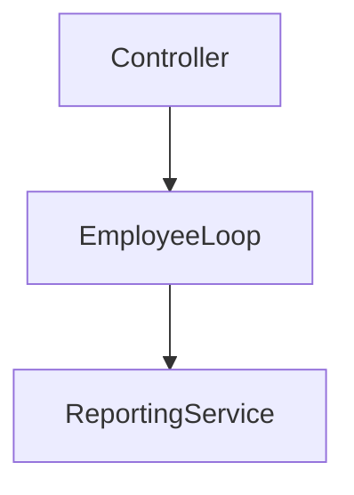
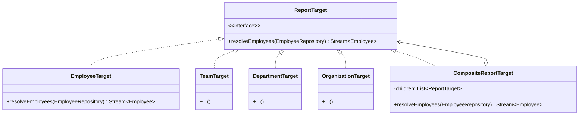
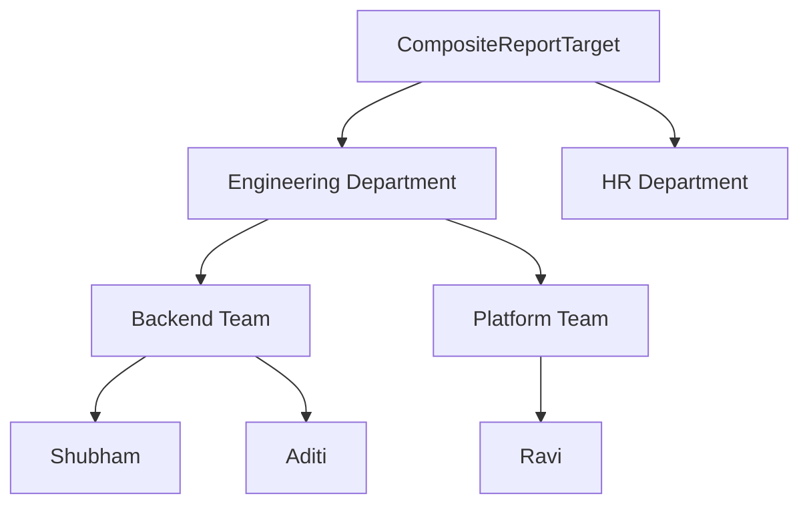

## 1. Why This Part Exists

---

So far in EMS:

- Reporting worked for a **single employee**
- Export pipeline is extensible (Decorator)
- Bundles are controlled (Abstract Factory)
- Workflow is orchestrated (Facade)

But the business introduces a new requirement:

> “We need to generate reports not just for a single employee,  
> but for teams, departments, and the entire organization.”

Examples:

- Export report for Employee(E123)
- Export report for Team(Backend Team)
- Export report for Department(Engineering)
- Export report for Organization(All Employees)

Important constraint:

> The reporting pipeline (Strategy + Decorator + Bundle) must remain unchanged.

The caller should not care whether the target represents:

- one employee
- hundreds
- thousands

This is structural pressure.

---

## 2. The Naive Solution (And Why It Breaks)

---

The first instinct is usually API expansion:

```java
exportEmployeeReport(Employee employee);
exportTeamReport(List<Employee> employees);
exportDepartmentReport(Department department);
exportOrganizationReport(Organization org);
```

Or worse — loops leak outward:

```java
List<Employee> employees =
        employeeDirectory.getEmployeesByDepartment(departmentId);

for (Employee e : employees) {
    reportingFacade.exportReport(e, request);
}
```

### Why this is problematic

- Logic duplication
- Loop orchestration leaks outward
- Inconsistent behavior per caller
- Hard to add new grouping levels later
- Violates SRP (controllers coordinating business logic)
- Encourages instanceof checks

### Diagram: The Problem



Loops start appearing everywhere.

This is structural smell.

---

## 3. The Core Insight

---

The business does not think in lists.

It thinks in **targets**.

> “Generate report for this reporting target.”

A reporting target may represent:

- A single employee
- A team
- A department
- The entire organization
- A custom combination

The mental shift:

> Instead of passing lists, pass a **structure that resolves employees**.

This is exactly what Composite provides.

---

## 4. The Composite Pattern (Definition)

---

> Composite lets you treat individual objects and compositions of objects uniformly.

In EMS terms:

- Individual employee → leaf
- Team → leaf
- Department → leaf
- Organization → leaf
- Team / Department / Organization → composite

All of them implement the same interface.

---

## 5. Designing Composite for EMS

---

We define a single abstraction:

```java
public interface ReportTarget {
    /**
     * Resolves the set of employees this target represents.
     * This may involve data access (DB/API) and is expected to be side-effect free.
     * Callers decide downstream policies like de-duplication and batching.
     */
    Stream<Employee> resolveEmployees(EmployeeRepository repository);
}
```

Key idea:

- ReportTarget does **not** store employees.
- It describes **how to obtain employees** via a domain dependency (EmployeeRepository).

This keeps:

- Data access inside domain services
- Structural composition inside targets
- Reporting(export/delivery) pipeline untouched

This interface represents:

> “Anything that can produce employees for reporting.”

We deliberately return `Stream<Employee>` instead of `List<Employee>`:

- avoids large memory allocations
- supports lazy traversal (important for departments/org-wide exports)
- keeps the design realistic for scale

> **Note:**  
> In production systems this often returns EmployeeId / EmployeeRef instead of full Employee objects, to avoid large payloads and repeated fetching. The pattern remains the same.

---

## 6. Leaf Targets (Individual Selectors)

---

### 6.1 EmployeeTarget (Leaf)

```java
public record EmployeeTarget(String employeeId) implements ReportTarget {

    @Override
    public Stream<Employee> resolveEmployees(EmployeeRepository repository) {
        return Stream.of(repository.getById(employeeId));
    }
}
```

Represents a single employee.

No loops.  
No branching.  
Simple leaf node.

---

### 6.2 TeamTarget

```java
public record TeamTarget(String teamId) implements ReportTarget {

    @Override
    public Stream<Employee> resolveEmployees(EmployeeRepository repository) {
        return repository.getEmployeesByTeam(teamId).stream();
    }
}
```

Represents a team.

Still uniform.

---

### 6.3 DepartmentTarget

```java
public record DepartmentTarget(String departmentId)
        implements ReportTarget {

    @Override
    public Stream<Employee> resolveEmployees(EmployeeRepository repository) {
        return repository.getEmployeesByDepartment(departmentId).stream();
    }
}
```

---

### 6.4 OrganizationTarget

```java
public record OrganizationTarget()
        implements ReportTarget {

    @Override
    public Stream<Employee> resolveEmployees(EmployeeRepository repository) {
        return repository.getAllEmployees().stream();
    }
}
```

All these are **leaves from the reporting perspective**.

Even if departments contain teams internally, reporting does not care.

Uniform interface achieved.

---

## 7. True Composite: Combining Targets

---

Sometimes business asks:

> “Export reports for Backend team + HR team only.”

Or:

> “Export reports for these 3 departments together.”

Now we need real composition.

```java
public record CompositeReportTarget(List<ReportTarget> children) implements ReportTarget {

    @Override
    public Stream<Employee> resolveEmployees(EmployeeRepository repository) {
        return children.stream()
                .flatMap(child -> child.resolveEmployees(repository));
    }
}
```

This is the actual Composite.

- Children are of the same abstraction
- Recursion is supported
- Nesting is arbitrary

---

## 8. Structural Diagram (UML)

---



Notice:

- Both leaf and composite implement ReportTarget
- Composite contains objects of the same abstraction
- Callers see only ReportTarget

That recursion is the pattern.

---

## 9. Runtime Structure Example

---

Let’s build:

- Engineering Department
  - Backend Team
    - Shubham
    - Aditi
  - Platform Team
    - Ravi
- HR Department

Business wants:

> Engineering + HR combined report.



Reporting does not care whether nodes are leaf or composite.

Uniformity achieved.

---

## 10. Integrating Composite with EMS Reporting

---

Now we update our reporting flow:

Before:

```java
reportingFacade.exportReport(employee, request);
```

Now:

```java
reportingFacade.exportReport(reportTarget, request);
```

Inside facade:

```java
public void exportReport(ReportTarget target,
                         ExportReportRequest request) {

    target.resolveEmployees(employeeRepository)
          .distinct()
          .forEach(emp ->
              exportSingleEmployeeReport(emp, request));
}
```

Caller now can create target as shown below and pass to exportReport:

```java
ReportTarget target = new CompositeReportTarget(List.of(
    new DepartmentTarget("engineering"),
    new EmployeeTarget("emp-123"),
    new DepartmentTarget("hr")
));

exportReport(target, request);
```

Facade still orchestrates.  
Composite decides “who”.

Responsibilities remain clean.

---

## 11. Why This Is a Structural Pattern

---

Composite does not change behavior.  
It changes structure.

It allows:

- recursive object composition
- uniform interface, it centralizes traversal logic inside the object graph.
- caller simplification

It removes conditional logic like:

```java
if (target instanceof Department) { ... }
```

That alone justifies the pattern.

---

## 12. When NOT to Use Composite Pattern

---

Do not introduce Composite when:

- There is no hierarchy
- Grouping is shallow and fixed
- Lists are sufficient and stable
- The abstraction adds no simplification

Composite introduces:

- additional types
- abstraction overhead
- recursion complexity

Use it when hierarchy is real and evolving.

---

## 13. Interview-Grade Explanation

---

If asked:

> “When would you use Composite?”

Strong answer:

> When you need to treat individual objects and groups of objects uniformly, especially in recursive or hierarchical domains.

Bonus insight:

> It eliminates type-based branching and centralizes traversal logic inside the structure itself.

---

## Conclusion

---

Reporting evolved from **single-employee** to **organization-level**.

Naive solutions duplicated loops and expanded APIs.

Composite restored structural sanity:

- Leaves and groups share a uniform abstraction
- Callers remain clean
- Hierarchies can grow safely
- Reporting pipeline remains untouched

This is how structural patterns protect systems as domains grow.

---

---

## 🔗 What’s Next?

---

Part 1 solved **structural uniformity**.

We can now treat:

- a single employee
- a team
- a department
- the entire organization

using the same `ReportTarget` abstraction.

But a new problem immediately appears:

- What if we need _Engineering department in London only_?
- What if we need _Backend team with tenure > 2 years_?
- What if we need _HR + Engineering, but active employees only_?

If we create a new `ReportTarget` type for every variation,  
we fall into **target type explosion**.

The next step is to separate:

- **Structural composition** (Composite)  
  from
- **Selection refinement** (Filtering / criteria)

In **Part 2**, we will:

- Prevent target subclass explosion
- Introduce composable filtering over targets
- Combine Composite with delegation cleanly
- Keep the reporting pipeline unchanged

👉 **Up next:**  
**[Composite Pattern – Avoiding Target Explosion with Filters (Part 2) →](/learning/advanced-skills/low-level-design/4_structural-design-patterns/4_11_composite-pattern-part2)**

---

> 📝 **Final Takeaway**
>
> - Composite treats individual and group uniformly
> - It removes type-based conditional logic
> - It centralizes traversal logic
> - It is ideal for recursive structures
> - When hierarchy grows, Composite becomes natural
