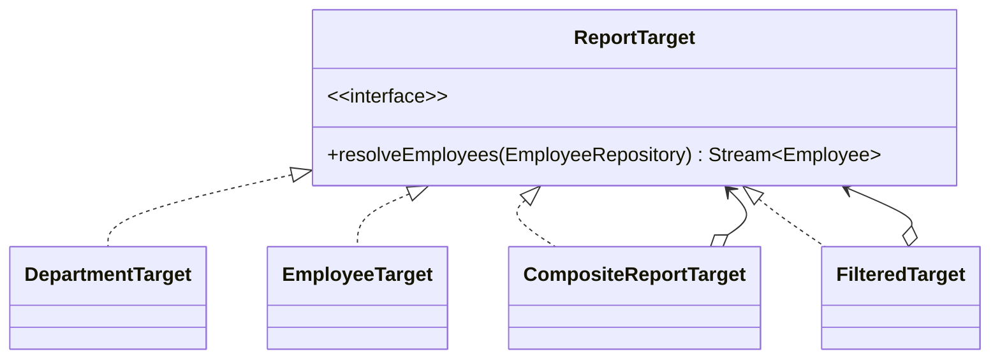

## 1. Why This Part Exists

---

In **Part 1**, Composite solved a structural problem:

> Treat a single employee and a group of employees uniformly.

We introduced:

```java
public interface ReportTarget {
    Stream<Employee> resolveEmployees(EmployeeRepository repository);
}
```

This allowed:

- EmployeeTarget
- DepartmentTarget
- TeamTarget
- CompositeReportTarget

Everything looked clean.

But real business rules rarely stop there.

---

## 2. New Design Pressure: Target Explosion

---

The business now says:

- “Export Engineering department, but only London employees.”
- “Export Backend team with tenure > 2 years.”
- “Export HR department, active employees only.”
- “Export Engineering + HR, but only managers.”

Naively, we might start creating:

- LondonDepartmentTarget
- EngineeringLondonTarget
- ActiveDepartmentTarget
- SeniorBackendTeamTarget
- EngineeringManagersTarget

This quickly becomes absurd.

We just replaced inheritance explosion (Decorator Part 1) with **target type explosion**.

---

## 3. The Core Insight

---

Department is a domain concept.

Location is a filter.

Tenure is a filter.

Active/inactive is a filter.

These are not new structural targets.

They are **selection criteria applied to an existing target**.

That means:

> We must separate structural composition from filtering logic.

---

## 4. Keep Structural Targets Minimal

---

Structural targets represent **identity-based selection**:

```java
public record EmployeeTarget(String employeeId)
        implements ReportTarget {

    @Override
    public Stream<Employee> resolveEmployees(EmployeeRepository repo) {
        return Stream.of(repo.getById(employeeId));
    }
}

public record DepartmentTarget(String departmentId)
        implements ReportTarget {

    @Override
    public Stream<Employee> resolveEmployees(EmployeeRepository repo) {
        return repo.streamByDepartment(departmentId);
    }
}
```

These remain stable.

We do **not** create new subclasses for every variation.

---

## 5. Introducing FilteredTarget (Composite + Decorator Synergy)

---

Now we introduce a new kind of target:

```java
public final class FilteredTarget implements ReportTarget {

    private final ReportTarget base;
    private final Predicate<Employee> filter;

    public FilteredTarget(ReportTarget base,
                          Predicate<Employee> filter) {
        this.base = base;
        this.filter = filter;
    }

    @Override
    public Stream<Employee> resolveEmployees(EmployeeRepository repo) {
        return base.resolveEmployees(repo)
                   .filter(filter);
    }
}
```

Key properties:

- Implements ReportTarget
- Wraps another ReportTarget
- Adds filtering behavior

This is structurally similar to **Decorator**, but applied to target selection.

---

## 6. Example: Department + Location

---

Instead of creating LondonDepartmentTarget:

```java
ReportTarget londonEngineering =
    new FilteredTarget(
        new DepartmentTarget("engineering"),
        emp -> "London".equals(emp.getLocation())
    );
```

No new subclasses.  
No type explosion.  
Full composability.

---

## 7. Structural Diagram

---



Notice:

- Composite handles grouping
- FilteredTarget handles criteria
- Both implement the same abstraction
- Composition is recursive

---

## 8. Composite + Filter Together

---

Now we can build complex structures:

```java
ReportTarget engineeringAndHR =
    new CompositeReportTarget(List.of(
        new DepartmentTarget("engineering"),
        new DepartmentTarget("hr")
    ));

ReportTarget londonEngineeringAndHR =
    new FilteredTarget(
        engineeringAndHR,
        emp -> "London".equals(emp.getLocation())
    );
```

No new types.  
No special cases.

Structural + behavioral composition working together.

---

## 9. When Filtering Should Move to Repository

---

The in-memory filtering shown above is fine for:

- moderate datasets
- in-memory repositories
- simple LLD discussions

But at scale (10k+ employees), filtering should be pushed down:

```java
public record EmployeeCriteria(
        String departmentId,
        String location,
        Boolean activeOnly
) {}
```

Then:

```java
public record CriteriaTarget(EmployeeCriteria criteria)
        implements ReportTarget {

    @Override
    public Stream<Employee> resolveEmployees(EmployeeRepository repo) {
        return repo.streamByCriteria(criteria);
    }
}

```

This avoids:

- loading entire departments into memory
- filtering inefficiently
- unnecessary object materialization

We will address scale explicitly in Part 3.

---

## 10. Why This Is Architecturally Correct

---

Composite handles:

> Structural hierarchy (single vs group).

FilteredTarget handles:

> Behavioral refinement (criteria).

This separation prevents:

- Type explosion
- SRP violation
- Domain concept pollution
- Complex branching logic

And it keeps your reporting pipeline untouched.

---

## 11. Interview-Grade Explanation

---

If asked:

> “How would you avoid creating too many subclasses when combining filters?”

Strong answer:

> I would keep structural targets minimal and introduce composable filtering, either using predicates or a specification pattern, instead of encoding every variation as a new type.

Bonus:

> Composite handles grouping; filtering should be data-driven, not type-driven.

---

## Conclusion

---

Part 1 gave us structural uniformity.

Part 2 prevents structural bloat.

We now have:

- Minimal structural targets
- Composable filtering
- Recursive grouping
- No subclass explosion
- Clean separation of concerns

Composite remains clean because we resisted turning every business rule into a new class.

---

### 🔗 What’s Next?

---

So far we solved modeling problems.

Now we face operational pressure:

- 10k+ employees
- Streaming constraints
- Batching
- Partial failure handling
- Aggregated vs per-employee export modes

In Part 3, we will:

- Make Composite scale-ready
- Introduce batching strategies
- Integrate with Decorator export pipelines
- Define failure policies

👉 Up next:
Composite Pattern – Scaling Hierarchical Reporting (Part 3)
