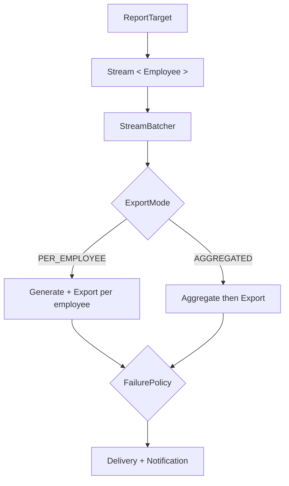
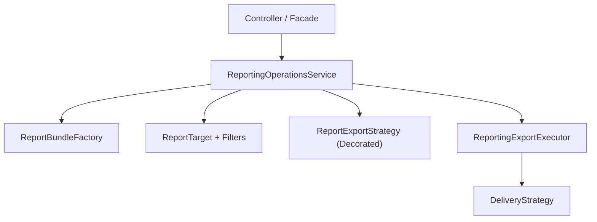

## 1. Why This Part Exists

---

Part 1 solved **structural uniformity**.  
Part 2 prevented **target type explosion**.

Now we apply real-world pressure:

- Departments with 10k+ employees
- Memory constraints
- Per-employee vs aggregated exports
- Partial failures during long runs
- Integration with Decorator-based export pipelines

This part is about making Composite **production-capable**,  
without polluting it with execution logic.

---

## 2. Reconfirm the Structural Contract (Unchanged)

---

Composite remains clean and minimal:

```java
public interface ReportTarget {
    Stream<Employee> resolveEmployees(EmployeeRepository repository);
}
```

Key rule:

> ReportTarget defines **who is included**, not how they are processed.

We will not modify this interface.

Execution belongs elsewhere.

---

## 3. The New Pressure: Scale Changes Everything

---

When exporting a full department:

- You cannot materialize everything into a List
- You cannot assume no failures
- You cannot assume identical output modes

So we introduce execution semantics — **outside Composite**.

---

## 4. Batching as an Execution Concern

---

Batching is not a structural feature of targets.  
It is a runtime execution strategy.

We keep it in a utility class:

```java
public final class StreamBatcher {

    private StreamBatcher() {}

    public static <T> Stream<List<T>> batch(Stream<T> source, int batchSize) {

        Iterator<T> iterator = source.iterator();

        Iterable<List<T>> iterable = () -> new Iterator<>() {

            @Override
            public boolean hasNext() {
                return iterator.hasNext();
            }

            @Override
            public List<T> next() {
                List<T> batch = new ArrayList<>(batchSize);
                int count = 0;

                while (iterator.hasNext() && count++ < batchSize) {
                    batch.add(iterator.next());
                }
                return batch;
            }
        };

        return StreamSupport.stream(iterable.spliterator(), false);
    }
}
```

This ensures:

- Memory remains bounded
- Backpressure can be controlled
- Composite remains pure

---

## 5. Export Modes: Flatten vs Aggregate

---

Hierarchical reporting typically requires two distinct behaviors.

```java
public enum ExportMode {
    PER_EMPLOYEE,
    AGGREGATED
}
```

### PER_EMPLOYEE

- One file per employee
- Suitable for payslips, compliance docs

### AGGREGATED

- One file for entire target
- Suitable for summaries, departmental reports

Composite remains unchanged.  
Export mode affects only execution.

---

## 6. Failure Policies: Make Behavior Explicit

---

Long-running exports require clear semantics.

```java
public enum FailurePolicy {
    FAIL_FAST,
    SKIP_FAILED_EMPLOYEES,
    RETRY_BATCH_THEN_SKIP
}
```

This prevents:

- Hidden retry logic
- Implicit assumptions
- Scattered exception handling

Execution rules must be explicit.

---

## 7. Execution Flow (Clean Separation)

---



Composite remains untouched.

---

## 8. Integrating with the Decorator Export Pipeline (Without Extra Abstractions)

---

Up to this point, we already have:

- `ReportExportStrategy` (PDF / CSV / HTML)
- Decorator wrappers (Encrypt / Compress / Audit)
- `ReportBundleFactory` assembling compatible strategies

The important clarification:

> The decorator chain **is already the export pipeline**.

We do **not** need an additional `ExportPipeline` abstraction.

Instead, the execution layer depends directly on:

```java
ReportExportStrategy
```

The runner does not need to know:

- whether the strategy is base or decorated
- how many decorators are applied
- what format is used

It simply calls:

```java
exportStrategy.export(report);
```

This keeps the architecture honest and minimal.

---

## 9. Production-Ready Execution Layer (Clean Version)

---

To prevent **ReportingOperationsService** from becoming overloaded with batching and failure logic, we extract execution mechanics into a dedicated executor.

```java
public final class ReportingExportExecutor {

    private final EmployeeRepository repository;
    private final EmployeeReportService reportService;
    private final ReportExportStrategy exportStrategy;
    private final DeliveryStrategy deliveryStrategy;

    public ReportingExportExecutor(EmployeeRepository repository,
                                   EmployeeReportService reportService,
                                   ReportExportStrategy exportStrategy,
                                   DeliveryStrategy deliveryStrategy) {
        this.repository = repository;
        this.reportService = reportService;
        this.exportStrategy = exportStrategy;
        this.deliveryStrategy = deliveryStrategy;
    }

    public ExportSummary execute(ReportTarget target,
                                 ExportMode mode,
                                 FailurePolicy failurePolicy,
                                 int batchSize,
                                 String deliveryAddress) {

        Stream<Employee> stream = target.resolveEmployees(repository);

        return switch (mode) {
            case PER_EMPLOYEE ->
                executePerEmployee(stream, failurePolicy, batchSize, deliveryAddress);

            case AGGREGATED ->
                executeAggregated(stream, deliveryAddress);
        };
    }

    private ExportSummary executePerEmployee(Stream<Employee> stream,
                                             FailurePolicy policy,
                                             int batchSize,
                                             String deliveryAddress) {

        ExportSummary summary = new ExportSummary();

        StreamBatcher.batch(stream, batchSize)
            .forEach(batch -> {

                for (Employee employee : batch) {
                    try {
                        EmployeeReport report = reportService.generate(employee);
                        ExportedReport exported = exportStrategy.export(report);
                        deliveryStrategy.deliver(exported, deliveryAddress);
                        summary.markSuccess(employee.getId());

                    } catch (Exception e) {

                        summary.markFailure(employee.getId(), e);

                        if (policy == FailurePolicy.FAIL_FAST) {
                            throw e;
                        }
                        // SKIP_FAILED_EMPLOYEES continues automatically
                    }
                }
            });

        return summary;
    }

    private ExportSummary executeAggregated(Stream<Employee> stream,
                                            String deliveryAddress) {

        AggregateReport aggregate =
            reportService.aggregate(stream);

        ExportedReport exported =
            exportStrategy.export(aggregate.toEmployeeReport());

        deliveryStrategy.deliver(exported, deliveryAddress);

        return ExportSummary.aggregateSuccess();
    }
}
```

---

## 10. Where This Executor Fits in EMS

---

The final structure now looks like this:



### Responsibilities:

- **ReportingOperationsService**
  - Interprets request
  - Builds target
  - Assembles decorated export strategy
  - Chooses failure policy
  - Delegates execution
- **ReportingExportExecutor**
  - Handles batching
  - Applies export mode
  - Enforces failure policy
  - Executes delivery
- **Composite**
  - Defines structural inclusion
- **Decorator**
  - Defines behavioral enhancement

Each layer now has exactly one reason to change.

---

## 11. What We Achieved

---

By the end of Composite:

#### Structural Modeling

- Uniform handling of leaf and group targets
- Recursive composition
- Filter-based refinement

#### Execution Semantics

- Batching
- Explicit export modes
- Explicit failure policies

#### Clean Separation

- No batching logic inside Composite
- No failure semantics inside Decorator
- No structural logic inside executor
- No artificial pipeline abstraction

This is disciplined Low-Level Design.

---

## 12. What We Intentionally Did NOT Introduce

---

We did not introduce:

- Async export orchestration
- Distributed retries
- Event-driven coordination
- Saga-style workflow management

Those belong to:

- High-Level Design (HLD)
- Large-Scale System Design

At LLD, our goal is:

- structural clarity
- predictable execution semantics
- clean seams for evolution

---

## Conclusion

---

Composite started as a structural pattern.

In production systems, it becomes the foundation for scalable hierarchical execution.

By separating:

- structure (Composite)
- behavior (Decorator)
- orchestration (Service)
- execution semantics (Executor)

we built a reporting system that can evolve without rewriting its core.

That is mature object-oriented design.

---

### 🔗 What’s Next?

---

We have now covered major structural pressures:

- Simplifying subsystems → **Facade**
- Adapting incompatible APIs → **Adapter**
- Extending behavior dynamically → **Decorator**
- Modeling hierarchical structures → **Composite**

The next structural pressure in real systems is:

> Controlled access without modifying clients.

Caching.  
Lazy loading.  
Permission checks.  
Remote boundaries.

👉 Up next:
Proxy Pattern – Controlled Access and Lazy Boundaries (Part 1)
