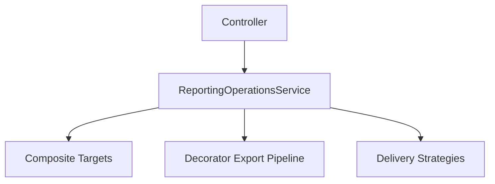
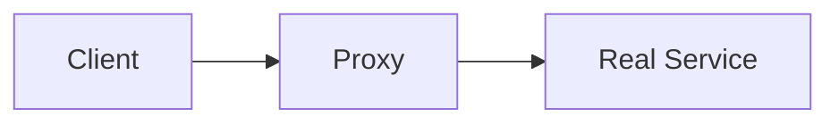
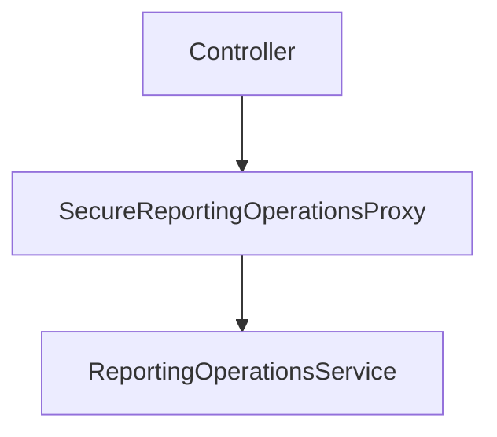
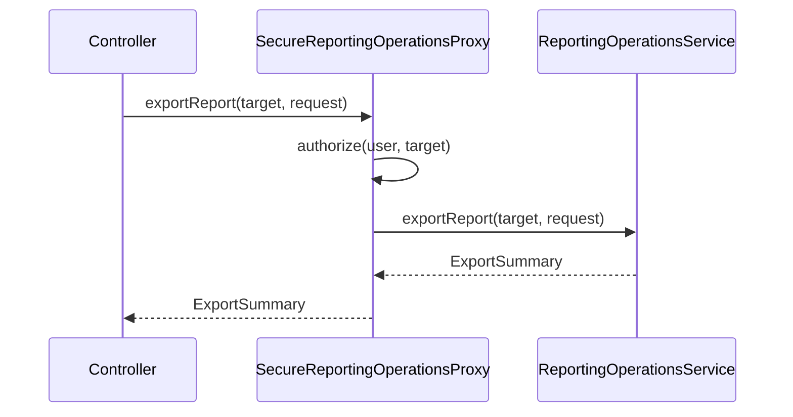
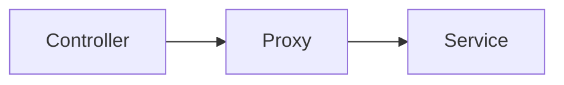
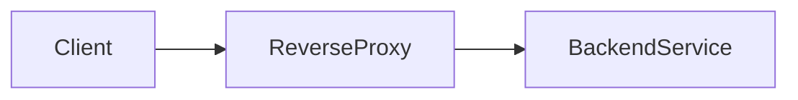
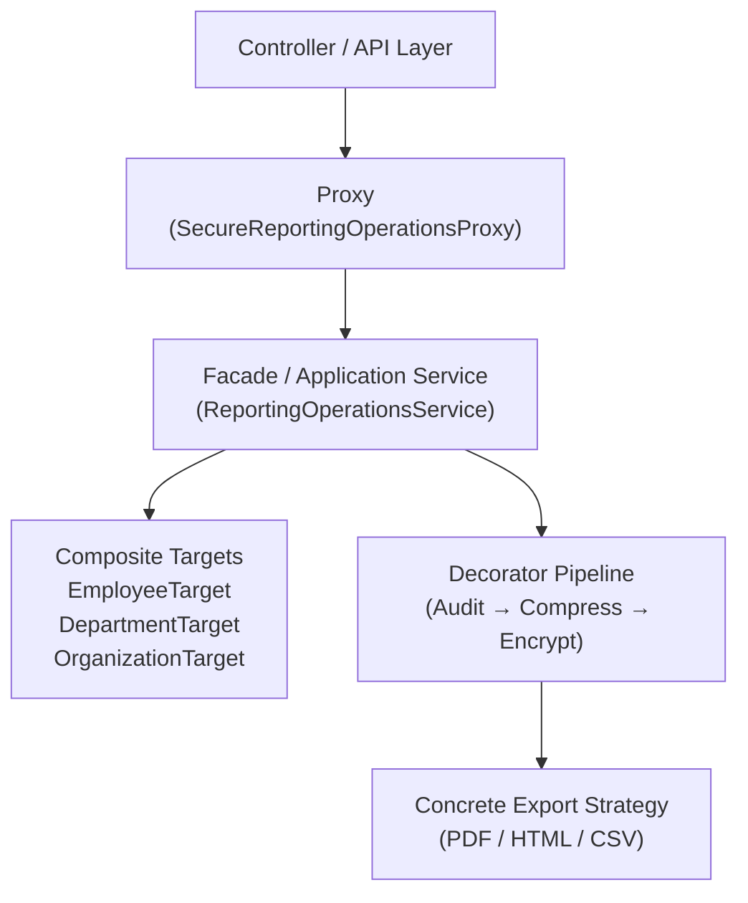

## 1. Why Proxy Pattern Exists

---

In real systems, we often need to **control access to operations**.

Examples include:

- Authorization checks
- Caching expensive results
- Lazy loading large resources
- Rate limiting
- Remote service access

However, we want to introduce these behaviors **without modifying the original service**.

This is exactly where the **Proxy Pattern** becomes useful.

> A Proxy acts as a **stand-in object** that controls access to another object.

The client interacts with the proxy **as if it were the real object**, while the proxy decides how and when to delegate the request.

---

## 2. The New Design Pressure in EMS

---

In the Employee Management System (EMS), we currently support exporting reports:

- Employee reports
- Team reports
- Department reports
- Organization-wide reports

The export operation already involves:

- **Composite** targets
- **Decorator** pipelines
- **Abstract Factory** bundles

But a new requirement appears.

> Not every user should be allowed to export every report.

Example rules:

- Employees can export **their own reports only**
- Managers can export **their team reports**
- HR/Admin can export **department or organization reports**

These rules introduce **access control pressure**.

---

## 3. The Naive Approach: Authorization Inside Services

---

A common first attempt is to place authorization logic directly inside the service.

Example:

```java
public class ReportingOperationsService implements ReportingOperations {

    @Override
    public void exportReport(ReportTarget target, ExportReportRequest request, User user) {

        if (!user.canExport(target)) {
            throw new UnauthorizedException("User cannot export this report");
        }

        // existing export logic
    }
}
```

This approach looks simple, but it creates problems.

### Why this fails

- Business logic and security logic become mixed
- Authorization rules spread across services
- Testing becomes harder
- Violates **Single Responsibility Principle**

The service should focus on **report generation**, not **access control**.

---

## 4. The Missing Boundary

---

Let’s look at the current interaction flow:



Now authorization logic must be added somewhere.

If we add it inside the service:

- The service grows in responsibility
- Security logic spreads everywhere

What we really need is **an intermediate layer that controls access**.

---

## 5. Introducing the Proxy

---

The Proxy Pattern introduces an object that:

- implements the same interface
- intercepts requests
- decides whether to delegate to the real service

### Structure:



The client does not know whether it is calling:

- the real service
- or a proxy

Both expose the **same interface**.

---

## 6. Defining the Service Boundary

---

First, we define a stable interface:

```java
public interface ReportingOperations {

    ExportSummary exportReport(
        ReportTarget target,
        ExportReportRequest request
    );
}
```

Our real implementation already exists:

```java
public class ReportingOperationsService implements ReportingOperations {

    @Override
    public ExportSummary exportReport(
        ReportTarget target,
        ExportReportRequest request) {

        // existing reporting pipeline
        return executor.execute(target, request);
    }
}
```

Now we can place a proxy in front of it.

---

## 7. Implementing the Protection Proxy

---

The proxy performs authorization before delegating.

```java
public class SecureReportingOperationsProxy implements ReportingOperations {

    private final ReportingOperations delegate;
    private final AuthorizationService authorizationService;

    public SecureReportingOperationsProxy(
            ReportingOperations delegate,
            AuthorizationService authorizationService) {

        this.delegate = delegate;
        this.authorizationService = authorizationService;
    }

    @Override
    public ExportSummary exportReport(
            ReportTarget target,
            ExportReportRequest request) {

        if (!authorizationService.canExport(request.getUser(), target)) {
            throw new UnauthorizedException("User not allowed to export this report");
        }

        return delegate.exportReport(target, request);
    }
}
```

The proxy:

1. Checks permissions
2. Delegates to the real service

The real service remains untouched.

---

## 8. Interaction Flow With Proxy

---

In EMS, the proxy sits **between the controller and the reporting service**.

This allows the proxy to enforce authorization before the real reporting logic runs.



### Request Execution Flow



### What the Proxy Does

The proxy performs **pre-processing before delegating**:

1. Validate permissions
2. Possibly log access
3. Forward the request to the real service

The real service remains responsible only for:

- report generation
- export pipelines
- delivery mechanisms

---

## 9. Why Proxy Is a Structural Pattern

---

Proxy does not create new objects (creational).

Proxy does not change algorithms (behavioral).

Proxy changes **how objects are accessed**.

This is why it belongs to **Structural Design Patterns**.

---

## 10. Types of Proxies (Overview)

---

Different systems use proxies for different purposes.

Common variants include:

| Proxy Type       | Purpose                           |
| ---------------- | --------------------------------- |
| Protection Proxy | Enforce access control            |
| Caching Proxy    | Cache expensive operations        |
| Virtual Proxy    | Delay expensive object creation   |
| Remote Proxy     | Represent remote services locally |

In this article, we implemented a **Protection Proxy**.

Other variants will appear naturally as systems grow.

---

## 11. Proxy Pattern vs Network Proxies

---

Many developers encounter the word **proxy** in networking before seeing it in design patterns.

Although they operate in different layers, the **core idea is the same**.

Both introduce an **intermediary that controls access to a real resource**.

### 11.1 Application Proxy (Design Pattern)

Inside the application:



Example in EMS:

```code
Controller
   ↓
SecureReportingOperationsProxy
   ↓
ReportingOperationsService
```

The proxy controls:

- authorization
- logging
- caching
- access policies

---

### 11.2 Network Proxy (Infrastructure)

At the infrastructure level:



Examples include:

- NGINX reverse proxy
- API gateways
- forward proxies
- service mesh sidecars

These proxies control:

- network routing
- TLS termination
- rate limiting
- request filtering

---

### 11.3 Key Difference

| Aspect         | Design Pattern Proxy | Network Proxy         |
| -------------- | -------------------- | --------------------- |
| Layer          | Application code     | Infrastructure        |
| Scope          | Objects/services     | Servers/APIs          |
| Implementation | Classes & interfaces | NGINX, Envoy, HAProxy |

Despite the difference in layer, both follow the same architectural principle:

> **Introduce an intermediary that controls access to a resource.**

---

## 12. How All Patterns Fit Together in EMS

---

By this point in the tutorial series, several patterns have been introduced
while evolving the **EMS reporting system**.

Instead of existing in isolation, these patterns form a layered architecture.



### 12.1 What Each Layer Does

| Layer                      | Responsibility                  | Pattern                            |
| -------------------------- | ------------------------------- | ---------------------------------- |
| Controller                 | Entry point (HTTP/API)          | —                                  |
| Proxy                      | Authorization & access control  | Proxy                              |
| ReportingOperationsService | Workflow orchestration          | Facade                             |
| ReportTarget hierarchy     | Resolve employees for reporting | Composite                          |
| Export pipeline            | Add behaviors dynamically       | Decorator                          |
| Export format              | Concrete export implementation  | Strategy / Abstract Factory bundle |

This layered design allows the system to evolve safely:

- Security can change without modifying services
- Workflows remain centralized
- Export features can grow without subclass explosion
- Report targets can scale hierarchically

Each pattern solves **one structural pressure**.

Together, they produce a system that remains **extensible, testable, and maintainable**.

> This is how real systems evolve: patterns emerge incrementally as new design pressures appear.

---

## 13. What We Achieved

---

By introducing the proxy:

- Authorization logic is isolated
- `ReportingOperationsService` remains focused on reporting logic
- Security policies can evolve independently
- Clients remain unchanged

The proxy acts as a **controlled gateway** to the real service.

This preserves:

- **Single Responsibility Principle**
- **Open/Closed Principle**
- clean separation of concerns

---

## Conclusion

---

The Proxy Pattern solves a simple but important problem:

> **How do we control access to an object without modifying the object itself?**

By introducing a proxy:

- the client interface remains unchanged
- additional responsibilities can be layered safely
- the real service stays focused on its core logic

This keeps the system modular and maintainable.

---

## 🔗 What’s Next?

---

So far we introduced a **Protection Proxy** to enforce authorization.

But another problem appears in EMS:

Exporting reports can be **expensive**.

If multiple users request the same export repeatedly, the system may perform the same heavy operation many times.

In the next part, we will introduce another proxy variant:

👉 **Caching Proxy**

which prevents unnecessary repeated work.

Up next:

**Proxy Pattern – Optimizing Expensive Operations with Caching (Part 2)**

---

> 📝 **Takeaway**
>
> - Proxy provides controlled access to an object
> - It implements the same interface as the real service
> - Clients remain unaware of the proxy
> - Access policies can evolve without modifying core services
