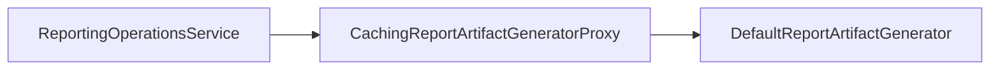
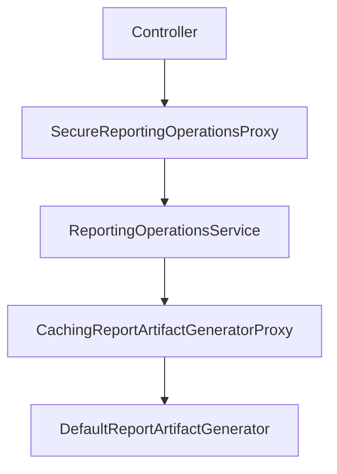

## 1. Recap: Protection Proxy

---

In Part 1, we introduced a **Protection Proxy**:

```text
Controller
   ↓
SecureReportingOperationsProxy
   ↓
ReportingOperationsService
```

The proxy enforced authorization before delegating to the real service.

This allowed us to:

- isolate security logic
- keep ReportingOperationsService focused on reporting
- evolve security independently

Now a different pressure appears.

---

## 2. New Design Pressure: Expensive Report Generation

---

As EMS grows, reports become more expensive to generate.

A single export may involve:

- resolving employees through Composite targets
- applying filters
- generating EmployeeReport objects
- executing Decorator pipelines
- exporting to PDF / HTML / CSV

For large departments or organizations, this can become costly.

Naturally, teams start asking:

> Can we cache reports?

The answer is:

> Sometimes — but not always.

---

## 3. The First Mistake: Caching the Entire Workflow

---

Our current workflow looks like this:

```text
Generate Report
      ↓
Export Artifact
      ↓
Deliver
      ↓
Notify
```

A common first attempt is:

```java
cache.get(key)
    .orElseGet(() -> exportReport(...));
```

This seems reasonable until we realize:

- delivery is a side effect
- notifications are side effects
- users may legitimately want multiple deliveries
- retries should not necessarily regenerate reports

Caching the entire workflow mixes two different concerns.

---

## 4. Identifying the Cacheable Boundary

---

Let's separate the workflow into two parts.

### Part A — Pure Artifact Generation

```text
Employee Data
      ↓
EmployeeReport
      ↓
Export Strategy
      ↓
ExportedReport
```

This step is:

- expensive
- deterministic
- potentially reusable

### Part B — Side Effects

```text
ExportedReport
      ↓
Delivery
      ↓
Notification
```

This step is:

- not expensive
- user-triggered
- often should execute every time

The insight:

> We should cache the generated artifact, not the entire export workflow.

---

## 5. Extracting a ReportArtifactGenerator

---

To make the cache boundary explicit, we introduce a dedicated abstraction.

```java
public interface ReportArtifactGenerator {

    ExportedReport generate(
            Employee employee,
            ExportReportRequest request,
            ReportBundleFactory bundle);
}
```

Its responsibility is simple:

> Generate an exported artifact.

Nothing more.

No delivery.
No notification.

---

## 6. Default Artifact Generator

---

This simply contains logic previously embedded inside ReportingOperationsService.

```java
public class DefaultReportArtifactGenerator
        implements ReportArtifactGenerator {

    @Override
    public ExportedReport generate(
            Employee employee,
            ExportReportRequest request,
            ReportBundleFactory bundle) {

        EmployeeReport report = generateReport(employee);

        return bundle.createExportStrategy()
                     .export(report);
    }
}
```

Nothing changes functionally.

We have simply isolated the expensive work.

---

## 7. Introducing the Caching Proxy

---

Now the Proxy Pattern becomes useful.



The service still asks for an artifact.

The proxy decides whether:

- an existing artifact can be reused
- a new artifact must be generated

---

## 8. Implementing the Caching Proxy

---

```java
public class CachingReportArtifactGeneratorProxy
        implements ReportArtifactGenerator {

    private final ReportArtifactGenerator delegate;

    private final Map<String, ExportedReport> cache =
            new ConcurrentHashMap<>();

    public CachingReportArtifactGeneratorProxy(
            ReportArtifactGenerator delegate) {
        this.delegate = delegate;
    }

    @Override
    public ExportedReport generate(
            Employee employee,
            ExportReportRequest request,
            ReportBundleFactory bundle) {

        String cacheKey = buildCacheKey(employee, request, bundle);

        return cache.computeIfAbsent(
                cacheKey,
                key -> delegate.generate(employee, request, bundle));
    }
}
```

The proxy:

1. checks cache
2. generates only on cache miss
3. returns the artifact

The real generator remains unchanged.

---

## 9. Cache Keys Matter More Than Caching

---

The difficult part is not storing reports.

The difficult part is deciding:

> When are two report requests actually identical?

A cache key may include:

- employee identifier
- export format
- report period
- filter configuration
- decorator configuration

Example:

```text
employee:123
period:2026-03
format:PDF
encrypted:true
```

Poor cache keys lead to:

- stale reports
- incorrect exports
- security problems

---

## 10. Should We Cache Reports At All?

---

This is the most important question.

Caching only helps when reports are reused.

Good candidates:

- monthly payroll reports
- downloadable report links
- report previews followed by exports
- frequently requested compliance reports

Poor candidates:

- highly dynamic reports
- one-off exports
- reports that change every few seconds

> Not every expensive operation deserves a cache.

Cache only when reuse is likely.

---

## 11. TTL, Cache Warming, and Reality

---

Three common questions appear immediately.

### TTL

How long should artifacts live?

Answer:

> It depends on how frequently underlying data changes.

Stable monthly reports may survive for days.

Real-time operational reports may survive for minutes.

---

### Cache Warming

Should we generate reports before they are requested?

Usually no.

Warm caches only when:

- requests are predictable
- generation is expensive
- usage is frequent

---

### Memory Usage

Caching large PDFs in memory is rarely ideal.

A common production approach is:

```text
Artifact Storage
        ↓
Cache Artifact ID
```

Store the actual file elsewhere.

Cache only references.

---

## 12. How This Fits Into EMS

---

Our updated architecture now looks like this:



Responsibilities remain clean:

| Component                           | Responsibility         |
| ----------------------------------- | ---------------------- |
| SecureReportingOperationsProxy      | Authorization          |
| ReportingOperationsService          | Workflow orchestration |
| CachingReportArtifactGeneratorProxy | Artifact caching       |
| DefaultReportArtifactGenerator      | Artifact generation    |

Each layer has exactly one reason to change.

---

## Conclusion

---

Caching can be powerful.

But caching the wrong thing creates more problems than it solves.

In EMS:

- report generation is cacheable
- delivery is not
- notifications are not

By placing a Proxy around artifact generation, we:

- avoid repeated expensive work
- keep workflows correct
- preserve clean separation of concerns

The Proxy Pattern once again allows us to add behavior without modifying the real implementation.

---

## 🔗 What’s Next?

---

So far, we have used proxies for:

- authorization
- caching

Both controlled access to an existing service.

The next question is:

> What if creating the real object itself is expensive?

This leads to another proxy variant:

👉 Proxy Pattern – Lazy Initialization with Virtual Proxy (Part 3)

---

> 📝 **Takeaway**
>
> - Cache the expensive artifact, not the entire workflow
> - Proxy keeps caching concerns separate from business logic
> - Cache keys are often harder than caching itself
> - Not every report benefits from caching
