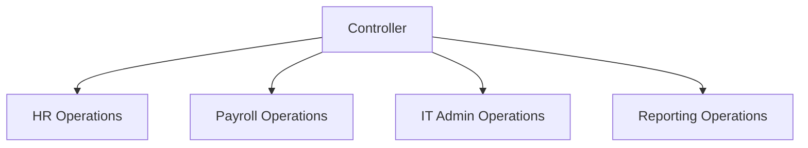
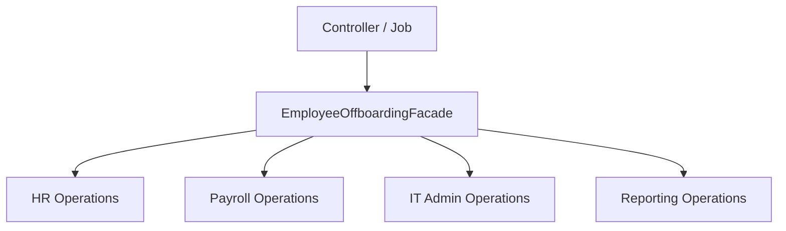

## 1. Recap: Why Facade Was Deliberately Delayed

---

In **Part 1**, we made a deliberate decision:

> **Do not introduce Facade until the system demands it.**

At that point:

- EMS had clean, SRP-aligned services
- orchestration was minimal
- adding a Facade would have been ceremony

Now we introduce **real workflow pressure**.

---

## 2. New Business Requirement: Employee Offboarding

---

HR introduces a new requirement:

> “When an employee leaves the organization, we must fully offboard them.”

This is **not a single operation**.

It is a **business workflow** that spans multiple subsystems.

---

## 3. What Employee Offboarding Actually Involves

---

Employee Offboarding requires coordinated actions across systems:

- **HR**
  - mark employee inactive
  - record exit reason and date

- **Payroll**
  - stop salary
  - trigger final settlement

- **IT Admin**
  - revoke system access
  - disable credentials

- **Reporting**
  - generate final employment report
  - archive documents

This is **system-level orchestration**, not a local service concern.

---

## 4. The Naive Approach: Orchestration in the Controller

---

The most common first attempt looks like this:

```java
@PostMapping("/{id}/offboard")
public void offboardEmployee(String id, OffboardingRequest request) {
    hrOperations.deactivateEmployee(id, request.reason());
    payrollOperations.stopSalary(id);
    itAdminOperations.revokeAccess(id);
    reportingOperations.generateFinalReport(id);
}
```

### Why this is a problem

- Controller knows too much
- Orchestration logic leaks outward
- Hard to test
- Impossible to reuse
- No clear ownership of the workflow

### Diagram: Naive Design (Before Facade)



> Controllers should **delegate**, not **coordinate**.

---

## 5. “Let’s Put It in a Service” (Still Wrong)

---

Next instinct:

> “Let’s put offboarding into HR service.”

```java
public class HROperationsService {
    public void offboardEmployee(...) {
        payroll.stopSalary(...);
        itAdmin.revokeAccess(...);
        reporting.generateFinalReport(...);
    }
}
```

### Why this is worse

- HR now depends on Payroll, IT, Reporting
- SRP is violated
- HR becomes a god service
- Subsystem boundaries collapse

This is **structural damage**, not simplification.

---

## 6. The Missing Abstraction Becomes Obvious

---

At this point, the design pressure is clear:

- Logic does not belong to any single subsystem
- It represents a **business workflow**
- It must coordinate multiple services
- It must be testable and reusable

This is exactly where **Facade** belongs.

---

## 7. Introducing the Facade: EmployeeOffboardingFacade (Orchestration & Call Order)

---

The Facade becomes the **explicit owner of the workflow**.

```java
public class EmployeeOffboardingFacade {

    private final HROperations hr;
    private final PayrollOperations payroll;
    private final ITAdminOperations itAdmin;
    private final ReportingOperations reporting;

    public EmployeeOffboardingFacade(
            HROperations hr,
            PayrollOperations payroll,
            ITAdminOperations itAdmin,
            ReportingOperations reporting) {
        this.hr = hr;
        this.payroll = payroll;
        this.itAdmin = itAdmin;
        this.reporting = reporting;
    }

    public void offboardEmployee(String employeeId, OffboardingRequest request) {

        hr.deactivateEmployee(employeeId, request.reason());

        payroll.stopSalary(employeeId);

        itAdmin.revokeAccess(employeeId);

        reporting.generateFinalReport(employeeId);
    }
}
```

The Facade does more than just “call services”.

It owns the **orchestration contract**:

- execution order
- mandatory steps
- dependency sequencing
- workflow-level failure boundaries

This logic does **not** belong in controllers or individual services.  
It belongs to a Facade, because it represents a **business workflow**, not a domain rule.

### In Employee Offboarding, the order is not accidental:

1. HR must mark the employee inactive
2. Payroll must stop salary **after** HR confirmation
3. IT access must be revoked **after** payroll is stopped
4. Reporting must run **after** the employee is fully offboarded

This ordering logic **does not belong** to:

- controllers
- individual services
- random utility classes

It belongs to a **Facade**, because it represents a **business workflow**, not a domain rule.

---

## 8. Diagram: Correct Design with Facade

---



### What changed

- Single orchestration point
- Services remain focused and pure
- Workflow intent is explicit
- System complexity is contained

The Facade **did not replace services**.
It **protected them**.

---

## 9. Who Calls the Facade?

---

A Facade is not tied to HTTP.

It is a **system-level API** and can be invoked from multiple entry points.

Common callers include:

- REST Controllers
- Scheduled Jobs (cron / batch processing)
- Event Consumers (Kafka / SQS / PubSub)
- Admin Tools
- UI-triggered workflows

### Example 1: Scheduled Offboarding Job

```java
public class OffboardingJob {

    private final EmployeeOffboardingFacade offboardingFacade;

    public void run(List<String> exitingEmployeeIds) {
        for (String id : exitingEmployeeIds) {
            offboardingFacade.offboardEmployee(id, OffboardingRequest.systemTriggered());
        }
    }
}
```

### Example 2: REST Controller:

```java
@RestController
@RequestMapping("/employees")
public class EmployeeController {

    private final EmployeeOffboardingFacade offboardingFacade;

    @PostMapping("/{id}/offboard")
    public ResponseEntity<Void> offboard(
            @PathVariable String id,
            @RequestBody OffboardingRequest request) {

        offboardingFacade.offboardEmployee(id, request);
        return ResponseEntity.ok().build();
    }
}
```

### Controllers:

- translate external input
- delegate to Facade
- stay thin and boring (good!)

> **The key insight:**
>
> Controllers, jobs, and event handlers are **delivery mechanisms**.  
> The Facade is the **business workflow boundary**.
>
> That boundary stays stable even when entry points change.

---

## 10. What About Failures and Rollback?

---

A natural question:

> “What if payroll succeeds but IT access revocation fails?”

This is the **right question**, but not for this pattern.

For now, we intentionally **do not** introduce:
• distributed transactions
• saga frameworks
• compensation engines

### Why this is still correct

Facade gives us:

- a **single place** to add compensation later
- a stable workflow boundary
- a natural hook for retries, alerts, or async processing

Facade makes advanced handling **possible**, not mandatory.

We will revisit this in later HLD / Large-Scale Design sections.

---

## 11. Why Facade Is a Structural Pattern

---

- **Abstract Factory** → creates compatible object families
- **Facade** → composes existing objects into workflows

Facade does not decide _what to create_.
It decides _how things work together_.

---

## 12. Interview-Grade Explanation

---

### When do you introduce a Facade?

> When multiple domain services must collaborate to fulfill a single business use case, and that coordination should not live in controllers or inside any one service.

That answer signals **design maturity**.

---

## Conclusion

---

In this part, Facade emerged naturally — not as a pattern choice, but as a necessity.

Employee Offboarding showed us that:

- orchestration does not belong in controllers
- it does not belong in individual services
- it must have a single, explicit owner

Facade provided that owner.

At this stage, our design is **structurally correct**.

But it is not yet **failure-aware**.

---

### 🔗 What’s Next?

So far, we assumed a happy path:

- every service succeeds
- no partial failures
- no retries
- no compensation

Real systems are never that simple.

In **Part 3**, we will zoom out and ask the uncomfortable questions:

- What happens when one step fails mid-workflow?
- Where does compensation logic belong?
- When does Facade stop being enough?
- Why patterns like Saga belong to **Large-Scale System Design**, not basic LLD?

This next part will not add more code —  
it will add **architectural judgment**.

👉 **Up Next →**  
**[Facade Pattern – From Orchestration to Distributed Workflows (Part 3) →](/learning/advanced-skills/low-level-design/4_structural-design-patterns/4_7_facade-pattern-part3)**

---

> 📝 **Takeaway**:
>
> - Facade is about orchestration, not delegation
> - Controllers and clients often look like facades but aren’t
> - Facade becomes obvious only under workflow pressure
> - We delay complexity until the design truly demands it
