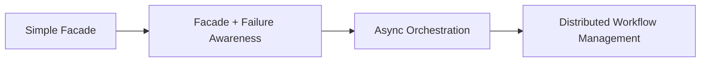

## 1. Why This Part Exists

---

In **Part 2**, we introduced a Facade to orchestrate **Employee Offboarding**.

The result was:

- clean orchestration
- SRP-compliant services
- a single workflow owner
- clear call order

At this point, many tutorials stop.

But real systems don’t.

This part exists to answer the next, harder question:

> **What happens when things go wrong?**

---

## 2. The Hidden Assumption in Part 2 (The Happy Path)

---

Our Facade in Part 2 assumed:

- every service call succeeds
- execution is synchronous
- failures are rare or acceptable
- ordering is linear and reliable

This assumption is common — and reasonable — at **Low-Level Design**.

But it is still an assumption.

> Facade simplified orchestration.  
> It did **not** solve failure semantics.

That distinction matters.

---

## 3. Real Failure Scenarios Facade Does Not Solve

---

Consider Employee Offboarding again.

What if:

- Payroll stops salary, but IT access revocation fails?
- HR marks employee inactive, but Reporting times out?
- Offboarding is triggered twice concurrently?
- The process crashes halfway through?

These are not edge cases.
They are **normal conditions** in real systems.

At this point, developers often feel:

> “Facade isn’t enough anymore.”

That feeling is **correct** — but incomplete.

---

## 4. The Wrong Reaction: Stuffing Rollback into Facade

---

A common instinct is to “fix” this by adding:

- try/catch everywhere
- manual rollback calls
- nested compensation logic
- undo methods in services

Example (❌ do not do this):

```java
try {
    payroll.stopSalary(id);
    itAdmin.revokeAccess(id);
} catch (Exception e) {
    payroll.restartSalary(id); // ❌ naive rollback
    throw e;
}
```

### 4.1 Why this fails

- rollback is rarely symmetric
- services may not support reversal
- retries introduce duplication
- partial failures create inconsistent state
- Facade turns into a fragile workflow engine

> **Trying to solve distributed failure inside Facade breaks the pattern.**

---

## 5. What Facade Actually Gives You (The Key Insight)

---

At this stage, it’s important to reset expectations.

Facade’s real value is **not** failure handling.  
Facade’s value is **structural clarity**.

What Facade gives you is:

- a **single workflow boundary**
- a **stable orchestration API**
- a **clear owner for business workflows**
- a **natural seam for future evolution**

In other words:

> Facade does **not** solve failure.  
> It creates the **place where failure can be handled later**.

This is a subtle but critical distinction.

Without a Facade:

- failure handling gets scattered
- compensation logic leaks into services
- controllers start coordinating retries
- workflows become implicit and fragile

With a Facade:

- all coordination is centralized
- evolution happens in one place
- advanced patterns can be introduced _without refactoring the system_

Facade is not the end of the journey.  
It is the foundation that makes _**correct evolution**_ possible.

---

## 6. The Natural Evolution of a Growing Workflow

---

As systems grow, workflows typically evolve like this:



Let’s clarify what this means.

### 6.1 Simple Facade (LLD)

- synchronous calls
- happy-path focus
- clear orchestration
- what we built in Part 2

### 6.2 Failure-Aware Facade

- retries
- alerts
- idempotency
- compensation hooks

This stage still assumes a single application boundary and does not introduce distributed coordination.

### 6.3 Async Orchestration

- events
- queues
- delayed processing
- eventual consistency

### 6.4 Distributed Workflow Management

- Saga-like coordination
- long-running transactions
- cross-service consistency guarantees

Each step introduces **new problems** — and **new design responsibilities**.

> Importantly, these steps do **not** belong to the same learning layer:
>
> - **Step 1: Simple Facade** → Low-Level Design (LLD)
> - **Step 2: Failure-Aware Facade** → Advanced LLD
> - **Step 3: Async Orchestration** → High-Level Design (HLD)
> - **Step 4: Distributed Workflow Management** → Large-Scale System Design
>
> This article intentionally **implements only Step 1**.
>
> The remaining steps are **named but not implemented — on purpose**.
>
> At this stage, our goal is not to solve every failure scenario,  
> but to place the system in a structure where those solutions can be added later  
> **without rewriting the design**.

---

## 7. Where Failure-Aware and Async Facades Will Be Taught

---

To avoid mixing abstraction layers, each workflow evolution is taught in a
**different part of the learning path**.

### 7.1 Failure-Aware Facade (Advanced LLD)

In a later **Low-Level Design add-on**, we will revisit Facade and extend it with:

- idempotency guarantees
- retry policies
- timeouts and alerting
- **compensation hooks** (not full rollback engines)

This stage focuses on **making workflows safe**, while still keeping them:

- synchronous
- bounded to a single application
- structurally simple

This is still **Low-Level Design**, but at a more mature level.

---

### 7.2 Async Orchestration (High-Level Design)

Once workflows can no longer remain synchronous, we move to **High-Level Design (HLD)**.

There, we will introduce:

- event-driven workflows
- background processing
- message queues
- eventual consistency

At this point:

- Facade still exists
- but it becomes an **orchestration trigger**, not the executor

This is where **system boundaries** start to matter.

---

### 7.3 Distributed Workflow Management (Large-Scale Design)

Finally, when workflows span **multiple services or systems**, we enter
**Large-Scale / Distributed System Design**.

This is where patterns like **Saga** belong.

Saga addresses:

- long-running workflows
- partial failure recovery
- cross-service consistency
- distributed compensation

Importantly:

> **Saga is not a Facade enhancement.**  
> It is a _different class of solution_ for a _different class of problems_.

Introducing it earlier would blur architectural boundaries and reduce clarity.

---

## 8. Why We Intentionally Stop at Facade in LLD

---

This tutorial series follows a strict rule:

> **Solve only the problems introduced so far.**

At the Low-Level Design stage, our goals are:

- correct structure
- clear ownership
- maintainable composition
- explicit workflows

Facade accomplishes all of these.

Failure handling is a **different class of problem** — and deserves its own context.

Deferring it is not avoidance.  
It is **design discipline**.

---

## 9. How This Connects to the Bigger Learning Path

---

Here’s how everything fits together:

- **LLD** → structure, correctness, orchestration
- **HLD** → async flows, compensation, resilience
- **Large-Scale Design** → consistency, latency, fault tolerance

The **same EMS example** will return later — with:

- async offboarding
- event-driven workflows
- Saga-style coordination

But only when the reader is ready for it.

---

## Conclusion

---

Facade is not a silver bullet.

It is a **boundary**.

- It simplifies orchestration
- It protects services from misuse
- It centralizes workflow intent

And just as importantly:

> **Facade tells you when the problem has outgrown Low-Level Design.**

That’s not a failure of Facade.  
That’s a signal to move up the abstraction ladder.

---

### 🔗 What’s Next?

---

With Facade complete, we continue with **Structural Design Patterns**.

The next problem to solve is not orchestration, but **behavior extension**:

> **How do we add features dynamically without modifying existing code?**

👉 **Up next:**  
**Decorator Pattern – Adding Behavior Without Inheritance**

---

> 📝 **Final Takeaway**
>
> - Facade earns its place under real workflow pressure
> - It coordinates, not compensates
> - When failure dominates the design, the problem has changed
> - Good design knows when to stop — and when to level up
